# MySQL 中的唯一键

> 原文：<https://www.educba.com/unique-key-in-mysql/>

## MySQL 中唯一键的介绍

MySQL 中的唯一键是每个表中都存在的键约束，以确保表中某一列中所有值的唯一性。基本上，主键和唯一键约束是 MySQL 中的两个键，它们保证一列或一组列中的值是不同的而不是重复的。通常，主键会自动包含唯一键约束，因为主键值需要是唯一的，并且不能为 NULL，因为 NULL 不是一个值。然而，在一个 MySQL 表中，可以有多个唯一键约束，但必须只有一个主键。唯一键保存整个表中唯一标识的一个或一组列或记录。唯一键可以包含空值，但每列只允许一个空值。

### 为什么我们需要 MySQL 中的唯一键？

*   在 MySQL 中，唯一键约束有助于防止任意两个记录或行在一列中具有相同的值。因此，唯一键是一组一个或多个字段或表的列，当我们检索或访问记录时，它们独特地确定数据库表中的记录。
*   我们可以说，MySQL 中的唯一键约束有助于消除表中的重复数据记录，从而保持数据库的完整性和可靠性，以有组织的方式存储和访问信息。
*   外键约束还可以引用唯一键来维护表的唯一性，同时在数据库中组合两个表，其中每个表都包括基于优先级的主键和唯一键约束。

**语法:**

<small>Hadoop、数据科学、统计学&其他</small>

在创建表时，我们使用以下基本 SQL 语法来编写具有唯一键的列:

**1。创建表的唯一约束:**

`CREATE TABLE Table_name (Column_name Datatype UNIQUE, Column_name Datatype);`

*   对于 Oracle | MS Access | SQL Server

`Create Table Persons (PersonID int NOT NULL UNIQUE, Name, varchar (255) NOT NULL, Address varchar (255), Age int);`

*   对于 MySQL

`Create Table Persons (PersonID int NOT NULL, Name, varchar (255) NOT NULL, Address varchar (255), Age int, UNIQUE (PersonID));`

我们在列“PersonID”上使用了唯一键。

现在，定义多列的语法:

`Create Table Persons (PersonID int NOT NULL, Name, varchar (255) NOT NULL, Address varchar (255), Age int, CONSTRAINT UC_Person UNIQUE (PersonID, Name));`

**2。更改表的唯一约束**

`ALTER TABLE Persons ADD UNIQUE (ID);`

**3。删除唯一约束**

*   对于 MySQL

`ALTER TABLE Persons DROP INDEX UC_Person;`

运筹学

`DROP INDEX IndexName ON TableName;`

*   对于 SQL | MS Access| Oracle:

`ALTER Table Persons DROP CONSTRAINT UC_Person;`

### MySQL 中唯一键的使用

*   在 MySQL 中，当我们定义主键时会自动生成聚集索引，而唯一键会创建非聚集索引。
*   唯一键可以避免表中的任何列或行包含重复值，并有助于存储不同的值。假设，我们有一个包含所有客户信息的客户表。可能有一个条件和要求，我们需要有没有相同年龄的客户。则使用表的该列值中的唯一键约束来防止这种类型的条件。
*   我们可以在一个表上定义多个唯一键，其中一个或多个列组合成一个唯一键。根据 ANSI，我们可以使用多个空值，但是在 SQL server 中，我们只能添加一个空值。使用 Unique 键时，不能插入多个 NULL 值，但是可以使用 NOT NULL 筛选器创建一个唯一的非聚集索引，并使用多个 NULL 值。按照标准，没有规则规定只能使用一个 NULL。
*   从逻辑上讲，唯一键约束在一列中保存非重复值，如果比较后发现任何相等的值，那么它将违反 MySQL 规则。
*   因此，使用唯一约束在表[的列中管理记录的个体唯一性。](https://www.educba.com/oracle-unique-constraint/)

### 如何在 MySQL 中对行、列、表使用唯一键？

让我们考虑一些表，看看如何在 MySQL 中对表中的行和列使用惟一键。

#### 示例 1–MySQL 唯一键创建表。

例如，我们创建了一个“学生”表，并添加了唯一约束:

`create Table If Not Exists Students (Id Int Auto_Increment Primary Key, Name Varchar(50) Not Null, Address Varchar(255) Not Null, Phone Varchar(15) Not Null, Email Varchar(100) Not Null, Unique Key Unique_Email (Email))`

**输出:**

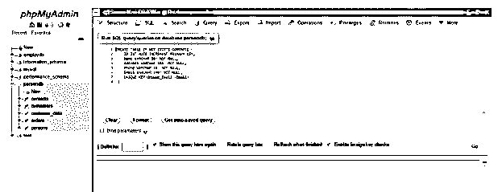

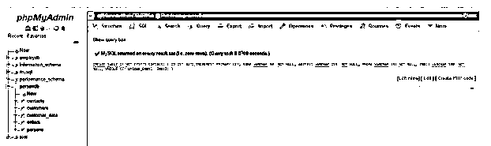

如果我们查看该表，它将显示如下布局:

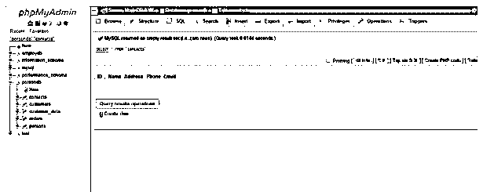

同样，如果我们使用下面的代码，我们将看到 MySQL 为电子邮件列生成了一个唯一的索引:

`SHOW INDEXES FROM students;`

**输出:**

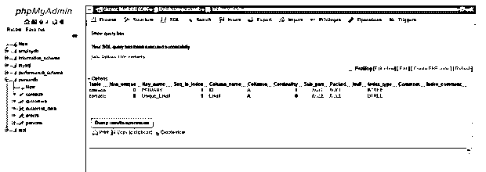

让我们输入一些数据:

`INSERT INTO students (ID,Name, Address, Phone,Email) VALUES ('12', 'Nikhil', 'Delhi', '8954780145', 'nikhil123@gmail.com');`

**输出:
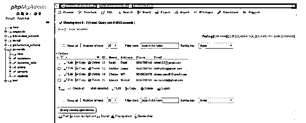

T7】**

现在，让我们尝试插入已经存在于该列中的重复电子邮件值，并使用以下 SQL 语句看看会发生什么:

`INSERT INTO students (ID,Name, Address, Phone,Email) VALUES ('16', 'Sangam', 'Bareilly', '9580014257', 'nikhil123@gmail.com');`

执行时，您将收到来自 MySQL 的如下错误消息:

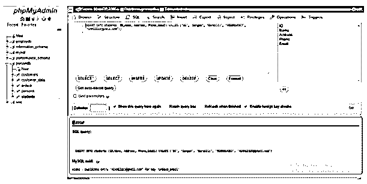

这就是唯一键如何防止 RDBMS 中的重复因素。

#### 示例 2–MySQL 唯一键变更表。

我们将使用 ALTER 来更改唯一的列 Phone，然后使用以下查询:

`ALTER TABLE students ADD CONSTRAINT Unique_Phone UNIQUE (Phone);`

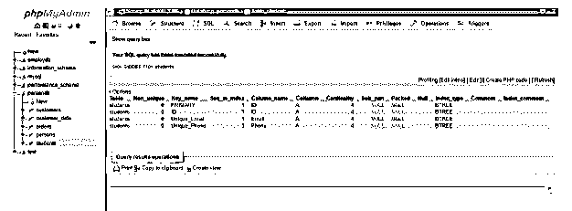

当我们插入相同的电话值时，它也显示错误:

`INSERT INTO students (ID,Name, Address, Phone,Email) VALUES ('16', 'Sangam', 'Bareilly', '8954780145', 'sangam102@gmail.com');`

**输出:**

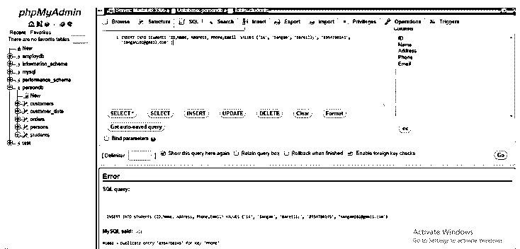

#### 示例 3——MySQL 唯一键删除表。

现在，我们将从 Email 列中删除唯一键约束。

对此的 SQL 语句是:

`ALTER TABLE students DROP INDEX UNIQUE_Email;`

当我们执行它时，会显示一个确认消息框，询问我们是否真的希望执行该查询，您可以继续单击 OK，然后查看结果:

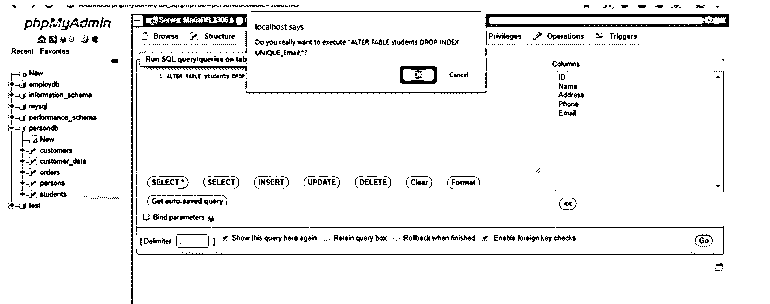

单击后，将从电子邮件列中删除唯一键约束:

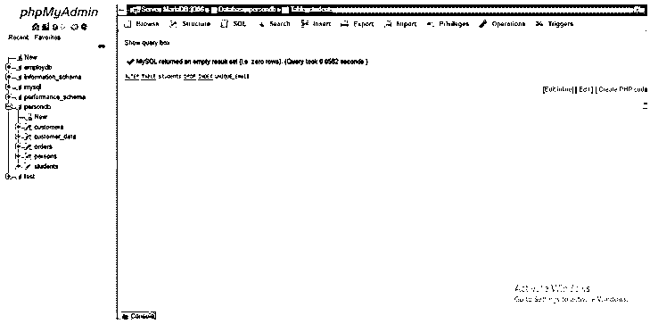

现在让我们通过查询来查看索引:

`SHOW INDEXES FROM students;`

现在，您无法将 Unique_Email 视为唯一邮件。

**输出:**

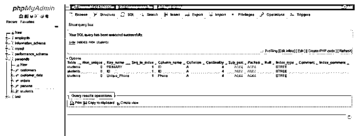

如果您插入相同的电子邮件值，那么它将被插入到列中:

`INSERT INTO students (ID,Name, Address, Phone,Email) VALUES ('16', 'Sangam', 'Bareilly', '9580014257', 'nikhil123@gmail.com');`

**输出:**

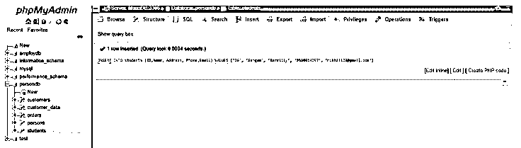

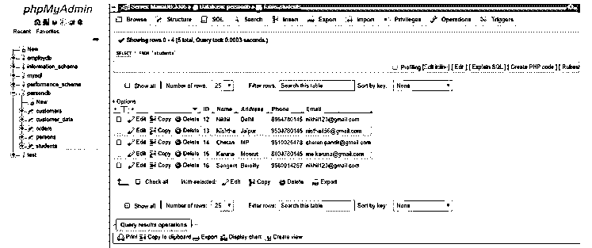

### 结论

在 MySQL 中，惟一键是一个完整性约束，它允许输入到列中的值在表中是不同的。有时，我们有像电子邮件、电话、ID、地址等栏目。出于安全原因，它需要是唯一的和不同的，并保持数据库表有组织的记录，以便它向用户提供有效的信息。因此，如果一个表使用唯一键列，那么我们就不能添加或插入甚至更新特定的一列或一组列。如果我们尝试这样执行，那么 MySQL 将拒绝更改并产生一个错误。

### 推荐文章

这是 MySQL 中唯一键的指南。在这里，我们讨论的介绍，为什么我们需要在 MySQL 的唯一键与工作和例子。您也可以看看以下文章，了解更多信息–

1.  [MySQL 触发器](https://www.educba.com/mysql-trigger/)
2.  [SQL 中的组合键](https://www.educba.com/composite-key-in-sql/)
3.  MySQL 中的[表](https://www.educba.com/table-in-mysql/)
4.  [SQL 中的外键](https://www.educba.com/foreign-key-in-sql/)
5.  [MySQL IN Operator |示例](https://www.educba.com/mysql-in-operator/)

