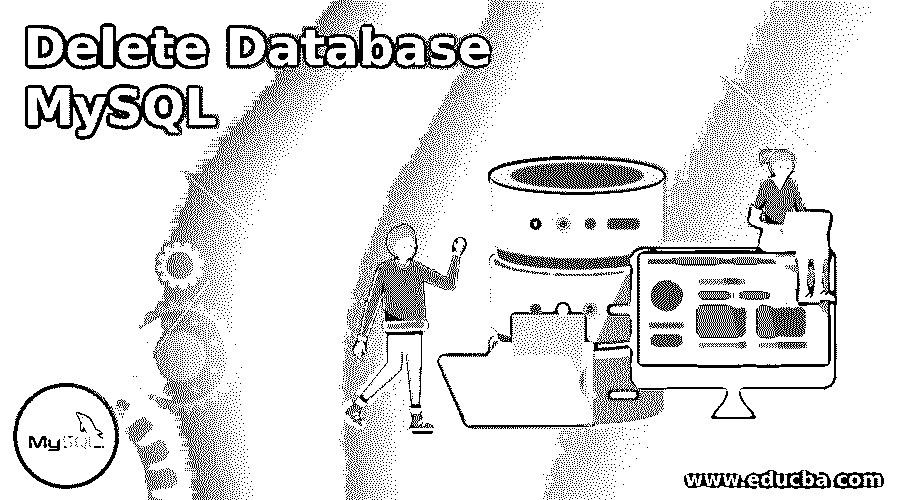
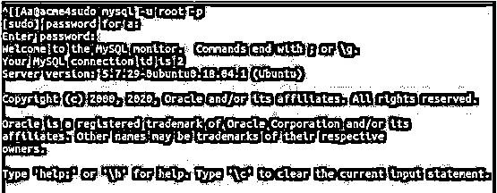
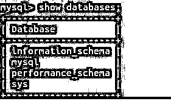
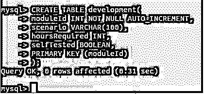

# 删除数据库 MySQL

> 原文：<https://www.educba.com/delete-database-mysql/>

## 删除数据库 MySQL 简介

我们可以使用 DROP DATABASE 命令删除数据库以及数据库中不再有用的所有内容。这不仅会删除 MySQL 数据库服务器中的内容，还会删除数据库中存储的所有与模式相关的信息。你将找不到被删除的数据库的踪迹。因此，在使用该命令时必须格外小心，因为如果没有数据库的任何备份，就不可能还原数据库，因为 DROP DATABASE 命令会将内容永久删除。

**语法**

<small>Hadoop、数据科学、统计学&其他</small>

`DROP DATABASE [IF EXISTS] name_of_database;`

**解释:**其中 name_of_database 帮助指定您希望完全删除的数据库的名称，包括其内容，如表、存储过程、触发器等。每当执行 DROP DATABASE 命令时，如果 MySQL 数据库服务器中不存在名为 name_of_database 的数据库，那么在执行该命令时，它会抛出一个错误，指出不存在这样的数据库。在这种情况下，如果我们在命令中使用了 IF EXISTS 子句，则会发出一条通知，而不是错误消息，指出具有指定名称的数据库不存在，并且 DROP DATABASE 命令的执行会在该处自行终止。IF EXISTS 子句用于防止在指定名称的数据库不存在时发出错误。

### 实现删除数据库 MySQL 的例子

以下是 DROP DATABASE 命令的示例:

#### 示例#1

首先，我们必须使用以下命令打开 MySQL 连接:

**代码:**

`mysql -u root -p`

**输出:**

**说明:**如果您希望以 root 用户名登录，并且如果设置了密码，它会提示您输入密码。

#### 实施例 2

然后，您必须执行以下命令来列出 MySQL 数据库服务器中存在的所有数据库。

**代码:**

`SHOW DATABASES;`

**输出:**

#### 实施例 3

现在，让我们尝试删除数据库服务器上不存在的数据库，并查看输出:

**代码:**

`DROP DATABASE educba;`

**输出:**

**解释:**可以看到，抛出了一个错误代码为 1008 的错误，说明“educba”数据库无法删除，因为不存在这样的数据库。

#### 实施例 4

现在，让我们研究一下在查询语句中添加 IF EXISTS 子句后的输出:

**代码:**

`DROP DATABASE IF EXISTS educba;`

**输出:**

**解释:**从输出中可以看出，即使 educba 命名的数据库在我们的数据库中不存在，也没有出现错误。它显示查询很好，没有任何行受到影响，并显示有一个警告。

#### 实施例 5

现在，让我们使用 CREATE DATABASE 命令创建一个名为 educba 的数据库:

**代码:**

`CREATE DATABASE educba;`

**输出:**

#### 实施例 6

现在让我们插入两个名为“测试和开发”的表:

**代码:**

`CREATE TABLE test(
testCaseId INT NOT NULL AUTO_INCREMENT,
testCase VARCHAR(100),
trials INT,
cleared BOOLEAN,
PRIMARY KEY (testCaseId)
);`

**输出:**

#### 实施例 7

另一个用于开发的 create table 查询如下:

**代码:**

`CREATE TABLE development(
moduleId INT NOT NULL AUTO_INCREMENT,
scenario VARCHAR(100),
hoursRequired INT,
selfTested BOOLEAN,
PRIMARY KEY (moduleId)
);`

**输出:**

#### 实施例 8

现在，让我们使用 drop database 命令删除 educba 数据库:

**代码:**

`DROP DATABASE IF EXISTS educba;`

**输出:**

**解释:**可以得出结论，查询成功执行，没有任何错误或警告，并返回受影响的两行。DROP DATABASE 命令给出的返回值是该数据库中存在的并且在删除数据库时被删除的表的数量。

### 删除数据库的替代方法

在 MySQL 中，数据库和模式可以互换使用，这意味着两者指的是同一个事物，并且是彼此的同义词。因此，我们可以利用

`DROP SCHEMA [IF EXISTS] name_of_database;`

这与 DROP DATABASE 命令的工作方式相同。

**步骤 1:** 让我们尝试使用以下查询语句删除名为 mysqlDropDemo 的数据库:

**代码:**

`DROP SCHEMA mysqlDropDemo;`

**输出:**

**解释:**它抛出一个错误，说我的数据库服务器中不存在名为 mysqlDropDemo 的数据库。

**步骤 2:** 现在，让我们用 IF EXISTS 子句执行相同的查询:

**代码:**

`DROP SCHEMA IF EXISTS mysqlDropDemo;`

**输出:**

**步骤 3:** 让我们使用以下查询创建名为 mysqlDropDemo 的数据库:

**代码:**

`CREATE DATABASE  mysqlDropDemo;`

**输出:**

**步骤 4:** 现在，如果您执行相同的 DROP SCHEMA 查询，那么输出将会不同。我们将执行以下查询语句:

**代码:**

`DROP SCHEMA IF EXISTS mysqlDropDemo;`

**输出:**

**说明:**可以看到，数据库被成功删除，并且没有任何行被返回和受到影响，因为 mysqlDropDemo 数据库中不包含任何表。

您还可以使用 SHOW DATABASES 来确认执行此任务时每个阶段数据库的存在和删除情况；该命令给出了在执行该命令的特定时刻数据库服务器上存在的所有数据库的列表。

### 结论

我们可以使用 SQL 命令 DROP DATABASE 来删除数据库，该命令会完全并永久地删除数据库以及该数据库的所有内容。因此，我们在使用这个命令时应该小心，因为如果没有任何备份，就不可能恢复删除的数据库。有一个替代命令 DROP SCHEMA 可用于删除数据库服务器上存在的数据库。它的工作方式与模式和数据库相同，在 MySQL 中它们是同义词。IF EXISTS 子句可在 DROP DATABASE 和 DROP SCHEMA 命令中使用，以防止在不存在具有 DROP 查询中指定的名称的数据库时引发错误。

### 推荐文章

这是一个删除数据库 MySQL 的指南。这里我们讨论一个关于删除数据库 MySQL 的介绍，语法，替代方法和例子。您也可以浏览我们的其他相关文章，了解更多信息——

1.  [MySQL 索引](https://www.educba.com/mysql-index/)
2.  [MySQL 日期函数](https://www.educba.com/mysql-date-functions/)
3.  [MySQL 管理](https://www.educba.com/mysql-administration/)
4.  [MYSQL 数据库](https://www.educba.com/mysql-database/)

