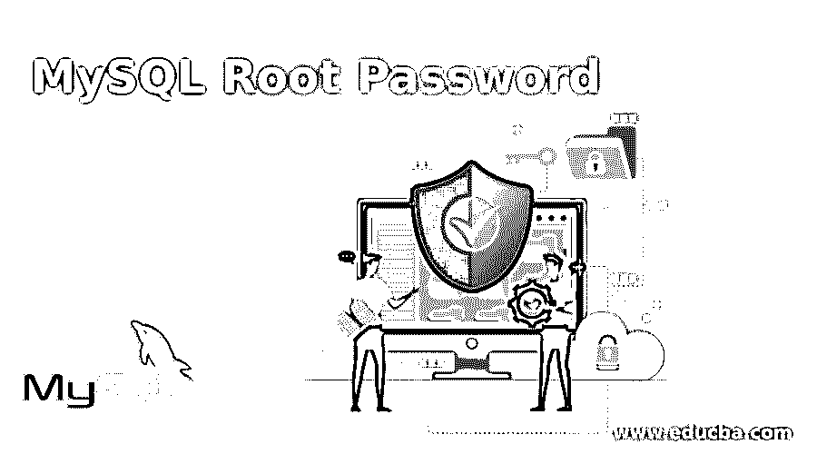
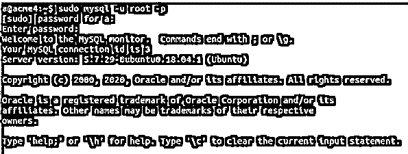
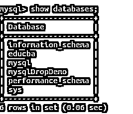
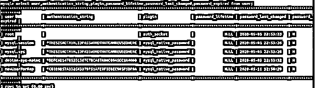
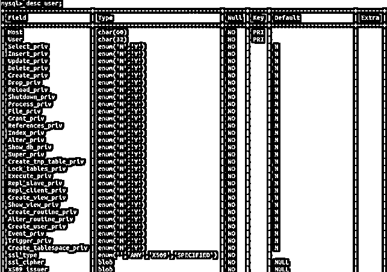
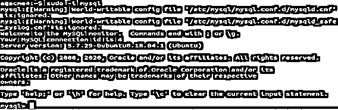

# MySQL Root 密码

> 原文：<https://www.educba.com/mysql-root-password/>

## MySQL Root 密码介绍

在 MySQL 数据库中，可能有多个用户被分配了不同的权限。但是，当您想要执行需要更高权限的数据库操作时，您可以使用 MySQL 中默认创建的帐户，该帐户拥有分配给它的 root 用户的几乎所有权限。默认情况下，每当您在机器上安装 MySQL 时，都会创建名为 root 的用户，并提示和询问该用户的密码。如果这种情况没有发生，并且您想要为默认根用户设置密码，那么您可以在以后这样做。此外，可能会出现这样的情况:您忘记了自己的 root 密码，希望设置新密码，或者有时您希望设置比以前更强的 root 用户密码。从安全角度来看，为 root 用户设置强密码非常重要，这样可以保护存储在 MySQL 数据库中的敏感数据。在本文中，我们将了解如何更改密码或为 root 用户设置密码。

### 使用 Root 用户登录

我们可以使用以下命令以 root 用户身份进入 MySQL 数据库

<small>Hadoop、数据科学、统计学&其他</small>

*   **sudo mysql -u root -p**

这将进一步提示您在机器上安装 MySQL 时设置的密码，并给出以下输出–

现在，您将看到 MySQL shell，并且您正在处理您的数据库。让我们看看我的 MySQL 数据库服务器中的用户列表。所有与用户相关的信息都存储在名为 user 的表中，该表位于默认创建的名为 MySQL 的数据库中。让我们首先使用以下命令检查所有数据库

*   **显示数据库；**

这给出了以下输出–

现在，我们将使用以下命令指定我们必须使用 mysql 数据库

*   **使用 mysql**

这在执行后给出了以下输出–

现在，我们将使用以下查询语句对 mysql 数据库中的用户表执行 select 查询

`select user, authentication_string, plugin, password_lifetime, password_last_changed, password_expired from user;`

上述查询的执行给出了以下输出。

我们已经在上面的 select 查询语句中检索了用户的所有密码相关字段。有许多属性和信息字段存储在用户表中，用于所有与用户相关的信息。您可以使用以下命令描述用户表并查看存储在用户表中的列的列表

`desc user;`

这给出了以下输出。

在为 root 用户选择了这些列之后，您将会看到 root 用户拥有分配给它的几乎所有权限，并且在 privilege 列中存储了一个“Y”值，代表 yes。

或者，可以使用另一个命令以 root 用户身份登录 MySQL 数据库，如下所示

*   sudo -i MySQL

这给出了以下输出。

这里不要求我们输入用户名或密码，因为这些信息存储在 my.cnf 或 mysqld.cnf 配置文件中，路径为/etc/MySQL/MySQL . conf . d/mysqld . CNF

### 为 Root 用户设置密码

现在，让我们看看如何为 root 用户设置密码或更改现有密码。如果您忘记了现有的密码或希望设置一个新的更强的密码，我们有多种方法可以更改 root 用户的密码。它们如下所列

*   使用 mysqladmin 命令
*   使用 mysql 安全连接命令
*   使用 ALTER 命令更改用户的密码

我们将详细地逐一查看所有方法。

#### 使用 mysqladmin 命令

默认情况下，为 root 用户安装 MySQL 时会询问密码。但是假设由于某种原因没有询问密码，现在您希望设置密码，那么您可以通过以下方式使用 mysqladmin 命令为 root 用户分配新密码

mysqladmin -u root 密码 myPassWhichIWant

这给出了以下输出-

**sudo mysqladmin-u root password my password want**

#### 使用 mysql 安全连接命令

我们可以使用替代的 mysql_secure_connection 命令来代替 mysqladmin，它更加安全和高级，因为它不仅允许为 root 用户设置密码，而且还提供了向 mysql 数据库添加和设置许多安全功能的工具，例如限制 root 用户从远程机器登录，可以删除匿名用户，也可以删除测试数据库。只需输入以下内容，即可使用该命令

**mysql_secure_connection**

这将询问您多个问题，这些问题的答案将设置您希望分配的所有属性。

#### 使用 ALTER 命令更改用户的密码

您可以使用 ALTER 命令更改任何用户的密码。该命令也可用于以下列方式设置 root 用户的密码

**更改由“a”标识的用户“root”@“localhost”；**

a 是我希望分配的新密码。执行上述命令会产生以下输出–

将该文件保存为~/mysql-password，以供进一步参考。

下一步是使用以下命令停止 MySQL 服务

**sudo systemctl 停止 mysql**

为此，您必须通过单击 ctrl+z 退出 MySQL 命令提示符，然后启动该命令，给出以下输出

现在，发出初始化设置密码过程的命令

**sudo mysqld-init-file = ~/MySQL-password**

然后，您将再次使用以下命令启动 MySQL 服务

**sudo systemctl 启动 mysql**

这会产生以下输出。

此外，您可以使用 mysql -u root -p 命令以更改后的密码登录。

### 结论

root 是安装 MySQL 时创建的默认用户。它被赋予了许多特权。安装时会提示并询问密码。但是，它可以通过使用上述任何方法进行更改。

### 推荐文章

这是一个 MySQL Root 密码的指南。这里我们讨论 MySQL 根密码的介绍，以及命令和相应的例子。您也可以看看以下文章，了解更多信息–

1.  [MySQL 中的唯一键](https://www.educba.com/unique-key-in-mysql/)
2.  [MySQL 子查询](https://www.educba.com/mysql-subquery/)
3.  [MySQL 约束](https://www.educba.com/mysql-constraints/)
4.  [MySQL 中的汇总](https://www.educba.com/rollup-in-mysql/)

