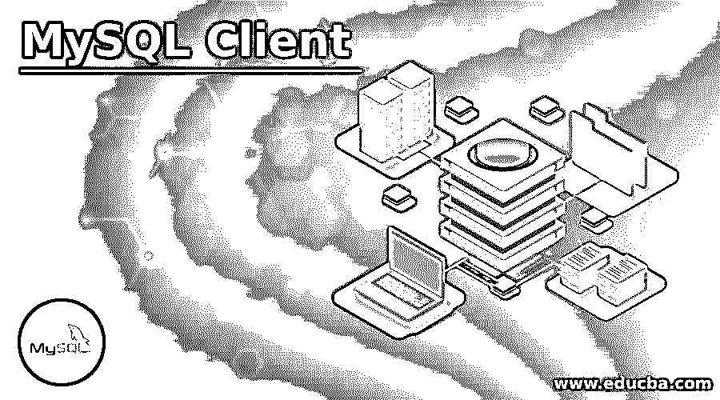
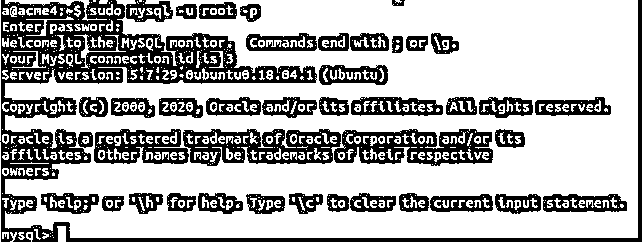

# MySQL 客户端

> 原文：<https://www.educba.com/mysql-client/>

## MySQL 客户端简介

每当 MySQL 安装在任何机器上时，默认的命令行界面(CLI)也会安装在该机器上，该界面将接受基于文本的输入，以便与 Mysql 数据库服务器进行通信。任何可以接受用户输入，然后将其发送到服务器，并接受服务器返回的响应，并将输出显示给用户的程序都被称为客户端程序或简称为客户端程序。

MySQL 客户端程序做类似的工作，发送用户输入的查询，并在屏幕上显示输出。在本文中，我们将了解 MySQL 命令行内置软件的用法，还将了解提供交互式 GUI 与 MySQL 服务器通信的其他客户端程序。

<small>Hadoop、数据科学、统计学&其他</small>

### MySQL 客户端的使用

默认情况下，当您安装 MySQL 时，也会安装 MySQL 客户端命令行程序。该客户端帮助通过网络将查询发送到服务器，还检索响应并将其显示在屏幕上。并不总是需要在服务器所在的同一台机器上使用 MySQL 客户端。我们可以在远程机器上安装 MySQL 客户端软件，并在任何地方使用它与您的 MySQL 服务器进行通信。使用 MySQL 客户端时，您需要遵循下面列出的特定步骤

#### 在您的机器上找到 Mysql 客户端

首先，你需要知道你的 MySQL 客户端在你的机器上的位置。默认情况下，对于 Unix/Linux 机器，它通常是/usr/local/MySQL/bin，而对于 windows 机器，默认位置是 c: Program，然后是您的 MySQL 文件夹，其中必须有 bin 文件夹。您可能找不到 MySQL 客户端程序的原因是，该程序没有安装在您的计算机上，或者安装在不同的路径上，或者您没有数据库管理员权限。

### 开始客户端使用

首先，打开终端或命令提示符，然后导航到您的 MySQL 客户端程序所在的路径，如果不需要用户名和密码凭证，您将自动进入 MySQL 客户端。如果您想使用 ceratin 用户名和密码登录并提及它们，那么您可以使用以下命令，前提是您位于 MySQL 的安装目录中

`mysql -u educba -p`

您将被进一步提示输入密码。

-u 代表指定您在进一步的参数值中提到用户名，而-p 代表指定您将输入密码。educba 是我们的用户名，所以我们在我的命令中使用了它。

如果您想要访问位于网络中不同机器上的 MySQL 数据库服务器，那么您需要在上面的查询中指定一些额外的参数，如下所示

`mysql -h educbadbhost.edu_database.com -u educba -p`

其中-h 代表主机地址，在我的例子中是 educbadbhost.edu_database.com，educba 是我们希望用来登录系统的用户名。在任何一种情况下，即本地或远程机器服务器的位置，一旦你看到以下输出 MySQL 客户端启动。

`sudo mysql -u root -p`

#### 选择要使用的数据库

下一步是指定 MySQL 数据库服务器上您希望使用的数据库的名称。为此，您可以使用以下命令–

`use nameOfYourDB;`

其中，nameOfYourDB 是您希望连接和使用的数据库的名称。如果您不知道数据库服务器中存在哪些数据库，可以使用 SHOW DATABASES 命令列出 MySQL 数据库服务器中存在的所有数据库。

#### 使用数据库和启动查询

如果您熟悉 MySQL 查询，您可以开始在数据库上触发查询，并通过触发或执行 MySQL 查询来执行您希望在数据库上执行的任何操作。确保在对数据库执行的每个查询的末尾都指定了分号。

#### 退出 MySQL 客户端程序

一旦使用完数据库服务器，只需在命令行上键入 quit 并按 enter 键。

### 具有交互式 GUI 的客户端工具

除了默认安装的命令行 MySQL 客户端与 MySQL 数据库服务器通信之外，您还可以使用市场上提供的各种其他工具，这些工具在 GUI 交互方面更好，并且提供了以简单有效的方式使用数据库的工具。其中大部分是免费的，而有些是付费的。

下面列出了一些使用 MySQL 的客户端工具

#### 1.Dbeaver

它具有多平台支持，这意味着它可以在任何操作系统上运行，如 windows、Linux 和 mac os。它提供了模拟数据，如果我们需要，可以生成模拟数据。该工具还支持 NoSQL 数据库。实体关系图可以运行来直观地查看我们的数据库。

#### 2.navicat

它有助于从各种来源和文件类型导入和导出数据。它是跨平台的，可以在不同的操作系统上使用，如 Linux、Windows 或 Mac。我们可以安排报告、恢复和备份任务。我们可以在队友之间共享连接、查询和数据。

#### 3\. sqlyog

它有最好的界面，非常优雅，提供了创建和管理模式和表以及可视化设计它们的能力。它是高度可定制的，并提供不同的主题，可用于个性化。

其他一些客户端工具包括 Mysql WorkBench、Jetbrain 的 datagrip、Heidi SQL、DB forge studio for MySQL。

### 结论

在机器上安装 MySQL 后，默认情况下会安装基于命令行的 MySQL 客户端，或者如果您希望在机器上使用远程数据库服务器，也可以从外部安装它。除此之外，市场上还有其他的客户端工具，它们提供了更好的 GUI，并且大多数时候是免费的。

### 推荐文章

这是一个 MySQL 客户端的指南。这里我们讨论一个 MySQL 客户端的介绍。详细的用法，详细的交互式 GUI 工具。您也可以浏览我们的其他相关文章，了解更多信息——

1.  [什么是 MySQL](https://www.educba.com/what-is-mysql/)
2.  [什么是 MySQL 数据库](https://www.educba.com/what-is-mysql-database/)
3.  [MySQL 开源](https://www.educba.com/mysql-opensource/)
4.  [MySQL 约束](https://www.educba.com/mysql-constraints/)

