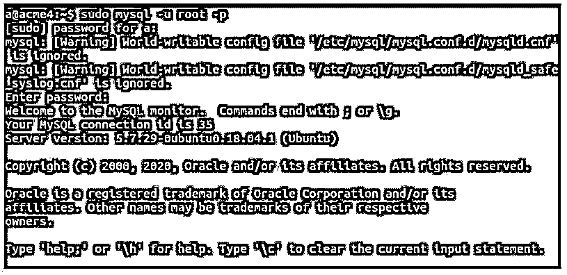
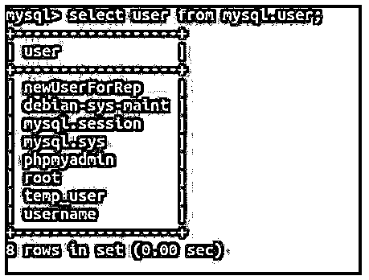
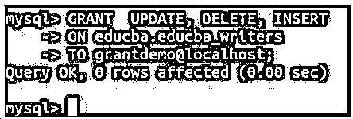

# MySQL 添加用户

> 原文：<https://www.educba.com/mysql-add-user/>

## MySQL 添加用户简介

MySQL 安装后出现的默认用户是根用户。除此之外，实时需要创建许多用户，以便可以相应地分配访问权限来维护数据库的安全性。在这里，我们将看到如何在 MySQL 中创建新用户。在 MySQL 中创建新用户需要使用 CREATE query 语句来创建新用户。

### MySQL 添加用户的语法

下面给出了在 MySQL 中创建新用户的 CREATE USER 语句的语法:

<small>Hadoop、数据科学、统计学&其他</small>

`CREATE USER [IF NOT EXISTS] name_of_account
IDENTIFIED BY 'password_to_be_used';`

帐户名是您希望给予新用户的帐户名。帐户名由两部分组成:用户名和主机名。以用户名@主机名格式创建新用户时，用户名和主机名用@符号分隔，同时将它们一起指定为帐户名。主机名帮助我们指定用户将从哪个主机访问和连接到 MySQL 数据库。

主机名是可选的，如果不指定，帐户名相当于用户名@%,表示用户可以从任何主机访问数据库。

当我们想要在主机名的用户名中添加空格、破折号(-)或任何其他字符时，我们需要用单引号、双引号或反勾号将用户名和主机名括起来，如下所示:

**`用户名`@ `主机名`**

password_to_be_used 字段帮助我们指定新创建的用户的密码，该密码将在该用户登录 MySQL 数据库时使用。创建新用户时，不会为其分配任何权限。我们需要使用 GRANT 语句为用户分配访问和操作数据库及其内容的权限。

如果数据库中已经存在具有相同用户名的用户，则使用 IF EXISTS 语句可以防止创建该用户，这被认为是在查询中使用该语句的良好做法。

### MySQL 添加用户示例

下面是提到的例子:

首先，我们将使用 root 用户登录我们的数据库，该用户是在安装 MySQL 时默认创建的，拥有几乎所有的权限，包括创建新用户和授予他们必要权限的权限。

借助以下语句，我们可以使用 root 用户登录。

**代码:**

`sudo mysql -u root -p`

一旦输入密码 sudo 并针对 root 设置，就会产生以下输出。使用 sudo 是可选的。这取决于分配的权限。大多数情况下，只需使用 mysql -u root -p 语句就可以登录。

**输出:**

为了检索 MySQL 数据库中存在的所有用户及其姓名的列表，我们可以使用下面的查询语句。

**代码:**

`select user from mysql.user;`

**输出:**

让我们使用下面的 create user 语句创建一个名为 grantdemo 的新用户，我们可以使用该语句授予特权。

**代码:**

`CREATE USER 'grantdemo'@'localhost' IDENTIFIED BY '123';`

**输出:**

让我们使用下面的查询语句来检查这个用户被授予的所有特权。

**代码:**

`SHOW GRANTS FOR grantdemo@localhost;`

**输出:**

我们可以从输出中看到，新创建的用户没有分配任何授权。它只能登录数据库，但不能访问内容，也不能修改内容。让我们使用 grant 语句授予 educba 数据库的所有 educba_writers 表上的 select 权限。

**代码:**

`GRANT SELECT
ON educba.educba_writers
TO grantdemo@localhost;`

**输出:**

我们甚至可以使用 GRANT 语句为 grantdemo 用户分配多个特权。例如，让我们在 educba 数据库中的表 educba_writers 上为 grantdemo 用户分配更新、删除和插入权限。为此，我们将使用下面的查询语句，其中以 comm-separated 格式提到了要授予的特权。

**代码:**

`GRANT UPDATE, DELETE, INSERT
ON educba.educba_writers
TO grantdemo@localhost;`

**输出:**

现在，假设我们尝试使用 CREATE USER 查询语句再次创建名为 grantdemo 的同一个用户，如下所示。

**代码:**

`CREATE USER 'grantdemo'@'localhost' IDENTIFIED BY '123';`

**执行后连同错误一起输出:**

现在，我们将在其中使用 IF NOT EXISTS 子句，而不仅仅是 CREATE USER 语句，这样就可以防止错误的发生。相反，它只显示查询成功执行的输出，并发出警告。

**代码:**

`CREATE USER IF NOT EXISTS 'grantdemo'@'localhost' IDENTIFIED BY '123';`

**输出:**

要查看执行语句时出现的警告，我们可以使用下面的查询语句。

**代码:**

`SHOW WARNINGS;`

这在执行后给出了以下输出，表明具有 grantdemo 名称和 localhost 主机名的用户已经存在于当前的 MySQL 数据库中。

**输出:**

### 结论

root 是安装 MySQL 时在 MySQL 中创建的默认用户。但是，我们可以使用 MySQL 中的 CREATE USER query 语句创建多个新用户。该方法提供了在 MySQL 中创建用户时指定用户相关属性和其他所需细节的灵活性。然而，当在 MySQL 中创建新用户时，并没有为其分配任何权限。因此，它不能对数据库或其内容执行任何操作，也不能访问内容。为此，我们需要授予用户特权。

### 推荐文章

这是一个 MySQL 添加用户的指南。这里我们讨论 MySQL 添加用户的介绍以及查询示例。您也可以看看以下文章，了解更多信息–

1.  [MySQL REGEXP_REPLACE()](https://www.educba.com/mysql-regexp_replace/)
2.  [MySQL Root 密码](https://www.educba.com/mysql-root-password/)
3.  [MySQL WHILE 循环](https://www.educba.com/mysql-while-loop/)
4.  [MySQL INSTR()](https://www.educba.com/mysql-instr/)

