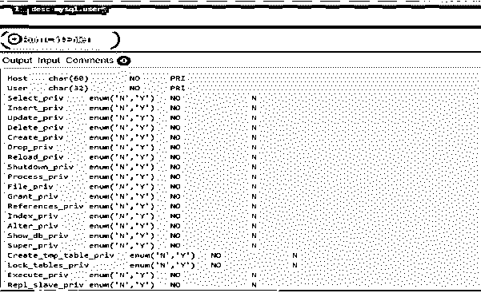
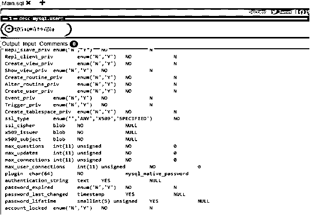
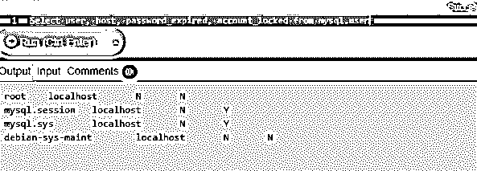
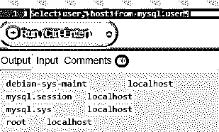
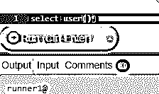

# MySQL 列表用户

> 原文：<https://www.educba.com/mysql-list-user/>

## MySQL 列表用户简介

有时为了管理 MySQL 中的数据库，我们需要列出数据库中所有用户的帐号。为了接收用户列表，您需要管理权限。我们还可以对用户进行分组，列出他们，并在用户列表中获取适当的信息。唯一看不到的字段是密码字段。MySQL 加密用户的密码。

大多数情况下，一些数据库使用 SHOW USERS 命令来获取用户列表。但是 MySQL 数据库不使用任何这样的命令，而是使用我们在语法课中提到的查询。

<small>Hadoop、数据科学、统计学&其他</small>

*   为了从 MySQL 数据库中获取用户列表，我们从用户表和 MySQL 数据库中查询用户数据。它提供了有关主机、用户、Select_priv、Insert_priv、Shutdown_priv、Create_tmp_table_priv、Lock_tables_priv、Create_view_priv、Create_routine_priv、Create_tablespace_priv、ssl_type、ssl_cipher、x509_issuer、x509_subject、max_updates、password_lifetime、account_locked 的详细信息。
*   为了获得用户列表的详细信息，我们使用管理员帐户登录 MySQL 并查询用户表。用户可以在 MySQL 中创建。让我们通过这个例子简单地看看用户的创建。

让我们来看一个例子

`create user new_user_to_create@localhost identified by 'new_userpassword';
/ * - - -  to create the new user - - - * /`

在本节课中，我们将了解更多有关如何查询“MySQL”数据库以及获取用户列表详细信息和其他详细信息的信息。

**语法:**

`select * from mysql.user;
/ * - - used to get the details regarding the user list - - * /`

### MySQL 列表用户是如何工作的？

为了获得用户的详细信息，我们执行下面的查询并获得详细信息。

`select * from mysql.user;
/ * - - used to get the details regarding the user list - - * /`

如果我们在上面的语句中看到“MySQL”是数据库，“user”是数据库中的表。我们有将近 37 个从用户表返回的列。列名如下所示:–

为了获得上面所有的列，我们执行下面的查询:

**代码:**

`desc mysql.user;
/ * - - - Gives description of the query - - - * /`

**输出:**

**代码:**

让我们得到用户列表:—

`select user, host, password_expired, account_locked from mysql.user;
/ * - - -  to get the user, host, pawword_expired, account_locked list - - - * /`

**输出:**

让我们只提取数据库的用户和主机，如下所示:

**代码:**

`select user, host from mysql.user;
/ * - - -  to get the user, host name list - - - * /`

**输出:**

如果我们想获得当前用户的信息，我们使用内置函数 user()。以下是相同的查询:

**代码:**

`select user();
/ * - - - gets the information of the current user - - - * /`

**或**

`select current_user();
/ * - - - gets the information of the current user - - - * /`

**输出:**

用户可以在 MySQL 中创建。为了创建，使用了以下语法:–

`CREATE USER [IF NOT EXISTS] account_name
IDENTIFIED BY 'password';
/ * - - -  to create the new user - - - * /`

在这里，account_name 表示用户名和主机名。让我们来看一个例子

`create user new_user@localhost identified by 'new_userpassword';
/ * - - -  to create the new user - - - * /`

这里的 new _ user:–是我们计划创建的新用户的名称。

Localhost 是主机名。“新用户密码”是给用户的密码。

### 推荐文章

这是一个 MySQL 列表用户指南。在这里我们讨论一个介绍，如何使用 MySQL 列表用户更好地理解详细。您也可以浏览我们的其他相关文章，了解更多信息——

1.  [MySQL INSTR()](https://www.educba.com/mysql-instr/)
2.  [MySQL 根目录](https://www.educba.com/mysql-root/)
3.  [MySQL 数据库修复](https://www.educba.com/mysql-database-repair/)
4.  [用 SQL 解释](https://www.educba.com/explain-in-sql/)

