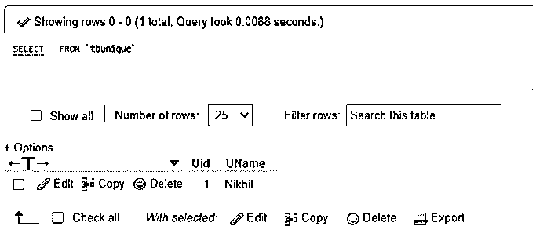
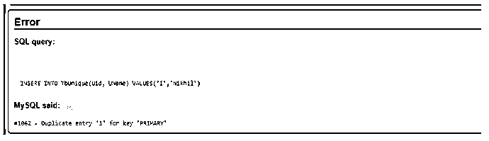
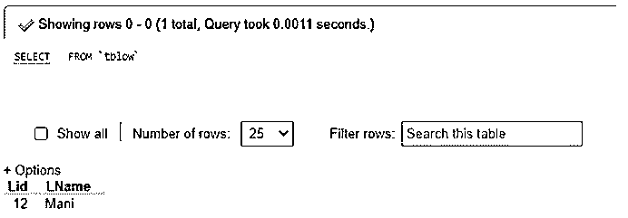
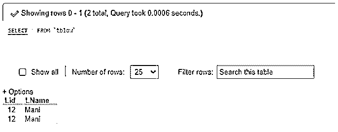

# MySQL 基数

> 原文：<https://www.educba.com/mysql-cardinality/>

## MySQL 基数的定义

MySQL 基数定义了一个术语，指的是要放入表列的数据值的独特性。我们可以进一步说，在 MySQL 中，基数是一个影响数据搜索、排序甚至聚类能力的属性。

MySQL 支持关于服务器中 MySQL 基数功能的两个概念:在低基数类型中，对于一个表列，所有数据值应该相同。而在高基数类型中，表列数据值应该是唯一的。在这里，当 MySQL 约束被添加到数据库中的特定表列时，高基数的思想经常被应用，以便它可以控制任何匹配的值，保持列的唯一性。

<small>Hadoop、数据科学、统计学&其他</small>

**语法:**

让我们编写一个简单的语法，展示如何通过下面的命令使用 MySQL 查询的 CREATE TABLE 语句将基数属性添加到表列中:

以下查询为高基数类型创建语法，其中表列的所有值都被定义为唯一的:

`CREATE TABLE TableName(ColumnName1 Datatype1, ColumnName2 Datatype2,…., ColumnNameN DatatypeN, UNIQUE(ColumnName1, …, ColumnNameN));`

这里，TableName 表示您希望在数据库中创建的特定表名，该表名在相应的列上具有惟一性的基数属性，如 ColumnName 和 Datatype。以下查询为低基数类型创建了语法，其中表列的所有值都没有定义为唯一的:

`CREATE TABLE TableName(ColumnName1 Datatype1, ColumnName2 Datatype2,…., ColumnNameN DatatypeN);`

这里，TableName 表示您希望在数据库中创建的特定表名，该表名在 ColumnName 和 Datatype 这两个列上没有唯一性。列值也可以包含重复记录。

### MySQL 中基数是如何工作的？

*   在 MySQL 概念中，用户可能会发现许多建议，用于识别要创建的正确索引或检测要删除的坏索引。有一个逻辑部分，在表字段(如 account enabled)上创建的索引包含一个非常小的非重复值集(是/否)，这可以极大地减少结果集。从 B 树索引几何的概念和知识中，我们知道具有少量可能值的索引可能真正损害性能，而不是帮助性能。
*   我们可以说，与数据库表相关联的 MySQL 基数表示表中可用的记录或行的数量。与索引相关，基数反映为索引中不同值的数量。因此，唯一索引的基数可能等于表中记录的数量。另一方面，非唯一索引可能包含从 1 到表中现有记录数范围内的基数，这取决于每个索引键在表中被查看的次数。
*   因此，低基数索引可以说是具有相对较少独特值的索引。因此，它可能表现不佳，并妨碍服务器在查询执行中的性能，导致任何不稳定的问题或对 CRUD 操作(如插入、更新、删除、删除)的影响。最好为表列建立可区分的基数索引，以便正确运行查询并提高性能。

### MySQL 基数的例子

我们现在将通过下面的例子来解释 MySQL 基数概念:

以下查询在创建名为“TbUnique”的表时创建高基数类型，在该表中，表列的所有值都被定义为 Unique:

`CREATE TABLE TbUnique(Uid INT PRIMARY KEY AUTO_INCREMENT, UName VARCHAR(100) NOT NULL, UNIQUE(Uid, UName));`

这里，在数据库中创建了表 TbUnique，在相关的列 Uid 和 UName 上具有唯一性的基数属性。让我们通过以下查询将一些数据插入到表中:

`INSERT INTO TbUnique(Uid, UName) VALUES('1','Nikhil');`

显示表格中的内容:

`SELECT * FROM TbUnique;`

**输出:**

同样，让我们将相同的行记录插入表中，结果会是什么:

`INSERT INTO TbUnique(Uid, UName) VALUES('1','Nikhil');`

**输出:**

从上面的输出中，我们可以看到，当我们试图将相同的记录添加到表中时，查询执行给出了一个错误。因此，该表将像以前一样只包含一行，而不是下一个重复的行。

此外，随后的查询创建了一个名为“TbLow”的低基数类型的表，其中提到的表列的所有值都没有被定义为唯一的:

`CREATE TABLE TbLow(Lid INT, LName VARCHAR(100) NOT NULL);`

这里，表 TbLow 是在同一个数据库中创建的，该数据库在 Lid 和 LName 这两个列上没有唯一性，也没有处理不同数据的特殊约束。列值也可以包含重复记录。

此外，我们还没有添加约束关键字 PRIMARY KEY，它只保存唯一值的列，并有助于索引。

让我们通过以下插入查询向表中输入一行数据:

`INSERT INTO TbLow(Lid, LName) VALUES('12','Mani');`

显示表格中的内容:

`SELECT * FROM TbLow;`

**输出:**

同样，我们将把前一行记录插入到表中，结果会是什么:

`INSERT INTO TbLow(Lid, LName) VALUES('12','Mani');`

展示表格中的内容:

`SELECT * FROM TbLow;`

**输出:**

从上面的输出可以清楚地看到，查询执行给出了一个重复的行，该行将被插入到表 TbLow 中，没有任何错误。因此，该表将在关联的列中包含相同的值，因为我们没有将 cardinality 属性的 constraint 关键字作为 UNIQUE 包含在内，并且我们也没有对该列使用主键来显示 id 整数值的唯一性。所以，这样一来唯一性就低了，那么 MySQL 的基数性能就低了。因此，有了高基数，我们可以处理独特的操作并收集适当的服务器报告来管理和维护数据库记录。

### 结论

*   MySQL Cardinality 是一个数据库表属性，它定义了与表列相关联的索引中唯一数据值的数量，并对其进行了估计。要修改这个数字，我们可以运行 ANALYZE TABLE 命令。
*   在 MySQL 中，基数是根据保存为整数的统计数据计算的，因此，即使对于小表，该值也可能不太精确。简而言之，如果基数较高，MySQL 在执行 MySQL JOINS 查询时应用索引的机会就更大。

### 推荐文章

这是一个 MySQL 基数指南。在这里，我们还将讨论基数的定义以及基数在 mysql 中是如何工作的？以及不同的示例及其代码实现。您也可以看看以下文章，了解更多信息–

1.  [MySQL 修复表](https://www.educba.com/mysql-repair-table/)
2.  [MySQL 删除连接](https://www.educba.com/mysql-delete-join/)
3.  [MySQL UNION ALL](https://www.educba.com/mysql-union-all/)
4.  [MySQL 字符集](https://www.educba.com/mysql-character-set/)

