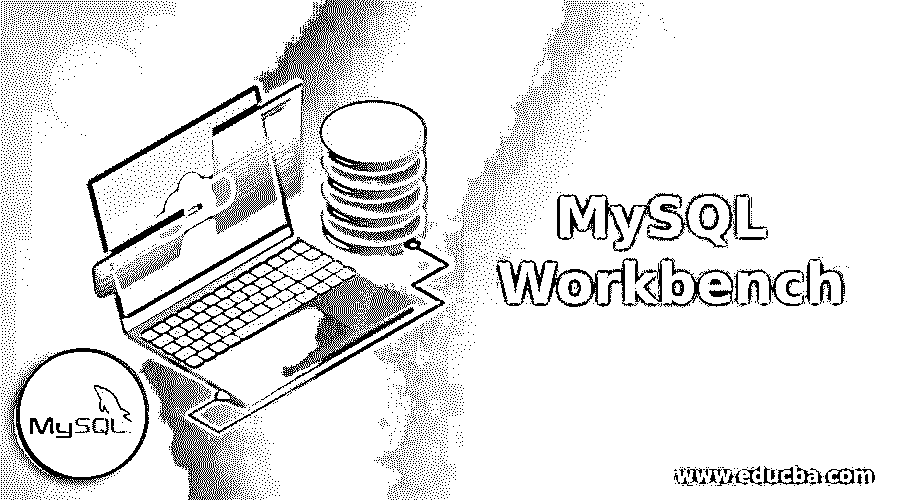
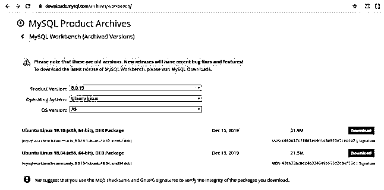
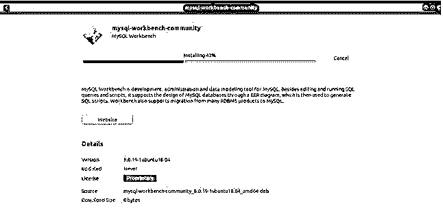
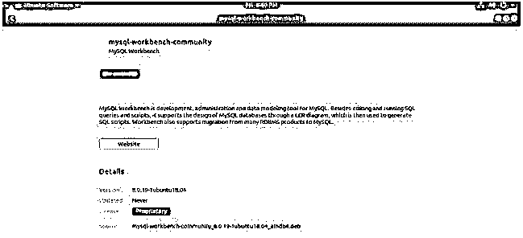
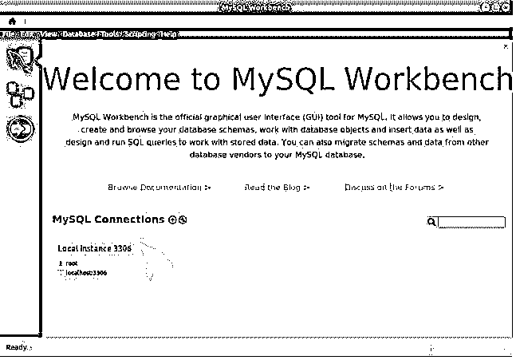

# MySQL 工作台

> 原文：<https://www.educba.com/mysql-workbench/>

## MYSQL Workbench 简介

Mysql workbench 是一个可视化图形工具，可用于数据库开发、建模、配置、设计、创建和维护数据库，包括使用交互式图形进行备份和恢复。它是一个复杂的工具，可供数据库的开发人员、架构师和管理员使用。它由 Sun Systems/Oracle 开发，完全跨平台，可以在 Mac Os x、Linux/Unix 和 windows 等操作系统上使用。

工作台的最新版本是 8.0.20。它支持使用 Mysql 5.6 或更高版本。对于剩余的 5.x MySQL 版本，它可以工作，但被剥夺了某些功能，而 MySQL workbench 不支持 MySQL version4.x。在本文中，我们将讨论工作台提供的特性以及它们可以在哪里使用，工作台的安装及其用法。

<small>Hadoop、数据科学、统计学&其他</small>

### MySQL Workbench 的功能和用法

以下是 MySQL Workbench 的特性:

1.  #### Design database

它为我们提供了许多可用于设计和建模的功能，例如可以创建复杂的 ER 模型，可以进行逆向和正向工程，还可以轻松地进行变更和文档管理，管理员、开发人员和架构师可以使用这些功能来设计他们的数据库。

2.  #### Development

可以创建和优化 SQL 查询，然后使用 MySQL workbench 提供的可视化工具进一步执行。有助于简化查询设计和执行任务的其他功能包括自动完成、使用不同颜色突出显示语法、提供查询的执行历史以及重用 SQL 片段。包括 MySQL fabric 在内的数据库的连接面板可以存储和管理各种数据库连接。借助于对象浏览器，可以立即访问数据库的模式和对象。

3.  #### Management

MySQL workbench 中提供了可视化控制台，数据库管理员和开发人员可以使用它来查看整个数据库环境。其他可用的工具在服务器配置、用户管理、审计数据以进行检查、查看数据库和备份的健康状况以及恢复数据方面也很有帮助。所有这些都可以通过使用可视化工具来完成。

4.  #### Instrument panel for performance analysis

使用 MySQL workbench 提供的工具套件可以分析和改进数据库应用程序的性能。它有助于找出 IO 热点以及将消耗大量时间和资源的 SQL 查询和语句。可以使用工作台的 performance dashboard 查看和分析性能指标。在工作台中，还建议和直观地解释了可以优化查询的其他点和地方。工作台的所有这些特性都可以用来提高数据库应用程序的性能。大多数涉及数据库数据检索和存储的应用程序的关键是基于查询执行及其性能。

5.  #### Move data into and out of the database

Workbench tool 为我们提供了解决方案和功能，可用于将数据从不同平台迁移到不同平台，如 Sybase ASE、Microsoft Access、PostgreSQL、Microsoft SQL Server，以及将其他对象、数据、关系数据库的表迁移到 MySQL。数据库管理员使用 workbench 可以很容易地将现有的应用程序转换到任何其他平台上，如 Windows、Linux 等。还可以使用工作台将数据从 MySQL 的旧版本迁移到新版本。

### Mysql 工作台的安装

可以使用以下链接在您的计算机上安装最新版本的 workbench:

https://downloads.mysql.com/archives/workbench/.

**步骤 1:** 您需要选择您想要安装的工作台版本和您正在使用的操作系统及其版本，然后单击下载选项，将下载符合您机器的可执行文件。例如，当我使用 Ubuntu Linux 操作系统时，我将选择我的操作系统和最新版本的 workbench，目前是 workbench 8.0.19。

Debian 文件将如下所示下载:

**步骤 2:** 此外，打开 Debian 文件后，如果您的操作系统是 ubuntu 软件中心，您将需要点击 install，如下所示，这将导致 workbench 的安装过程成功完成。

**第三步:**安装完成后，你会在 ubuntu 中心看到如下窗口。

**第四步:**您可以在仪表板中搜索 Mysql workbench，然后打开 workbench 应用程序。这将打开以下屏幕。

这是工作台应用程序的欢迎屏幕。

### MySQL Workbench 的优缺点

下面是提到的优点和缺点:

#### 优势

以下是优点:

*   用户界面非常易于使用，用户友好，直观。
*   它是 GPL 许可的，可以免费下载。
*   Workbench 支持跨平台，可以在不同的操作系统上使用，包括 Windows、Linux 和 mac os。
*   模式和查询的形成和优化可以使用图形可视化工具来完成。
*   它包含了所有的特性，这些特性随着 MySQL 数据库服务器的变化而不断更新，以使它完全支持 MySQL 数据库服务器。
*   EveSQL 开发了一个插件，可以与工作台一起使用，允许优化 ide 本身内部的查询。

#### 不足之处

以下是缺点:

*   根据一些用户的报告，该软件有时会崩溃，并且包含一些错误。
*   涉及大量记录的使用和操作的查询有时无法停止。在这些时候，您将不得不强制终止查询，或者如果不可能的话，终止工作台应用程序本身的实例。

### 结论

Mysql 是免费下载的，它提供了很多功能，这些功能都是考虑到 MySQL 数据库服务器本身的特性而集成的。数据库管理员、设计人员和开发人员可以利用该应用程序，通过 ER 图、正向和反向工程以及查询构建(包括查询优化)来设计数据库模式。通过查看和分析数据库环境，可以使用性能仪表板进一步优化您的数据库应用程序。

### 推荐文章

这是一个 MySQL 工作台的指南。这里我们讨论 MySQL Workbench 的介绍、特性和用法以及安装。您也可以浏览我们的其他相关文章，了解更多信息——

1.  [什么是 MySQL 模式？| MySQL 模式的类型](https://www.educba.com/what-is-a-mysql-schema/)
2.  [什么是 MySQL 数据库|优势](https://www.educba.com/what-is-mysql-database/)
3.  [如何安装 MySQL |教程](https://www.educba.com/install-mysql/)
4.  [如何将数据库连接到 MySQL？](https://www.educba.com/connect-database-to-mysql/)

