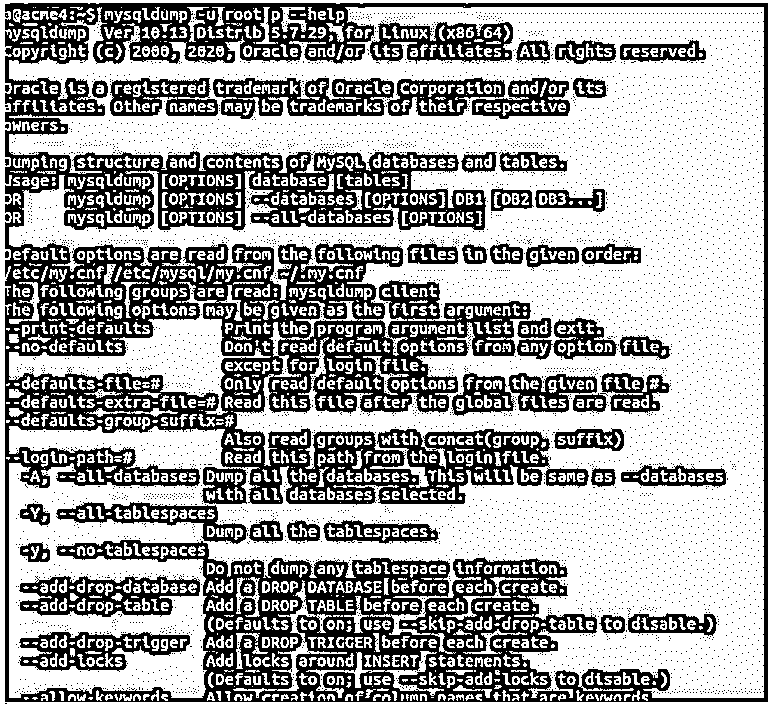
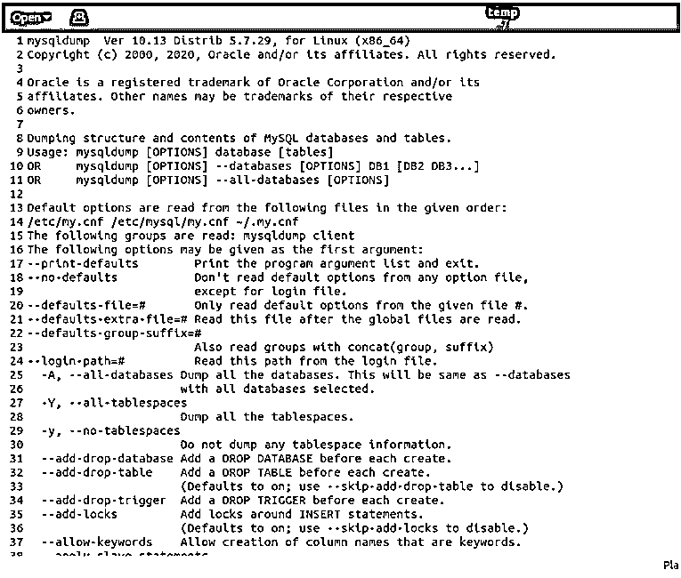
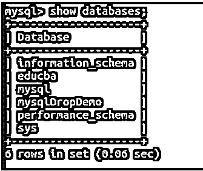
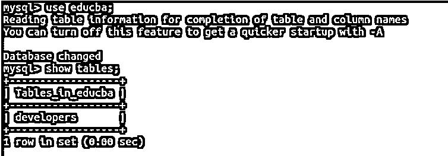
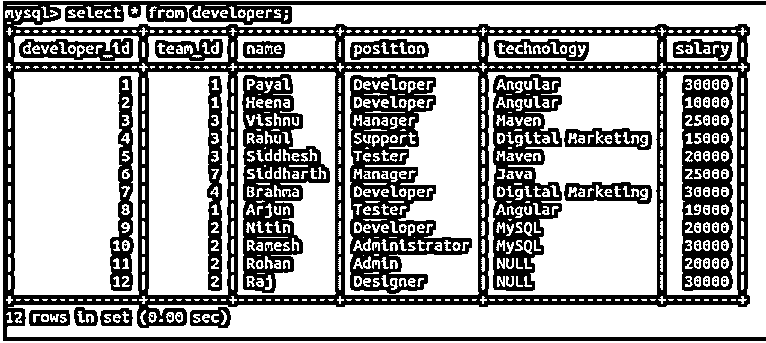
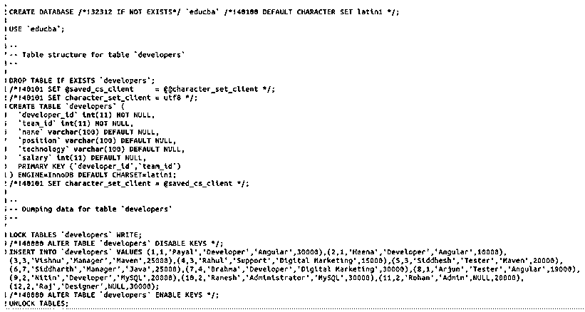
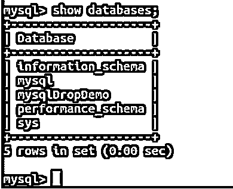
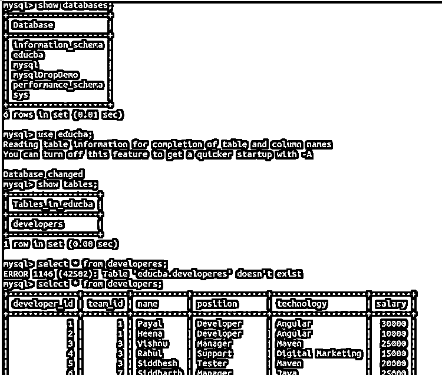

# mysqldump

> 原文：<https://www.educba.com/mysql-dump/>

## MySQL 转储简介

万一如果系统的数据库损坏或崩溃或丢失，那么我们应该能够恢复数据库中的数据。出于这个原因，MySQL 为我们提供了一个使用 mysqldump 实用程序来转储数据库的工具。只有当您的数据库是可访问的，并且该数据库的表上的 select 权限已分配给您，并且该数据库正在运行时，才能使用该实用程序。该实用程序创建一个逻辑备份和一个包含 SQL 语句的平面文件，可以再次运行该文件以将数据库恢复到创建该文件时的状态。该工具可用于单个或多个数据库备份。mysqldump 实用程序还可以用来生成 XML、CSV 或任何其他分隔文本形式的数据。

我们必须经常转储我们的数据库，以使数据库的更新备份对我们可用。每当备份恢复时，数据库将返回到使用 mysqldump 创建转储文件时的状态。

<small>Hadoop、数据科学、统计学&其他</small>

### 先决条件

在使用 mysqldump 实用程序时，我们应该对表、视图、触发器和事务拥有某些特权。这取决于我们正在备份的内容。如果我们要备份包含表的数据库，那么您应该拥有 select 权限，对于视图，必须拥有 SHOW VIEW 权限，对于触发器，必须拥有 TRIGGER 权限，如果我们在转储数据库时使用–single-transaction 选项，那么我们应该拥有 LOCK TABLES 权限。

类似地，在重载或恢复转储的数据时，我们必须拥有特权，例如 CREATE、INSERT 和 ALTER 特权，这些特权可能存在于将要执行的转储的平面文件中。当存储的程序为了保留编码字符而被转储时，ALTER 语句有时可能出现在转储文件中。此 ALTER 命令可能会导致数据库排序规则更改，因此需要具有 ALTER 特权。

### MySQL 转储的语法

我们可以通过转储一个或多个选定的表或转储一组一个或多个数据库来创建备份，也可以转储整个 MySQL 服务器，其中包含所有数据库和表以及其他对象。所有这三个功能都可以通过 mysqldump 命令来使用。但是，它们的语法各不相同，如下所述——

**转储一个或多个选定的表:**

`mysqldump [specified_options] name_of_database [name_of_table ...] > nameOfBackupFile.sql`

**转储一个或多个所选数据库:**

`mysqldump [specified_options] --databases name_of_database ... > nameOfBackupFile.sql`

### 转储整个 MySql 服务器

转储完整 mysql 服务器的语法有:

`mysqldump [specified_options] --all-databases > nameOfBackupFile.sql`

我们可以使用许多选项来指定一些对象的行为或值，例如-u 表示我们将登录时使用的用户名-p 表示密码和其他与定义转储行为相关的选项。可以指定许多不同类型的选项。它们分为以下几类

*   连接选项
*   选项-文件选项
*   DDL 选项
*   调试选项
*   帮助选项
*   国际化选项
*   复制选项
*   格式选项
*   过滤选项
*   性能选项
*   交易选项

要查看可用选项的完整列表，我们可以执行以下命令

`mysqldump -u root p –help`

这给出了显示所有选项及其用法的以下输出:

由于列表太大，您可以将其导出到文件中，然后打开文件来查看选项并搜索可以在您的上下文和用例中使用的选项。可以使用以下命令将输出导出到文件中

`mysqldump -u root p --help > temp`

**输出:**

在编辑器中打开的临时文件如下所示:

### MySQL 转储的示例

让我们考虑一个例子，我们将首先在我的数据库服务器上查询，以显示所有数据库

`show databases;`

**输出:**

现在，我们将使用 educba 数据库并检查其中的表。

`use educba;
show tables;`

**输出:**

现在让我们看看 developers 表中的所有记录。

`select * from developers;`

**输出:**

现在，让我们使用 mysqldump 命令导出 educba 数据库

`mysqldump -u root -p --databases educba > backupOfEducba.sql`

**输出:**

注意，我们必须退出 MySQL 命令 shell，然后执行上面的命令。之后，将在同一路径上创建一个名为 backupOfEducba.sql 文件的文件。打开该文件后，我们将看到它包含所有 SQL 命令，如果我们将该文件恢复到某个数据库，这些命令将重新创建 educba 数据库。下面是该文件的样子:

这是在转储 educba 文件后创建的转储平面文件，该文件包含创建数据库、创建表和插入查询以在表中插入记录的命令。

#### 还原数据库

现在，让我们使用以下命令删除数据库 educba

`DROP DATABASE educba;`

**输出:**

现在，使用以下命令确认可用的数据库

`show databases;`

**输出:**

我们可以看到 educba 数据库并不存在于我们的 MySQL 的数据库服务器中。现在，我们将从之前通过转储 Educba 数据库创建的备份文件 backupOfEducba.sql 中恢复 educba 数据库。

可以使用以下命令完成恢复:

`sudo mysql -u root -p < backupOfEducba.sql`

**输出:**

让我们检查 backup_educba 数据库的内容

`show database;
use educba;
MySQL
select * from developers;`

我们可以看到，名为 educba 的数据库被再次创建，并包含与开发人员的表以及该表的所有记录相同的内容。

### 推荐文章

这是一个 MySQL 转储指南。在这里，我们还将讨论 mysql dump 的介绍和语法，以及不同的示例和代码实现。您也可以看看以下文章，了解更多信息–

1.  [MySQL 中的唯一键](https://www.educba.com/unique-key-in-mysql/)
2.  [MySQL 中的运算符](https://www.educba.com/mysql-in-operator/)
3.  [MySQL 子查询](https://www.educba.com/mysql-subquery/)
4.  MySQL 中的 IF 语句

