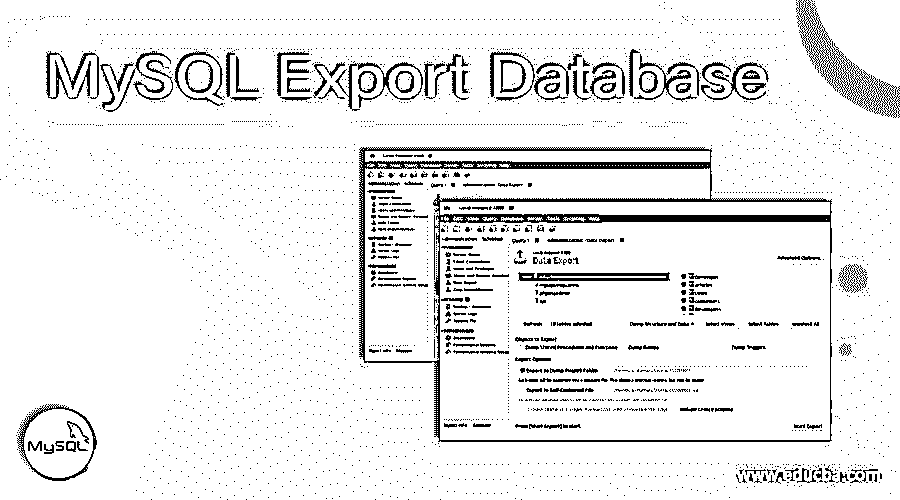
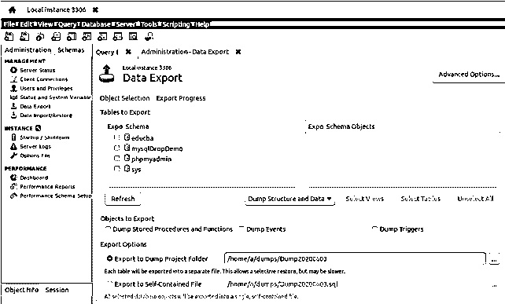
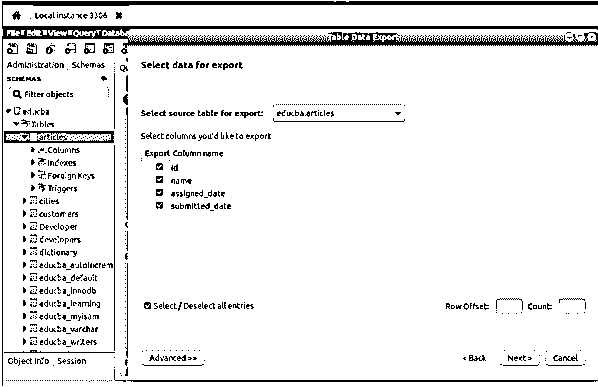
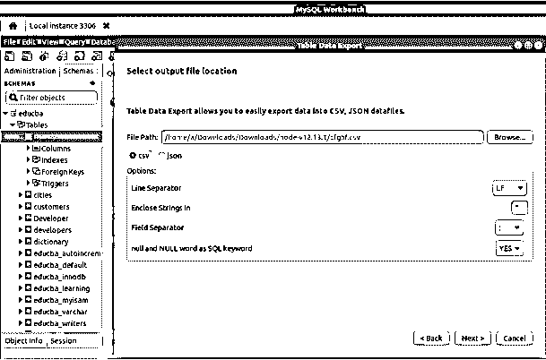
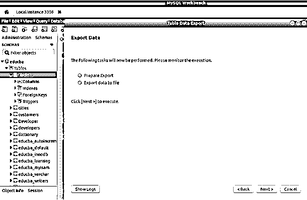
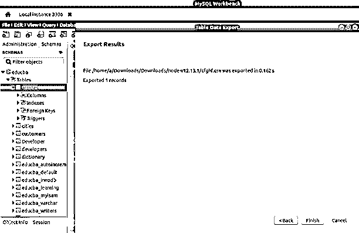
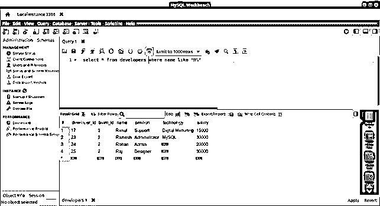
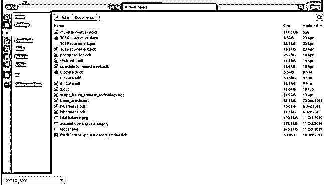

# MySQL 导出数据库

> 原文：<https://www.educba.com/mysql-export-database/>

## MySQL 导出数据库简介

在 MySQL 中，我们将数据以表格的形式存储在数据库中。很多时候，需要将存储在 MySQL 数据库表中的数据转换成其他格式，比如 CSV、JSON 或 SQL 格式。这通常是我们在多个公司和个人之间进行数据传输和共享时的需求。

如果我们有导出的 CSV 格式的数据库数据及其表格内容，那么这些数据可以进一步用于其他平台，如 google docs、open office 或 Microsoft Excel，以进一步分析结果集，并通过对导出的数据执行各种操作得出必要的统计数据，从而得出某些结论。当 MySQL 数据以 JSON 格式导出时，我们可以将这些数据传输到其他应用程序，因为 JSON 是目前最受欢迎的数据传输方法。此外，MySQL 数据还可以导出或转储到 SQL 文件中，这些文件可以用作备份文件，并且为特定数据库或表内容导出的命令可以在某个不同或相同的 MySQL 服务器上再次运行，以实现类似于数据导出时的数据库状态。

<small>Hadoop、数据科学、统计学&其他</small>

在本文中，我们将学习如何在使用 MySQL Workbench 编辑器时将 MySQL 的数据导出为各种格式。注意，mysqldump 命令也可以通过命令行将数据导出为 SQL 格式。除此之外，我们可以使用 INTO OUTFILE 语句将 MySQL 数据库的数据及其内容导出为任何其他格式，如。csv 或。使用命令行 MySQL shell。

### 以 SQL 格式导出 Workbench 中的数据库和表

您可以在 MySQL workbench 的第一个屏幕中选择管理向导中提供的“数据导出”选项，或者转到上部的服务器菜单，然后选择“数据导出”选项来打开 MySQL 的导出向导，如下所示

在这里，您可以选择要导出其内容或整个数据库本身的数据库。单击所需的数据库名称后，您将看到在右侧窗口中自动选择了其中的所有表，如下图所示。点击 educba 数据库后，在右边的窗口中可以看到其中所有的表都被选中了。如果您想导出整个数据库内容，或者选择要导出的特定表，并单击 start export 按钮来初始化导出过程，您可以保持原样。

点击开始导出 MySQL 转储文件。将在指定的导出选项路径上创建 sql 格式。

### 在 Workbench 中将数据导出为任何其他格式

您可以通过转到工作台工具左侧栏中提到的 schemas 选项卡来导出表内容和结构。然后，您可以右键单击要导出的数据库表，然后单击“表数据导出向导”，这将打开导出向导，如下图所示。在这里您将看到该表中自动选择用于导出的所有列的列表。您可以通过更改选定的列来进一步选择要导出的列，然后单击底部按钮中的“下一步”按钮，如下所示

如果您单击下面的“高级”按钮，您可以键入等效的查询，其结果数据和内容将被导出。单击“下一步”按钮后，您可以选择需要导出文件的路径以及您希望导出 CSV 或 JSON 的格式类型，如果是 CSV，您可以选择与要导出的数据相关的选项，并指定导出数据时需要应用的不同属性，如要考虑的字段分隔符和空字解释等，如下所示

点击“下一步”后，如果指定路径中存在相同名称和格式的相同文件，它会询问您是否要覆盖该文件，或者只是提到导出时将遵循和执行的步骤，如下所示

点击“下一步”后，您将看到一条消息，提示文件已成功导出，如下所示

您可以看到，在成功运行导出过程后，将在指定的路径中创建所需格式的导出文件。

### 导出查询结果集

还可以导出在 Workbench 中执行的任何 select 查询的结果集，只需单击 export 按钮，然后指定文件的路径和名称。注意，在使用命令行的 MySQL 中，我们可以使用 INTO OUTFILE 语句导出查询结果。让我们借助一个例子来看看如何在 workbench 中导出查询的结果集。考虑下面的 select 查询，该查询检索以字母 R 开头的所有开发人员的姓名，如下所示

`select * from developers where name like "R%";`

在执行查询后，它会给出以下输出–

现在，我们可以单击导出按钮，打开文件，我们可以通过键入文件来选择文件的路径和名称，如下所示

您可以从 CSV、HTML、XML、JSON、SQL 或 Excel 中选择您想要的报告格式，从下面左上角提供的选择列表中选择。只需单击 save，您的文件将与检索到的结果集一起导出。

### 结论

我们可以使用 MySQL 的客户端工具(如 Workbench ),甚至使用命令行 mysqldump 命令来创建 MySQL 中的数据库、表内容和结构或 MySQL 查询的输出结果集。sql 导出文件或使用 INTO OUTFILE 语句。

### 推荐文章

这是一个 MySQL 导出数据库的指南。这里我们分别讨论 SQL 格式的简介、导出数据库和 Workbench 中的表。您也可以看看以下文章，了解更多信息–

1.  [MySQL 拆分](https://www.educba.com/mysql-split/)
2.  [MySQL 存在](https://www.educba.com/mysql-exists/)
3.  [MySQL 删除触发器](https://www.educba.com/mysql-delete-trigger/)
4.  [MySQL 查询缓存](https://www.educba.com/mysql-query-cache/)

