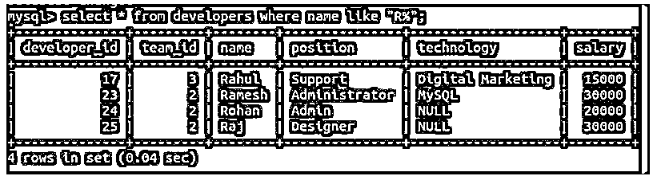
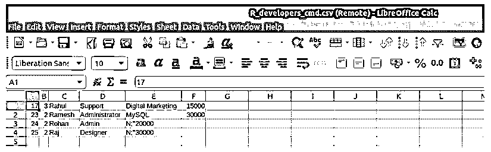
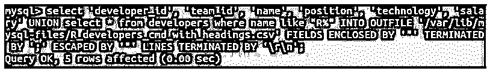
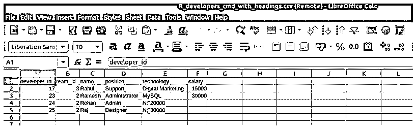
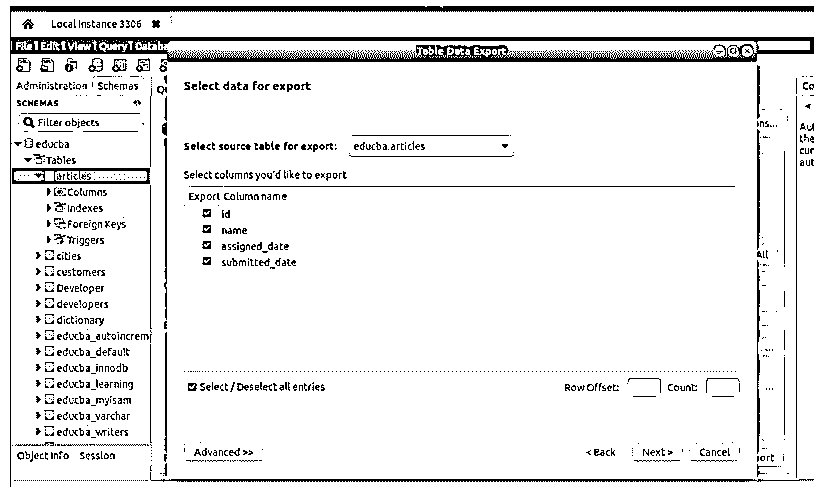
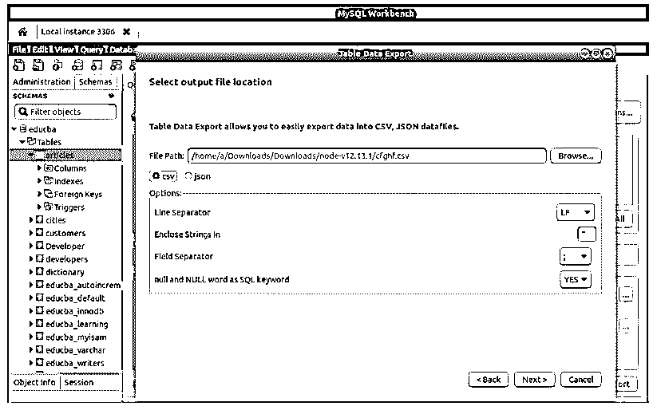
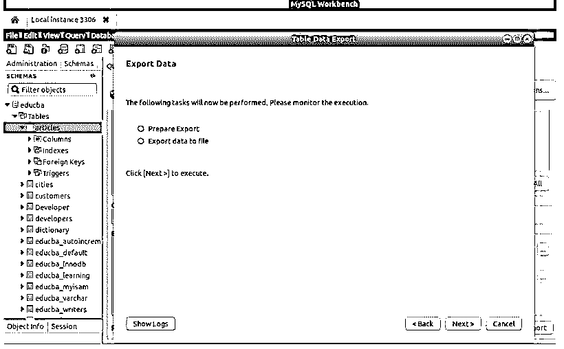
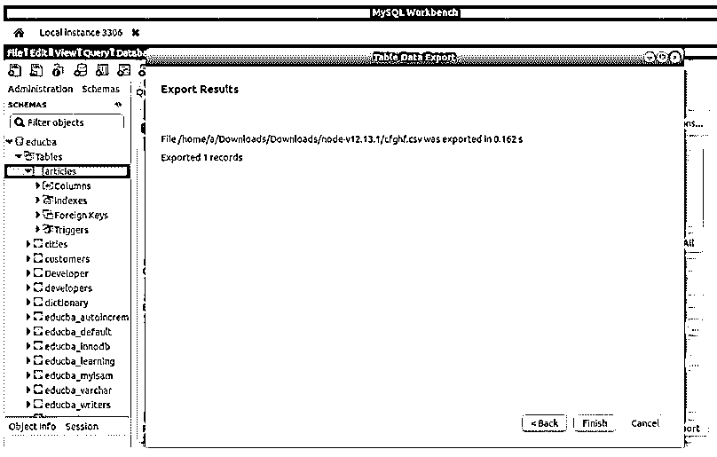
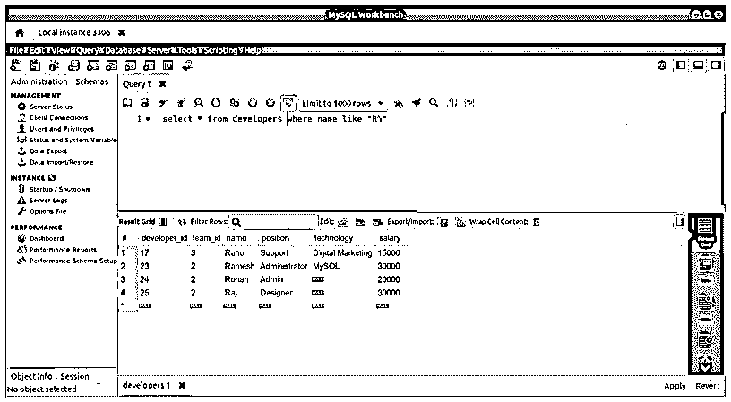
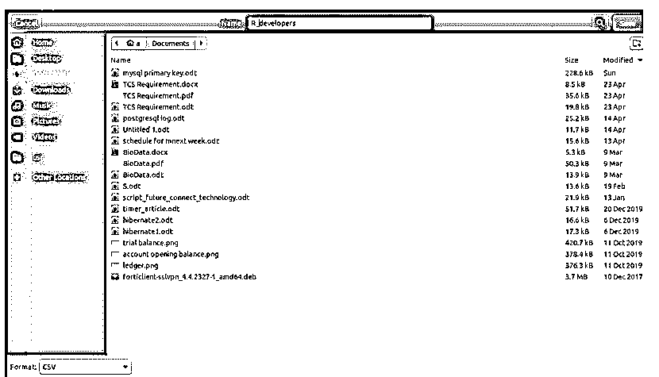

# MySQL 导出到 CSV

> 原文：<https://www.educba.com/mysql-export-to-csv/>

## **MySQL 导出到 CSV 简介**

以下文章提供了 MySQL 导出到 CSV 的概要。在 MySQL 中，我们将数据以表格的形式存储在数据库中。很多时候，有必要将存储在 MySQL 数据库表中的数据转换成其他格式，比如 CSV、JSON 或 SQL 格式。这通常是我们在多个公司和个人之间进行数据传输和共享时的需求。如果我们以 CSV 格式导出了数据库的数据及其表格内容，则可以在其他平台(如 google docs、open office 或 Microsoft Excel)中进一步使用这些数据，以进一步分析结果集，并通过对导出的数据执行各种操作得出必要的统计数据，从而得出某些结论。

在本文中，我们将了解如何使用 INTO OUTFILE 语句，通过命令行 MySQL shell 将 MySQL 数据库的数据及其内容导出为任何 CSV 格式，并且在使用 MySQL Workbench 编辑器时，我们可以借助一个示例将 MySQL 的数据导出为 CSV 格式。

<small>Hadoop、数据科学、统计学&其他</small>

### 使用命令行 MySQL 查询导出

在导出为 CSV 格式之前，我们需要确保在所使用的路径上不存在与查询中提到的文件同名的其他文件，并且 MySQL 的服务器必须对保存 CSV 文件的指定路径或文件夹具有写权限。

考虑以下查询语句，该语句检索姓名以 r 开头的开发人员的数据。

**代码:**

`select * from developers where name like "R%";`

**输出:**

要将结果集导出到 CSV 文件，我们将使用 INTO OUTFILE 子句，如下所示。

**代码:**

`select * from developers where name like "R%" INTO OUTFILE 'https://cdn.educba.com/var/lib/mysql-files/R_developers_cmd.csv' FIELDS ENCLOSED BY '"' TERMINATED BY ';' ESCAPED BY '"' LINES TERMINATED BY '\r\n';`

**输出:**

当在 libreoficecalc 的 Microsoft Excel 中打开时，导出的 CSV 文件将如下所示。

您可以看到，只有数据被导出，但列标题没有被导出。如果您想要导出列的标题名，那么您可以使用下面的查询语句。

**代码:**

`select 'developer_id', 'team_id', 'name', 'position', 'technology', 'salary' UNION select * from developers where name like "R%" INTO OUTFILE 'https://cdn.educba.com/var/lib/mysql-files/R_developers_cmd_with_headings.csv' FIELDS ENCLOSED BY '"' TERMINATED BY ';' ESCAPED BY '"' LINES TERMINATED BY '\r\n';`

**输出:**

当在 LibreOffice calc 的 Microsoft Excel 中打开时，导出的 CSV 文件将如下所示。

### 在 Workbench 中将数据导出为任何其他格式

您可以通过转到工作台工具左侧栏中提到的 schemas 选项卡来导出表内容和结构。然后，您可以右键单击要导出的数据库表，然后单击“表数据导出向导”，这将打开导出向导，如下图所示。在这里您将看到该表中自动选择用于导出的所有列的列表。您可以通过更改选定的列来进一步选择要导出的列，然后单击底部按钮中的“下一步”按钮，如下所示。

如果您单击下面的“高级”按钮，您可以键入等效的查询，其结果数据和内容将被导出。单击“下一步”按钮后，您可以选择需要导出文件的路径以及您希望导出 CSV 或 JSON 的格式类型，如果是 CSV，您可以选择与要导出的数据相关的选项，并指定导出数据时需要应用的不同属性，如要考虑的字段分隔符和空字解释等，如下所示。

点击“下一步”后，如果指定路径中存在相同名称和格式的相同文件，它会询问您是否要覆盖该文件，或者只是提到导出时将遵循和执行的步骤，如下所示。

单击“下一步”后，您将看到一条消息，说明文件已成功导出，如下所示。

您可以看到，在成功运行导出过程后，将在指定的路径中创建所需格式的导出文件。

### 导出查询结果集

还可以导出在 Workbench 中执行的任何 select 查询的结果集，只需单击 export 按钮，然后指定文件的路径和名称。注意，在使用命令行的 MySQL 中，我们可以使用 INTO OUTFILE 语句导出查询结果。让我们借助一个例子来看看如何在 workbench 中导出查询的结果集。

考虑下面的 select 查询，该查询检索以字母 R 开头的所有开发人员的姓名，如下所示。

**代码:**

`select * from developers where name like "R%";`

**输出:**

现在，我们可以单击 export 按钮打开文件，我们可以通过键入文件来选择文件的路径和名称，如下所示。

您可以从 CSV、HTML、XML、JSON、SQL 或 Excel 中选择您想要的报告格式，从下面左上角提供的选择列表中选择。我们将选择 CSV 选项，因为我们希望将数据导出为 CSV 格式。只需单击 save，您的文件将与检索到的结果集一起导出。

### 结论

我们可以使用命令行、MySQL 查询语句甚至 MySQL Workbench 客户端工具中提供的各种选项来导出文件。在上述两种方法中，我们可以指定回车符、文件和行分隔符，甚至可以指定列值应该包含的值。

### 推荐文章

这是一个 MySQL 导出到 CSV 的指南。这里我们讨论使用命令行 MySQL 查询导出、在 workbench 中将数据导出为任何其他格式以及导出查询结果集。您也可以看看以下文章，了解更多信息–

1.  [MySQL 中的自然连接](https://www.educba.com/natural-join-in-mysql/)
2.  [MySQL ROW_NUMBER()](https://www.educba.com/mysql-row_number/)
3.  [MySQL DATE_SUB()](https://www.educba.com/mysql-date_sub/)
4.  [MySQL DECODE()](https://www.educba.com/mysql-decode/)

