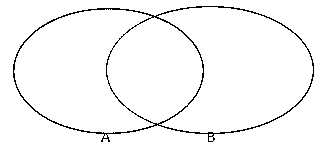
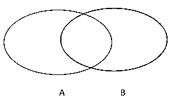
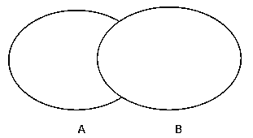
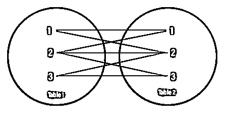

# 加入 MySQL

> 原文：<https://www.educba.com/joins-in-mysql/>


## MySQL 中的连接介绍

MySQL Joins 在根据两个表共享的一个或多个公共值将两个表连接在一起时起着重要的作用。

**示例**:假设我们有两张表；一个是由 employee_id、phn_no、salary 和 department 组成的 employee 表。另一个表是由 employee_id 和 address 组成的 address 表。因此，如果我们需要找出 employee_id、department 和 address，那么我们必须连接这两个表，共享一个公共字段作为 employee_id。

<small>Hadoop、数据科学、统计学&其他</small>

**查询**:

```
SELECT e1.employee_id, e1.department, a1.address
FROM employee e1
INNER JOIN address a1
ON e1.employee_id = a1.employee_id;
```

### MySQL 中最常见的 6 种连接类型

MySQL 中有不同类型的连接。下面提到的连接在日常使用中会遇到，在实际场景中执行许多查询时最有用。

1.  内部连接
2.  左连接
3.  右连接
4.  完全外部连接
5.  自连接
6.  交叉连接

#### 1.内部连接

内部联接返回两个表中匹配的值。


这部分出现在输出中，如上图所示。

**例#1:**

| **雇员标识** | **部门** | **工资** |
| **第 1001 章** | 信息技术 | One thousand |
| **第 1002 章** | 企业社会责任 | Eight hundred |
| **第 1003 章** | 信息技术 | Two thousand |

这是雇员表。

| **雇员标识** | **地址** |
| **第 1002 章** | 德里 |
| **第 1003 章** | 班加罗尔 |
| **第 1005 章** | Bbsr |

这是那些雇员的地址表。父表 employee 的主键 emp_id 被用作子表 address 表中的外键。我们将使用内部连接找到一个雇员的 emp_id、部门和地址。因为内部连接状态，它获取两个表中存在/共有的记录。

**查询:**

```
SELECT emp.emp_id, emp.department, ads.address
FROM employee AS emp
INNER JOIN address AS ads
ON emp.emp_id = ads.emp_id;
```

我们给表名一个别名，只是为了避免更多的时间消耗。例如，在上面的查询中，我们对雇员表使用别名“emp ”,对地址表使用别名“ads”。

**输出:**

| **雇员标识** | **部门** | **地址** |
| **第 1002 章** | 企业社会责任 | 德里 |
| **第 1003 章** | 信息技术 | 班加罗尔 |

和上面的例子一样，emp_id 1002 和 1003 在两个表之间是通用的；inner join 命令只获取这些雇员的输出。

**例 2:**

这里我们有两个表，表 1 和表 2。这两个表都包含一个属性，分别作为列 A 和列 B。

**表 1**

| **A 列** |
| **1** |
| **1** |
| **2** |
| **3** |
| **4** |

**表 2**

| **B 列** |
| **1** |
| **2** |
| **2** |
| **3** |
| **3** |
| **5** |

**查询:**

```
If we apply inner join here,
SELECT * FROM Table1
INNER JOIN table2
ON columnA = columnB;
```

**输出:**

| **A 列** | **B 列** |
| **1** | One |
| **1** | 空 |
| **2** | Two |
| **Null** | Two |
| **3** | Three |
| **Null** | Three |

#### 2.左连接

该连接返回左表中的所有记录和右表中的匹配记录。




如上图所示，它包含表 A 的所有记录以及 A 和 b 中的公共记录。

**例#1:**

| **客户标识** | **名称** | **城市** |
| **1** | 哈里什 | 卡塔克 |
| **2** | 大卫 | 班加罗尔 |
| **3** | 马赫什 | 布巴内斯瓦尔 |
| **4** | 萨姆（男子名） | 加尔各答 |

**客户表:**

| **订单 id** | **金额** | **客户标识** |
| **19868 年** | Seven thousand five hundred and seventy-five | Four |
| **19976** | Four hundred and thirty-four thousand six hundred and fifty-four | Two |
| **99680** | Seven thousand four hundred and fifty-seven | Three |

**订单表:**

我们将使用 left join 找出关联的 customer_id、name 和 order_id。

**查询:**

```
SELECT cust.Customer_id, cust.Name, ord.Order_id
FROM customer cust
LEFT JOIN order ord
ON cust.customer_id = ord.customer_id;
```

**输出:**

| **客户标识** | **名称** | **订单 id** |
| **1** | 哈里什 | 空 |
| **2** | 大卫 | Nineteen thousand nine hundred and seventy-six |
| **3** | 马赫什 | Ninety-nine thousand six hundred and eighty |
| **4** | 萨姆（男子名） | Nineteen thousand eight hundred and sixty-eight |

正如我们所讨论的，这个 left join 从 customer 表中获取所有的客户 id 以及两个表之间的公共 id。customer _ id“1”将显示为“null ”,因为“1”customer _ id 不在订单表中。

**例二:**

这里我们有两个表，表 1 和表 2。这两个表都包含一个属性，分别作为列 A 和列 B。

**表 1**

| **A 列** |
| **1** |
| **1** |
| **2** |
| **2** |
| **3** |

**表 2**

| **B 列** |
| **1** |
| **2** |
| **2** |
| **4** |
| **4** |
| **5** |
| **5** |

**查询:**

```
If we apply left join on above 2 tables,
SELECT * FROM table1
LEFT JOIN table2
ON columnA = columnB;
```

| **A 列** | **B 列** |
| **1** | One |
| **1** | 空 |
| **2** | Two |
| **2** | Two |
| **3** | 空 |

#### 3.右连接

该连接返回右表中的所有记录和左表中的匹配记录。




上图显示了它从表 B 和公共记录中获取所有记录，这两个表中都存在。

**举例:**

| **客户标识** | **名称** | **城市** |
| **3** | 马赫什 | 布巴内斯瓦尔 |
| **4** | 萨姆（男子名） | 加尔各答 |
| **5** | 随机存取存储器(random access memory 的缩写)ˌ随机访问内存(random-access memory 的缩写) | 孟买 |

**客户表:**

| **订单 id** | **金额** | **客户标识** |
| **19868 年** | Seven thousand five hundred and seventy-five | Four |
| **19976** | Four hundred and thirty-four thousand six hundred and fifty-four | Two |
| **99680** | Seven thousand four hundred and fifty-seven | Three |

**订单表:**

我们将使用正确的连接找出与其相关联的 customer_id、name 和 order_id。

**查询:**

```
SELECT cust.Customer_id, cust.Name, ord.Order_id
FROM customer cust
RIGHT JOIN order ord
ON cust.customer_id = ord.customer_id;
```

**输出:**

| **客户标识** | **名称** | **订单 id** |
| **2** | 空 | Nineteen thousand nine hundred and seventy-six |
| **3** | 马赫什 | Ninety-nine thousand six hundred and eighty |
| **4** | 萨姆（男子名） | Nineteen thousand eight hundred and sixty-eight |

因为我们在这里执行了 right join，所以查询从 order 表和 common 记录中获取了所有的客户 id，这两个表都有。

#### 4.完全外部连接

如果一个公共字段是共享的，则完全外连接将返回两个表中的所有记录。




**举例:**

| **客户标识** | **名称** | **城市** |
| **3** | 马赫什 | 布巴内斯瓦尔 |
| **4** | 萨姆（男子名） | 加尔各答 |
| **5** | 随机存取存储器(random access memory 的缩写)ˌ随机访问内存(random-access memory 的缩写) | 孟买 |

**客户表:**

| **订单 id** | **金额** | **客户标识** |
| **19868 年** | Seven thousand five hundred and seventy-five | Four |
| **19976** | Four hundred and thirty-four thousand six hundred and fifty-four | Two |
| **99680** | Seven thousand four hundred and fifty-seven | Three |

**订单表:**

我们将使用一个完整的外部连接找出与其相关联的 customer_id、name 和 order_id。

**查询:**

```
SELECT cust.Customer_id, cust.Name, ord.Order_id
FROM customer cust
FULL OUTER JOIN order ord
ON cust.customer_id = ord.customer_id;
```

**输出:**

| **客户标识** | **名称** | **订单 id** |
| **2** | 空 | Nineteen thousand nine hundred and seventy-six |
| **3** | 马赫什 | Ninety-nine thousand six hundred and eighty |
| **4** | 萨姆（男子名） | Nineteen thousand eight hundred and sixty-eight |
| **5** | 随机存取存储器(random access memory 的缩写)ˌ随机访问内存(random-access memory 的缩写) | 空 |

这个完整的外部连接从 customer 表和 order 表中获取所有的客户 id。

#### 5.自连接

自联接是一种常规联接，这里表只与自身联接。

| **雇员标识** | **名称** | **电话号码** | **城市** | **国家** |
| **第 1001 章** | R.马德万 | Nine billion six hundred and eighty-seven million six hundred and eighty-seven thousand six hundred and ninety-eight | 班加罗尔 | 印度 |
| **第 1002 章** | 戈布·夏尔马 | Nine billion eight hundred and fifty-six million four hundred and fifty-three thousand four hundred and twenty-three | 浦那 | 印度 |
| **第 1003 章** | 德巴西什达斯 | Eight billion seven hundred and sixty-five million four hundred and fifty-six thousand seven hundred and eighty-seven | 孟买 | 印度 |
| **第 1004 章** | 无尾根 | Four billion five hundred and sixty-seven million seven hundred and eighty-eight thousand six hundred and thirty-five | 浦那 | 印度 |
| **第 1005 章** | 桑比特卡尔 | Eight billion seven hundred and eighty-nine million eight hundred and eighty-seven thousand eight hundred and seventy-three | 海得拉巴 | 印度 |

这是由几个字段组成的雇员表。我们会找出住在同一个城市的员工。

**查询**:

```
SELECT e1.name AS Employee_name1, e2.name AS employee_name2, e1.City
FROM employee e1, employee e2
WHERE e1.name <> e2.name
AND e1.city = e2.city;
```

**输出**:

| **员工姓名 1** | **员工姓名 2** | **e1 .城市** |
| **戈布夏尔马** | 无尾根 | 浦那 |
| **Amit 路由器** | 戈布·夏尔马 | 浦那 |

#### 6.交叉连接

这种连接产生的结果是，第一个表中的行数与第二个表中的行数相乘。这种结果叫做笛卡尔积。如果我们对这个连接使用 WHERE 子句，那么它将作为一个内部连接。




**例如:**

| **产品标识** | **产品名称** | **生产单位** | **公司 id** |
| **1** | Chex 混合 | 换极开关 | Twelve |
| **2** | Cheez-it | 换极开关 | Fifteen |
| **3** | 饼干 | 换极开关 | Sixteen |

**产品** **表:**

| **公司 id** | **公司名称** | **公司 _ 城市** |
| **15** | 美食家 | 德里 |
| **16** | 杰克·吉尔 | 卡塔克 |
| **17** | 自然的 | 班加罗尔 |

**公司** **表:**

我们将对这些表应用交叉连接。

**查询**:

```
SELECT p.product_name, p.prod_unit, c.company_name
FROM product p
CROSS JOIN company c;
```

**输出**:

| **p.product_name** | **生产单位** | **c .公司名称** |
| **Chex mix** | 换极开关 | 美食家 |
| Cheez-it | 换极开关 | 美食家 |
| **饼干** | 换极开关 | 美食家 |
| **Chex mix** | 换极开关 | 杰克·吉尔 |
| Cheez-it | 换极开关 | 杰克·吉尔 |
| **饼干** | 换极开关 | 杰克·吉尔 |
| **Chex mix** | 换极开关 | 自然的 |
| Cheez-it | 换极开关 | 自然的 |
| **饼干** | 换极开关 | 自然的 |

### 结论

在实时场景和其他一些技术中，这些连接的重要性非常重要。在 Tableau 和 Power BI 等可视化工具中，连接扮演着至关重要的角色。这种结构化的实践是嵌入这些新技术和技能的关键。

### 推荐文章

这是 MySQL 中连接的指南。在这里，我们讨论 MySQL 中的基本概念和前 6 种连接类型，如 Inner、Left、Right、Full、Self、Cross 及其示例，以及查询和输出。您也可以浏览我们推荐的文章，了解更多信息——

1.  [MySQL 命令](https://www.educba.com/mysql-commands/)
2.  [MySQL 操作符](https://www.educba.com/mysql-operators/)
3.  [MySQL vs SQLite](https://www.educba.com/mysql-vs-sqlite/)
4.  [MySQL 字符串函数](https://www.educba.com/mysql-string-functions/)


