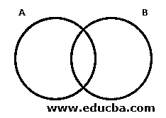
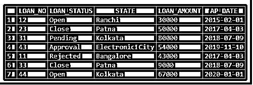
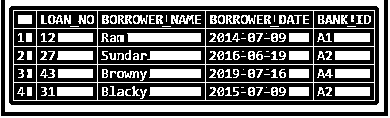
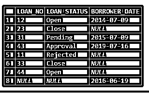
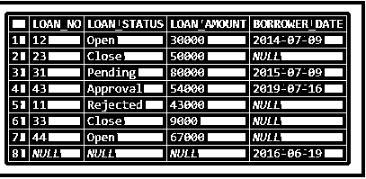
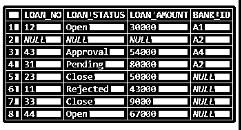

# MySQL 外部连接

> 原文：<https://www.educba.com/mysql-outer-join/>

## MySQL 外部连接简介

MySQL 外部连接被认为有三种类型:-

*   [完全外部连接](https://www.educba.com/oracle-full-outer-join/)
*   [左外连接](https://www.educba.com/left-outer-join-in-mysql/)–与左连接相同。
*   右外部联接–与右联接相同。

### 完全外部连接

完全联接从两个表中获取所有行。在这一节中，让我们讨论更多最常用的完全连接。

<small>Hadoop、数据科学、统计学&其他</small>

**举例:**

下面是完全连接的维恩图。

**语法:**

`SELECT * FROM TABLE_A A
FULL OUTER JOIN TABLE_B B
ON A. Common_COLUMN =B. Common_COLUMN
WHERE <Condition>`

结果集包含空集值。以下语法可用于忽略空值:–

`SELECT * FROM TABLE_A A
FULL OUTER JOIN TABLE B B
ON A. Common_COLUMN =B. Common_COLUMN
WHERE A.Common_COLUMN IS NULL
AND A.Common_COLUMN IS NULL`

### 完全外连接与右连接的主要区别

让我们讨论一下完全外连接和右连接的主要区别。

| **完全外部连接** | **右连接** |
| 考虑两个表上的所有行。 | 考虑右表中的所有行和两个表中的公共行。 |
| 两个表中的所有行 | 内部联接+右表中的所有行 |
| 基于条件的连接 | 基于条件的连接 |
| ON 关键字用于指定条件和连接表。 | ON 关键字用于指定条件和连接表。 |
| The result set contains NULL set values. Below syntax can be used to neglect the NULL values: –SELECT * FROM TABLE_A A完全外部连接表 B BON a . Common _ COLUMN = b . Common _ COLUMN其中 B.Common_COLUMN 为空 | The result set contains NULL set values. Below syntax can be used to neglect the NULL values: –SELECT * FROM TABLE_A A右连接表 B BON a . Common _ COLUMN = b . Common _ COLUMN其中. Common_COLUMN 为空 |
| SELECT * FROM TABLE_A完全外部连接表 BON a . Common _ COLUMN = b . Common _ COLUMN | SELECT * FROM TABLE_A右连接表 BON a . Common _ COLUMN = b . Common _ COLUMN |

### 如何在 MySQL 中使用全外连接？

*   完全外部联接=两个表中的所有行
*   考虑两个表中的所有行。不匹配的行将获得空值
*   基于条件的连接
*   ON 关键字用于指定条件和连接表。

### 例子

下面举几个例子

#### 示例#1

让我们考虑两个表，并对这两个表应用完全外连接:

**贷款表**:

**借款人** **表:**

查询以从两个表中获取 loan_no、status 和借方日期。

**查询:**

`SELECT L.LOAN_NO, L.LOAN_STATUS, B.BORROWER_DATE
FROM LOAN L FULL OUTER JOIN BORROWER B
ON L.LOAN_NO=B.LOAN_NO`

在对它们应用了正确的连接之后，让我们检查一下上表的输出。

**输出:**

结果集包含空集值。

以下语法可用于忽略空值:–

`SELECT * FROM TABLE_A A
FULL OUTER JOIN TABLE B B
ON A. Common_COLUMN =B. Common_COLUMN
WHERE A.Common_COLUMN IS NULL`

让我们考虑两个表，并对这两个表应用完全外连接:

查询以从两个表中获取 loan_no、status、loan_aount 和借方日期。

**查询:**

`SELECT L.LOAN_NO, L.LOAN_STATUS,L.LOAN_AMOUNT, B.BORROWER_DATE
FROM LOAN L FULL OUTER JOIN BORROWER B
ON L.LOAN_NO=B.LOAN_NO`

在对它们应用完整的外部连接后，让我们检查上表的输出。

**输出:**

在上表中，贷款是右表，借款人是左表。与完全外连接一样，我们从两个表中获取所有行。这里我们从贷款表和借款人表中获取所有行。不存在的值将为空。

#### 实施例 2

让我们考虑两个表，并对这两个表应用完全外连接:

查询以从两个表中获取 loan_no、status、loan_aount 和借方日期。

**查询:**

`SELECT L.LOAN_NO, L.LOAN_STATUS,L.LOAN_AMOUNT, B.BANK_ID
FROM BORROWER B FULL OUTER JOIN LOAN L
ON L.LOAN_NO=B.LOAN_NO`

在对它们应用完整的外部连接后，让我们检查上表的输出。

**输出:**

在上表中，贷款是右表，借款人是左表。与完全外连接一样，我们从两个表中获取所有行。这里我们从贷款表和借款人表中获取所有行。不存在的值将为空。

### 结论

为了获取与客户需求相关的数据，我们可能需要连接表，这将通过连接来实现。如前所述，连接用于从多个表中获取数据。要连接多个表，我们需要两个表中至少有一个公共列。基于指定的条件连接表。

### 推荐文章

这是一个 MySQL 外连接的指南。这里我们讨论如何在 MySQL 中使用全外连接，以及全外连接和右连接的主要区别和例子。您也可以看看以下文章，了解更多信息–

1.  MySQL 中的[表](https://www.educba.com/table-in-mysql/)
2.  [MySQL 聚合函数](https://www.educba.com/mysql-aggregate-function/)
3.  [PostgreSQL 中的左外连接|示例](https://www.educba.com/left-outer-join-in-postgresql/)
4.  SQL 中的左外连接|如何工作？

