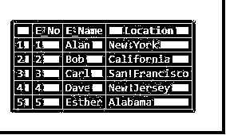
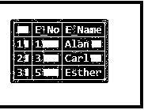
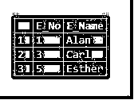
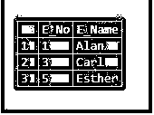

# MySQL 中的自然连接

> 原文：<https://www.educba.com/natural-join-in-mysql/>

## MySQL 中的自然连接介绍

MYSQL 中的自然连接是 SELECT 查询中使用的连接操作，用于从两个或多个具有公共列名的表中检索行。我们需要确保两个表中的公共列具有相同的数据类型。我们知道 JOIN 是一个带条件的叉积，这意味着输出是基于指定的条件从多个表中得到的。NATURAL JOIN 有这个预定义的“条件”,即输出是所研究的所有表中公共列的乘积。

### 句法

自然连接语法如下:

<small>Hadoop、数据科学、统计学&其他</small>

`SELECT row_name from table_1_name NATURAL JOIN table_2_name;`

**解释:**这里我们有两个表，分别名为表 1 和表 2。这两个表至少有一列属于相同的数据类型，并且具有相同的列名。现在，输出是“row_name ”,它可以是表 1 和表 2 中具有相似值的任何一行或多行。这是解释自然连接的最简单的方法。我们可以通过例子进一步详细讨论这一点。另外，请注意，自然连接可以用在具有多个公共列的表中，也可以用在具有两个以上列的场景中。

### MySQL 中的自然连接是如何工作的？

让我们详细讨论一下自然连接的工作原理。为此，我们可以考虑下面的两个表:

我们的第一个表名为 EMP，包含关于雇员编号 asE_No、雇员姓名 E_name 和雇员地点 location 的详细信息。

**代码:**

`SELECT * from  EMP;`

**输出:**

现在，第二个名为 Dept 的表中的数据将雇员编号视为 E_No，将雇员部门视为 Dept，将部门名称视为 Dept_name。

**代码:**

`SELECT * from Dept;`

**输出:**

现在，我们需要如下输出:打印被分配了部门的雇员的姓名。

如果我们对 EMP 和 Dept 这两个表进行基本分析，我们可以知道这两个表中有一个公共列，即 E_No。但是所需的输出是 employee names，其中 employee names 字段取自 EMP 表。所以很明显，我们需要连接两个表来获得输出。

现在，从第二个表中也可以清楚地看到，只有三名员工被分配了一个部门，而该公司总共有 5 名员工。所以，两个雇员没有被分配到任何部门。没有部门的两个雇员是 id 为 2 和 4 的雇员。

让我们考虑用普通的 SELECT 和 where 子句为这个问题编写一个查询，如下所示。

**代码:**

`select EMP.E_No, EMP.E_Name from EMP, Dept where EMP.E_NO = Dept.E_No;`

这个 SELECT 查询执行以下功能:从 EMP 和 Dept 表中选择雇员姓名，其中 EMP 表中的 E_No 与 Dept 表中的 E_No 相同。这也正是我们的查询所需的输出。

**输出:**

上面的 SELECT 查询看起来简单且易于编写，但是想象一下，如果有更多的公共列，并且输出中需要的数据也更多。在这种情况下，简单的选择查询将变得更加复杂。

作为另一种选择，内部连接也可以代替自然连接，但是条件要像上面那样指定。在详细介绍自然连接之前，让我们先快速了解一下如何使用内部连接。该查询将看起来像这样，

**代码:**

`SELECT EMP.E_No, EMP.E_Name from EMP INNER JOIN Dept on EMP.E_No = Dept.E_No;`

该查询将从 EMP 表中选取行，该表在 EMP 和 Dept 表中具有相同的字段 E_No。如上所述，这个查询只有在小表上才会更简单、更容易理解，因为小表上的列、公共列和数据更少。

**输出:**

这就是使用自然连接的地方。该操作将根据所有可用的公共列选择所需的行。选择查询看起来也会简单得多。

我们已经讨论了使用 where 子句的普通选择查询和内部连接的场景。现在，让我们用一个自然连接编写同样的查询。

**代码:**

`SELECT E_No, E_Name from EMP NATURAL JOIN Dept;`

为了解释上面的查询，考虑我们上面讨论的两个表。该查询要求从 EMP 表中选择雇员姓名，其中要对表 Dept 执行自然联接。我们知道自然联接考虑了两个表 understudy 中的公共列，这里 Dept 表和 EMP 表有一个标题为 E_No 的公共列。因此，查询将只选择那些在 EMP 和 Dept 表中都有值的行。查看这些表，我们可以发现两个表中都有三行数据。因此输出如下所示:

**输出:**

这解释了自然连接在选择查询中的基本工作原理。自然连接也可以和 WHERE 子句一起使用。假设，从上面的表中，我们只需要选择 Alan 的数据，他是一个 Emp 和 Dept 表中都有数据的雇员，E_No 为 1。查询将如下所示:

**代码:**

`SELECT E_No, E_Name from EMP NATURAL JOIN Dept WHERE E_No = ‘1’;`

**输出:**

自然连接也可以用在两个以上的表上。第三个表可以有公共列，也可以有这两个表中的任何其他列。

### 结论

我们已经详细讨论了自然连接的工作原理。回想一下，下面是要点，NATURAL JOIN 给出了两个或多个表的输出，这些表具有相同的列名和相似的数据类型。这是一种主要用于选择查询的操作。自然连接以最少的条件使用使选择查询更简单。确保公共列具有相同的列名和数据类型。

### 推荐文章

这是一个 MySQL 中自然连接的指南。这里我们详细讨论 MySQL 中自然连接的介绍、语法以及它是如何工作的。您也可以浏览我们的其他相关文章，了解更多信息——

1.  [自然连接 SQL](https://www.educba.com/natural-join-sql/)
2.  [加入 MySQL](https://www.educba.com/joins-in-mysql/)
3.  [MySQL 自我加入](https://www.educba.com/mysql-self-join/)
4.  [MySQL 触发器](https://www.educba.com/mysql-trigger/)

