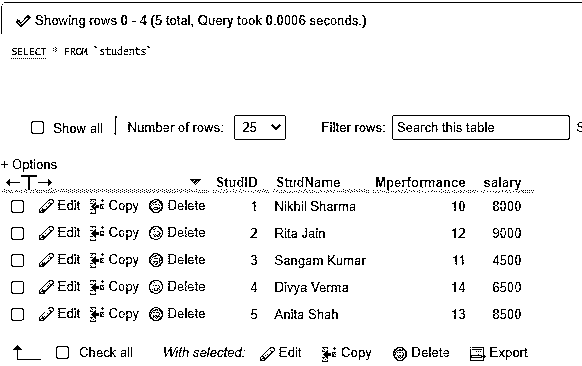
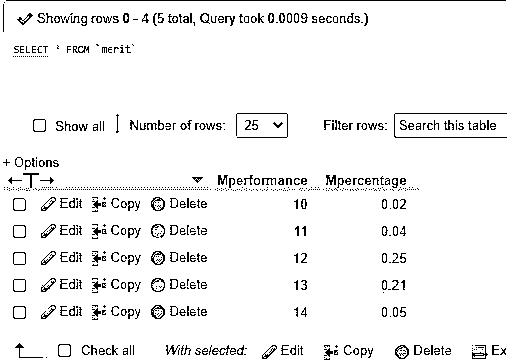
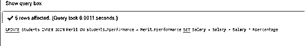
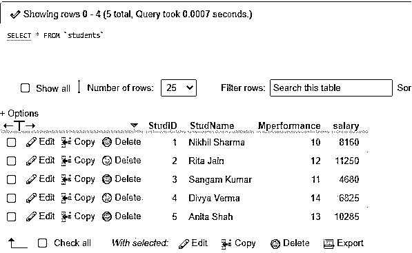
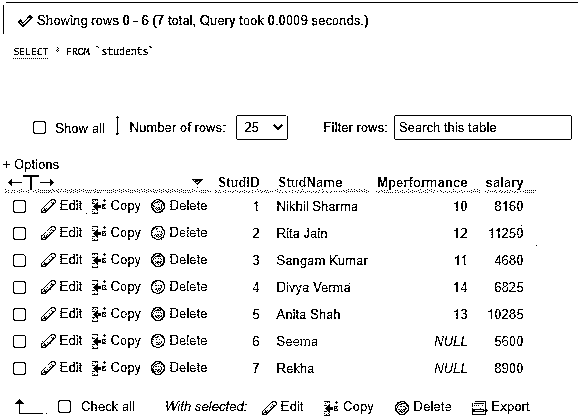
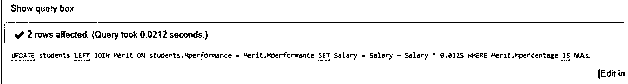
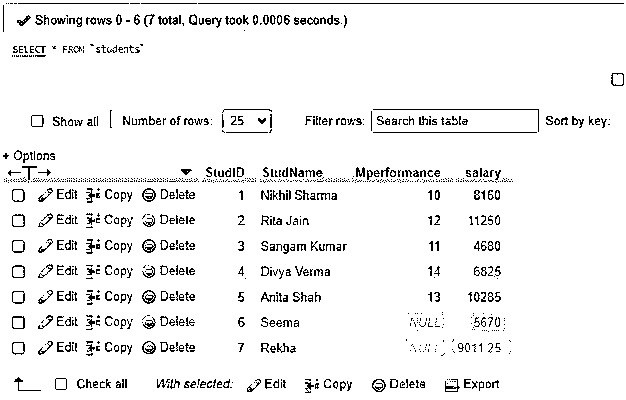

# MySQL 更新加入

> 原文：<https://www.educba.com/mysql-update-join/>

## MySQL 更新加入简介

MySQL Update Join 是一个 MySQL 语句，它使用 UPDATE MySQL query 命令中的 JOIN MySQL 子句执行跨表更新。MySQL Update Join 用于执行 Update 语句，以及在服务器中实现 INNER JOIN 和 LEFT JOIN MySQL 子句。MySQL 中的这个 Update JOIN 子句有助于从相关的数据库表中检索数据记录，并使用查询修改它们。该查询过程导致跨表更新，其中一个数据库表根据表上定义的主键和外键以及数据库服务器中的连接条件，使用其他数据库表进行连接和更改。

### 句法

MySQL Update Join 语句具有以下基本语法代码，用于在数据库中执行更新查询:

<small>Hadoop、数据科学、统计学&其他</small>

`UPDATE Table1, Table2, [LEFT JOIN clause| INNER JOIN clause] Table1 ON Table1.ColA = Table2.ColA
SET Table1.ColB = Table2.ColB, Table2.ColC = Expression
WHERE Condition`

**解释:**让我们详细说明上述语法结构中包含的术语:

首先，获取主表(Table1)和另一个表(Table2 ),该表用于连接更新查询后实现的主表。在 UPDATE 子句之后，需要标识至少一个表，否则，如果没有指定该表，则在执行更新查询时，表中的数据行将不会被更新。

其次，我们需要在子句更新后立即声明 JOIN 子句。您可以从上面提到的两个连接中选择您想要应用的任何类型的连接，即内连接或左连接，以及一个连接谓词。

现在，您将设置新值，并将它们分配给想要修改的两个表列，即 Table1 和 Table2。表达式表示 update 子句中要提到的任何表达式值或列字段。最后，您可以使用 WHERE 子句添加一个连接条件，以限制要更新的记录。

### MySQL Update Join 是如何工作的？

工作过程与上述语法中解释的相同。但是在某些情况下，您可能会发现更新查询只执行跨表更新，而不涉及连接。这是另一种方式，其语法可以写成:

**代码:**

`UPDATE Table1, Table2, SET Table1.ColB = Table2.ColB, Table2.ColC = Expression WHERE Table1.ColA = Table2.ColBAND Condition`

上面的 UPDATE 命令类似于 UPDATE JOIN 和一个隐式的 INNER JOIN 或 LEFT JOIN MySQL 子句。因此，上述语法可以重新设计为上面显示的 UPDATE JOIN 语法，并且可以执行查询并获得期望的结果。

我们使用 MySQL Update Join 用与前一个表相关的其他表的新值来更新一个主表的列值，对两个表的列值使用 INNER JOIN 或 LEFT JOIN。此外，WHERE 子句还会根据某些指定的条件对查询进行筛选，以便可以正确地更新表中的行。

通过在 UPDATE 语句中指定，还可以将空值应用于任何列值。我们还可以设置多个列值来更新可以用逗号(，)分隔的多个表列。

### 实现 MySQL Update Join 的示例

为了更好地理解 MySQL 中的 UPDATE JOIN，让我们考虑并使用下面的例子，并用 JOIN 和 WHERE 子句通知 UPDATE 语句的工作。

为了进行演示，让我们为查询中使用的示例创建一个数据库，其中包括要应用于 MySQL Update Join 的表。假设，我们在数据库中创建了两个表:

创建一个名为 Students 的表，其中包含学生的数据，如学号、成绩、工资和学生姓名。另一个表 Merit 是创建的，包含学生表现和成绩百分比的列。

让我们首先开始创建一个数据库，如果已经存在，那么使用下面的语句加载它:

**代码:**

`CREATE DATABASE IF NOT EXISTS StudDb;`

现在，在这个数据库下，我们将设计如上所述的两个表 Students 和 Merit，它们将用于进一步更新连接查询。

创建价值表的 SQL 语句:

**代码:**

`CREATE TABLE Merit ( Mperformance INT NOT NULL, Mpercentage FLOAT NOT NULL, PRIMARY KEY (Mperformance) );`

SQL 语句创建学生表:

**代码:**

`CREATE TABLE Students ( StudID INT NOT NULL PRIMARY KEY AUTO_INCREMENT, StudName VARCHAR(255) NOT NULL, Mperformance INT DEFAULT NULL, salary FLOAT DEFAULT NULL, CONSTRAINT fk_mperformance FOREIGN KEY (Mperformance) REFERENCES Merit (Mperformance) );`

此外，使用下面的 SQL 命令向两个表中插入一些数据值:

在学生表中插入行的 SQL 语句:

**代码:**

`INSERT INTO Students(StudName,Mperformance,Salary) VALUES('Nikhil Sharma', 10, 8000), ('Rita Jain', 12, 9000), ('Sangam Kumar', 11, 4500), ('Divya Verma', 14, 6500), ('Anita Shah', 13, 8500);`

在绩效表中插入行的 SQL 语句:

**代码:**

`INSERT INTO Merit(Mperformance,Mpercentage) VALUES(10,0.02),(11,0.04),(12,0.25),(13,0.21),(14,0.05);`

同样，您可以使用查询来查看数据记录:

SQL 语句:

**代码:**

`SELECT * FROM Students;`

**输出:**

SQL 语句:

**代码:**

`SELECT * FROM Merit;`

**输出:**

#### 示例#1:

使用 MySQL UPDATE JOIN with INNER JOIN 子句

使用 INNER join 让我们使用下面的查询，根据学生的成绩和来自 Merit 表的百分比计算，更新 Students 表中的 Salary 列值:

**代码:**

`UPDATE students INNER JOIN Merit ON students.Mperformance = Merit.Mperformance SET Salary = Salary + Salary * Mpercentage;`

**输出:**

**解释:**由于 performance 列链接了这两个表，所以薪水值根据百分比值分别调整为新值，如上面的输出所示。

#### 示例 2:

使用带有 LEFT JOIN 子句和 WHERE 子句的 MySQL UPDATE JOIN

假设我们在 student 表中又添加了两个新提交的学生，因此他们的成绩数据不可用，值被设置为 NULL。

**代码:**

`select * from `students``

**输出:**

因此，我们不能使用内部连接来更新表，因为在另一个表中没有增量基。为此，将实现左连接以更新新接纳的具有空性能值的连接。我们可以使用 UPDATE LEFT JOIN 语句设置一些百分比值来计算新生的薪金，如 1.25%，如下所示:

**代码:**

`UPDATE students LEFT JOIN Merit ON students.Mperformance = Merit.Mperformance
SET Salary = Salary + Salary * 0.0125 WHERE Merit.Mpercentage IS NULL;`

**输出:**

`select * from `students``

### 结论

MySQL Update Join 是一个 MySQL 查询，它使用来自另一个数据库表的新记录值以及 Join 子句条件来更新一个表中的现有记录。该查询对于在包含 INNER JOIN 和 LEFT JOIN 子句的语句中通过 WHERE 子句指定的某些列中进行一些修改非常重要。

### 推荐文章

这是一个 MySQL 更新加入指南。在这里，我们讨论了 MySQL 更新连接的介绍，语法，它如何与各自的查询例子。您也可以浏览我们的其他相关文章，了解更多信息——

1.  [MySQL 索引](https://www.educba.com/mysql-index/)
2.  [MySQL 子查询](https://www.educba.com/mysql-subquery/)
3.  [不在 MySQL 中](https://www.educba.com/not-in-mysql/)
4.  [MySQL 中的光标](https://www.educba.com/cursor-in-mysql/)

