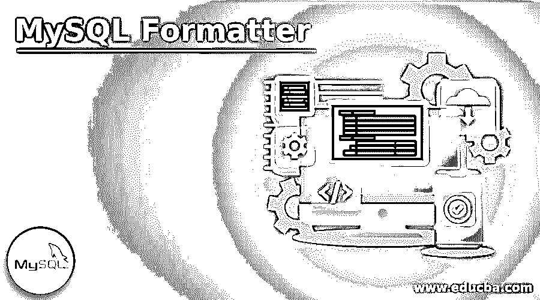

# MySQL 格式化程序

> 原文：<https://www.educba.com/mysql-formatter/>

## MySQL 格式化程序简介

MySQL 格式化程序是一个计算机程序，专用于格式化任何具有所需缩进级别的 MySQL 查询命令，即使查询语句无效。我们可以说，这个格式化程序通过重新组织查询结构来美化我们的查询结构，并允许用户在服务器数据库中正确地查询语句。因此，这个 MySQL 美化器非常重要，尤其是对于 MySQL SELECT 语句，但是这个工具能够处理插入、删除和更新查询语句。这是为处于困境中的数据库构建的，需要维护 MySQL、Oracle、Microsoft SQL Server 和其他 ANSI SQL 数据库。

### 格式器在 MySQL 中是如何工作的？

*   MySQL Formatter 可以说是 MySQL 代码格式化的强大免费工具，它可以自动重构查询代码和许多其他功能和服务，使事情变得更容易。
*   为了使查询遵循所有重要的标准规则和语法代码，以构建一个无错误且有效的 MySQL 程序，这个格式化器或组织器工具是必不可少的。
*   使用 MySQL 格式化程序，用户可以将 MySQL 查询中使用的 MySQL 关键字和标识符的大小写更新为大写或小写，或者保持不变。
*   它最大限度地减少了程序员在提供自动完成选项的编辑器工具中输入查询的时间。
*   MySQL GUI 工具提供了带有 MySQL 提示选项的智能服务，可以定制和组织语法高亮显示、检查以及其他功能，使您能够更出色、更自然地编写和检查 MySQL 查询代码。
*   代码补全具有许多 MySQL 格式所必需的特性，例如列表成员、短语补全、单词补全、存储函数的参数数据、关于逻辑示意图对象的快速信息。这样你需要输入的代码就更少了，可以写更多的代码了。
*   代码片段有助于节省建议列表中的时间，关键字和表名也是如此，它们基于您键入的符号。
*   MySQL 格式化程序是一个保持你的代码清晰的工具，就像 CRUD generator 一样，你可以为任何操作生成代码脚本，比如插入、选择、更新或删除。
*   此外，用户可以获得无错误代码和正确的选项，以便在执行前编写有效的代码。具有自动语法检查功能，在编写代码时，如果发现任何错误，它会在那里自己突出显示。
*   用户可以访问以浏览原理图对象或变量的定义。
*   格式化完成后，您可以下载文件或共享链接。因此，您可以简化、优化和简化您的 MySQL 代码。

### MySQL 格式化程序的规则

让我们看看一些指南，允许在任何工具上进行 MySQL 格式化时，使用大写的 MySQL 命名协议。有许多格式选项有助于实现大写的稳定性。

<small>Hadoop、数据科学、统计学&其他</small>

以下规则描述了查询的清晰格式和有效代码的实现:

#### 1.数据库标识符的命名规则

数据库中的对象名被标识为标识符，并且是在数据库对象定义良好时构建的。假设，随后的 MySQL 语句将创建一个标识符为 TableA 的数据库表和一个标识符为 ColumnKey 的表列。

**代码:**

`CREATE TABLE TableA (ColumnKey INT PRIMARY KEY)`

不同的开发人员喜欢在命名数据库表时使用单数名称，如雇员、产品、学生、人员等。这在许多指南中，甚至在 Adventure Works 数据库中，都被作为标准应用。提供此建议是为了避免在数据库开发过程中由于多个名称而导致的任何错误。然而，当用户选择命名约定作为标准 ISO 11179 时，可以使用复数，例如如上所述的雇员、人、产品或学生。此外，存储过程名应该遵守标识符准则。

#### 2.数据库标识符的大写规则

这种大写规则有很多准则。举例来说，Adventure Works 数据库为数据库表和相关列(如 BusinessEntity、AddressType 等)实现了 PascalCase。这里，这个 PascalCase 允许将大写字母标记为新名称或单词的首字母。它减少了对任何新名称或单词使用下划线字符的需要。类似地，可能很少有指导原则建议仅使用大写的原理图对象名称，同时使用小写的表列名称，如 payment_id、employee_name 等。

#### 3.变量的命名规则

此外，按照通用命名标准，变量名应该以符号@开头。但是我们不应该使用@@，符号作为变量的前缀。因为这会影响性能，因为变量的前缀是作为 SQL Server 系统全局变量实现的。

#### 4.变量的大写规则

很少有大写标准规则建议必须在 CamelCase 中键入变量，例如@person、@city、@ProductId。

#### 5.关键字的大写规则

您可以在 MySQL 或 SQL 中找到两种不同类型的关键字，其中保留关键字是 SQL Server 应用的 T-SQL 语法的片段，另一个是非保留关键字在各自的环境中被定义为元数据名称，但在实际中并未应用。在这里，所有的大写指导方针都建议使用大写字母，如 PERCENT、ADD、EXCEPT。

### MySQL 格式化程序示例

您可以使用 MySQL 格式化程序美化您的 MySQL 代码查询，例如 ApexSQL Refactor SQL formatter，这是一个免费的工具，可以集成到 SQL Server Management Studio 和 visual studio 中。您需要创建您的格式化配置文件来继续，它提供了不同的选项来在编写脚本时使用规则，并且对于生成有效且节省时间的代码过程和代码增强器类型选项非常有用。

**其他像:**代码美化 SQL 格式化程序，SQL 格式，Freeformatter.com，即时 SQL 格式化程序等。

MySQL 的另一个格式化工具可以是 dbForge Studio for MySQL，它具有自动代码完成特性和许多其他功能，可以增强用 MySQL 编写的查询的美观性。它为您提供了代码片段、代码配置文件、CRUD 生成器、语法检查器和模式对象，以便为 MySQL 服务器中的所需操作提供易于实现、无错误、结构化和干净的代码。

### 结论

当我们编写任何 MySQL 查询时，它必须是正确有效的，而不回避规则和语法，因此，不同的 MySQL 格式化程序可用于提供明智和正确的语句。这个过程需要 MySQL 格式化技术来为开发人员或程序员生成定义良好的结构化查询。

### 推荐文章

这是一个 MySQL 格式化程序的指南。这里我们讨论一下引言，格式器在 MySQL 中是如何工作的？规则和示例。您也可以看看以下文章，了解更多信息–

1.  [MySQL 删除连接](https://www.educba.com/mysql-delete-join/)
2.  [MySQL 数学函数](https://www.educba.com/mysql-math-functions/)
3.  [MySQL 列表用户](https://www.educba.com/mysql-list-user/)
4.  [mysql_real_escape_string](https://www.educba.com/mysql_real_escape_string/)

