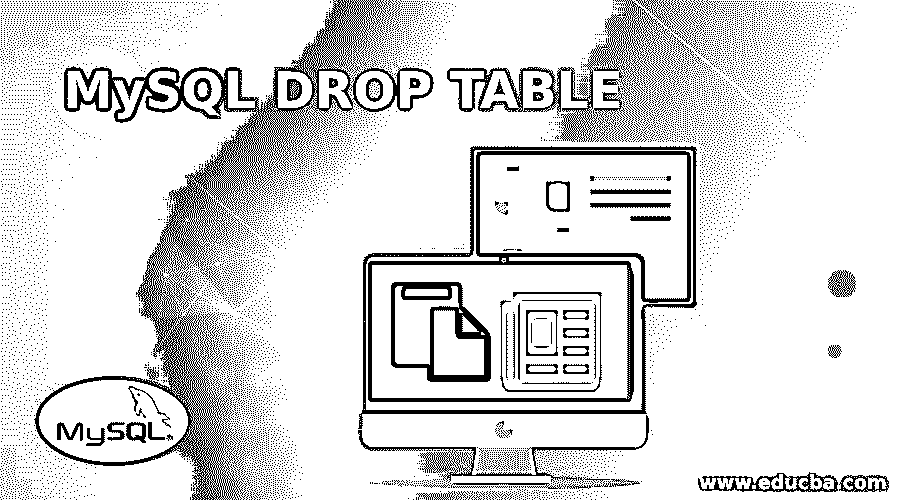
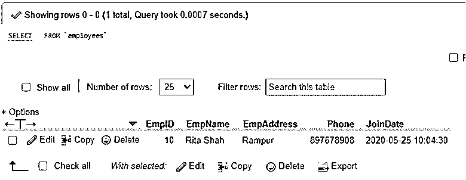
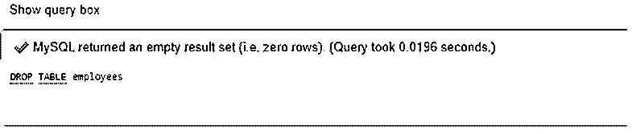
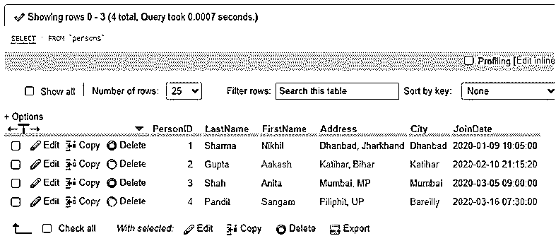
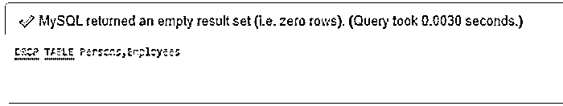
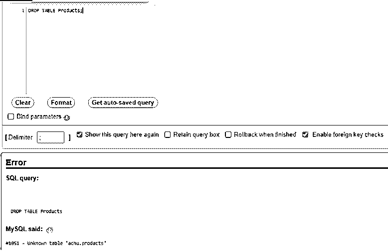
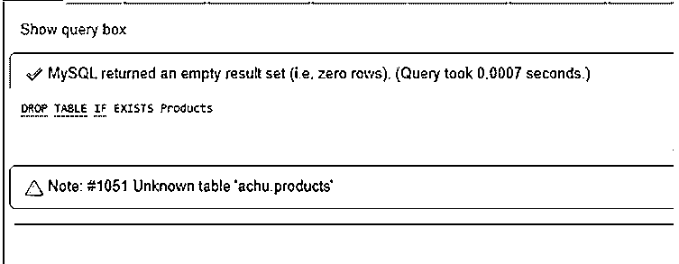
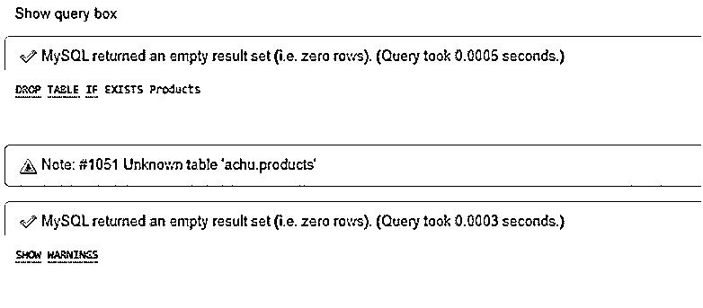

# MySQL DROP 表

> 原文：<https://www.educba.com/mysql-drop-table/>

## MySQL DROP 表的定义

MySQL DROP TABLE 是一个 MySQL 查询语句，负责删除数据库服务器中现有的 MySQL 表。这是一个 MySQL 命令，如果我们想要删除任何不需要的表，或者出于任何原因，在数据库中建立了某个表，就需要使用该命令。

假设，有时为了管理和维护数据库服务器，我们需要不时地修复或恢复数据库表和记录，以便正确有效地访问数据库。为此，可能有必要删除任何表并调整数据库中的记录。我们将在服务器上使用 DROP table 语句并执行它，以在 MySQL 服务器上正确运行和控制管理功能。

<small>Hadoop、数据科学、统计学&其他</small>

**语法:**

对于 MySQL 中的 DROP Table 查询，我们有以下基本语法代码:

`DROP TABLE [IF EXISTS] TableName [,TableName1, TableName2,….,] [CASCADE | RESTRICT];`

该查询语句将从 MySQL 服务器上永久删除数据库表及其信息。

*   这里，IF EXISTS 关键字表示一个条件，即一个表在数据库中是否可用。
*   这是因为，如果使用 IF EXISTS 选项删除数据库中不存在的表，服务器将生成一个注释，可以通过语句 SHOW WARNINGS 访问该注释。
*   还可以使用 TEMPORARY 关键字来确保删除的是临时数据库表，而不是非临时数据库表。
*   同样，请注意，DROP table 命令只会删除表，但不会删除与特定表相关联的特定用户权限。假设如果 new create 一个新表与被删除的表同名，那么 MySQL 将向它提供当前的特权，这可能会对服务器造成安全威胁。
*   此外，如果我们想删除一个以上的用 DROP table 查询实现的表，我们需要使用用逗号(，)分隔的其他表名。此外，语法中还提供了 CASCADE 或 RESTRICT 选项，这些选项不会对查询造成任何影响，并且是专门为将来使用 MySQL 版本而保留的。
*   为了删除任何表并执行 DROP 查询，用户必须对我们要删除的数据库表拥有 DROP 权限。

### MySQL Drop Table 是如何工作的？

假设我们的数据库中有一个名为 Persons 的表，我们想在这个表上实现 MySQL DROP TABLE 命令。我们已经编写了下面的 SQL 查询来执行和删除 Persons 表:

`DROP TABLE Persons;`

让我们考虑一下，如果我们想要删除所有的数据库表，那么在 MySQL 中，我们应用 DROP DATABASE 命令来删除所有的表并使其为空。但是，如果我们想要删除任何数据库表，那么我们使用 DROP TABLE 语句永久删除该表及其记录。

MySQL 语句 DROP 和 TRUNCATE 具有与删除过程相同的功能。但是它们在工作形式、语法和结果上是不同的。

为了截断一个表，我们有如下的语法结构:

`TRUNCATE TABLE TableName;`

DROP Table 查询删除整个表及其记录，但是 TRUNCATE Table 查询将只删除数据库表中的数据，而不是整个表。正确使用 MySQL 查询 DROP TABLE 和 TRUNCATE TABLE 时，请记住这一区别。

### MySQL 中的 Drop Table 示例

让我们用 MySQL DROP TABLE 查询语句来详细说明一些例子:

#### 示例#1

**使用 DROP TABLE 查询删除单个数据库表的示例:**为了实现 MySQL 语句，我们首先需要使用 MySQL 服务器中的 CREATE TABLE 语句在数据库中创建一个表。因此，让我们为示例构建一个表:

`CREATE TABLE Employees (EmpID INT PRIMARY KEY AUTO_INCREMENT, EmpName VARCHAR (255) NOT NULL, EmpAddress VARCHAR(255) NOT NULL, Phone INT NOT NULL, JoinDate DATETIME NOT NULL);`

同样，让我们在 MySQL 数据库中使用 insert 命令创建的表中插入一些记录:

`INSERT INTO Employees(EmpID,EmpName,EmpAddress,Phone,JoinDate) VALUES (‘10’,’Rita Shah’,’Rampur’,’897678908’,’2020-05-25 10:04:30’);`

为了查看表记录，我们将应用下面的 SELECT 语句:

`SELECT * FROM Employees;`

**输出:**

现在，为了删除该表，我们将使用以下查询:

`DROP TABLE Employees;`

**输出:**

#### 实施例 2

**使用 DROP TABLE 查询删除多个数据库表的示例:**为了实现这个 MySQL 语句，让我们再次在数据库服务器上创建另一个表。因此，让我们构建其他表来显示多个表的删除:

`CREATE TABLE Persons (PersonID INT PRIMARY KEY AUTO_INCREMENT, LastName VARCHAR (255) NOT NULL, FirstName VARCHAR (255) NOT NULL, Address VARCHAR(255) NOT NULL, City VARCHAR(255) NOT NULL, JoinDate DATETIME NOT NULL);`

同样，让我们在 MySQL 数据库中使用 insert 命令创建的表中插入一些记录:

`INSERT INTO Persons (PersonID,LastName,FirstName,Address,City,JoinDate) VALUES (‘1’,’Sharma’,‘Nikhil’,’Dhanbad,Jharkhand’,’Dhanbad’,’2020-01-09 10:05:00’);`

为了查看表记录，我们将应用下面的 SELECT 语句:

`SELECT * FROM Persons;`

**输出:**

现在，为了删除由逗号分隔的两个表，我们将使用以下查询，并重新创建以前的表 Employees:

`DROP TABLE Persons,Employees;`

**输出:**

#### 实施例 3

**使用 DROP TABLE 查询删除不存在的数据库表的示例:**我们正在考虑 MySQL 中的语句，尝试对数据库服务器中不可用的表执行 DROP TABLE 查询。

`DROP TABLE Products;`

当查询上述语句并且 MySQL 运行代码时，它将生成以下错误。

**输出:**

因此，如果我们使用 MySQL 选项 IF EXISTS with the above query like the below statement:

`DROP TABLE IF EXISTS Products;`

然后，MySQL 会发出警告，而不是处理错误。

**输出:**

要查看警告或读取错误，我们可以在 MySQL 中使用 SHOW WARNINGS 语句:

`SHOW WARNINGS;`

**输出:**

### 结论

在 MySQL 中，DROP Table 语句有助于删除数据库服务器中存在的表，这也将删除与其相关的信息。因此，在删除任何现有的表之前，我们应该小心，因为这可能会导致删除保存在数据库服务器中的任何重要数据或信息。

### 推荐文章

这是一个 MySQL DROP TABLE 的指南。在这里，我们还将讨论 mysql drop table 的定义和工作原理。以及不同的示例及其代码实现。您也可以看看以下文章，了解更多信息–

1.  [MySQL TRUNCATE()](https://www.educba.com/mysql-truncate/)
2.  [MySQL INSTR()](https://www.educba.com/mysql-instr/)
3.  [MySQL 约束](https://www.educba.com/mysql-constraints/)
4.  [MySQL 根目录](https://www.educba.com/mysql-root/)

