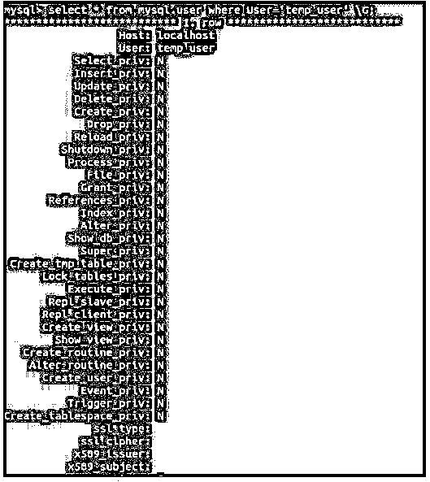
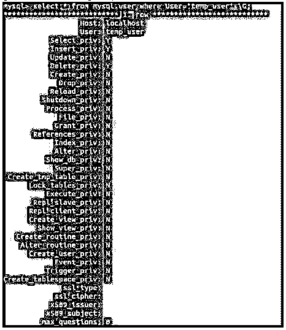
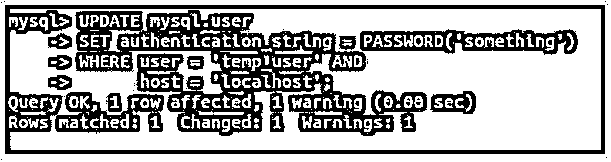

# MySQL 刷新权限

> 原文：<https://www.educba.com/mysql-flush-privileges/>

## MySQL 刷新权限介绍

以下文章提供了 MySQL 刷新权限的概述。每当我们创建一个用户时，我们都会分配或授予它一些权限。这些特权包括对数据库执行操作和访问数据库的权限。可以对用户进行诸如插入、更新、删除和选择之类的操作。除此之外，还可以分配授予和撤销的权限。

在您授予用户权限后，为了使这些更改生效，我们需要重新加载或重新启动我们正在使用的 MySQL 服务。除此之外，还有一种方法可以用来使授予的权限生效，而无需重新启动 MySQL 服务。所有授权操作完成后，我们可以使用 flush privileges 命令。

<small>Hadoop、数据科学、统计学&其他</small>

### MySQL 刷新权限的使用

如果 MySQL 服务启动时没有使用选项–skip-grant-tables，那么所有的授权表内容都会在启动时读取。此外，如果我们使用帐户管理语句间接地授予或撤销特权，MySQL 会自动检测授予表中所做的更改，然后再次将授予表自动加载到内存中。但是，如果我们直接修改授权表，那么这些更改不会生效，除非您从外部指定重新启动或重新加载 MySQL 服务。

可以使用 Insert、Delete 和 Update 等语句直接修改授权表。在这种情况下，我们可以通过操作 flush-privileges 命令服务器重新加载 MySQL 服务器。此操作可以通过使用 FLUSH PRIVILEGE 命令语句来执行。也可以使用 mysqladmin flush-privileges 或 mysqladmin reload 命令来重新加载 MySQL 服务。

对于客户端会话，授权表的重新加载按如下指定生效:

*   每当客户端的下一个请求被触发时，列和表上的特权就会生效。
*   每当我们使用 use database_name 语句的下一个命令时，在数据库上更改的所有权限都将生效。
*   有时，数据库的名称被缓存到内存中，因此，更改的效果可能不可见。为此，您必须首先使用一个不同的数据库，然后使用您之前使用的同一数据库。
*   在授权表中所做的所有更改都与全局设置相关，使用刷新权限命令不会影响密码。为此，您必须在同一连接中使用一个新的会话。

使用–skip-grant-tables 选项启动 MySQL 服务是非常危险和不安全的，因为没有读取授权表的内容，也没有访问控制系统生效，导致任何用户登录数据库并执行他/她希望的任何操作。为了防止这种情况，我们可以刷新特权，使服务器读取所有授权表内容和访问控制系统。

**语法:**

我们可以通过使用下面的 flush 语句运行 flush-privileges 命令来重新加载内存中的授权表。

`FLUSH PRIVILEGES;`

### MySQL 刷新权限示例

下面是提到的例子:

我们将创建一个用户，然后为该用户分配特定的权限，然后从用户表中检查权限是否已正确分配和生效。

首先，使用下面的 CREATE USER 查询语句创建一个名为 temp_user 的用户，密码为 123。

**代码:**

`CREATE USER 'temp_user'@'localhost' IDENTIFIED BY '123';`

**输出:**

#### 示例#1

现在，让我们检查通过使用以下语句查询用户表来创建 temp_user 时，默认情况下分配给它的所有特权。

**代码:**

`select * from mysql.user where User='temp_user' \G;`

**输出:**

我们可以看到，所有以 _priv 结尾的列(表示授予 temp_user 用户的权限)都有 N 值，代表 No，这意味着没有为用户分配该操作的权限。

#### 实施例 2

这里，我们将通过使用下面的 GRANT query 语句向 temp_user 表授予一些特权。

**代码:**

`GRANT SELECT, INSERT, DELETE ON *.* TO temp_user@'localhost';`

我们已经将所有数据库的所有表上的 SELECT、DELETE 和 INSERT 特权分配给了 temp_user。

**输出:**

#### 实施例 3

现在，让我们检查在发出下面的命令后是否所有的特权都被分配了。

**代码:**

`FLUSH PRIVILEGES;`

**输出:**

**代码:**

`select * from mysql.user where User='temp_user' \G;`

**输出:**

#### 实施例 4

让我们使用下面的查询语句来检查身份验证字符串，该字符串是为 temp_user 存储的加密密码。

**代码:**

`select authentication_string from mysql.user where User='temp_user' \G;`

**输出:**

#### 实施例 5

让我们使用下面的查询语句通过更改密码来改变身份验证字符串。

**代码:**

`UPDATE mysql.user
SET authentication_string = PASSWORD('something')
WHERE user = 'temp_user' AND
host = 'localhost';`

**输出:**

#### 实施例 6

让我们通过执行产生以下输出的 flush 命令来刷新特权。

**代码:**

`FLUSH PRIVILEGES;`

**输出:**

#### 实施例 7

现在让我们通过使用下面的查询语句检索身份验证字符串来检查它。

**代码:**

`select authentication_string from mysql.user where User='temp_user' \G;`

**输出:**

我们可以看到，先前的和当前的认证字符串在存储于其中的加密字符串中显示出实质性的差异。

**以前的认证字符串:*** 8 c 6 F5 DC 80 b 8e 3 EC 9003 b 2666d 8e 2 f 89 FFE 0 a 15cd

**当前认证字符串:*** 88 c 89 be 093d 4 ECF 72d 039 f 62 ebb 7477 ea 1 FD 4d 63

### 结论

我们可以通过将授权表重新存入内存，使对用户权限的更改或授权表的修改生效。这可以通过使用 Flush Privileges 命令、mysqladmin flush-privileges 或 mysqladmin reload 命令在内存中重新加载授权表来完成。当使用 grant 命令时，没有必要刷新特权，因为 MySQL 会自动确定更改并重新加载 Grant 表。如果使用 Insert、Update 或 Delete 命令修改了授权表，则需要通过执行 flush privileges 命令重新加载授权表，以使更改生效。

### 推荐文章

这是一个 MySQL 刷新权限的指南。这里我们分别讨论 MySQL flush 权限的介绍、工作方式和示例。您也可以看看以下文章，了解更多信息–

1.  [MySQL 时间戳](https://www.educba.com/mysql-timestamp/)
2.  [MySQL 数据库修复](https://www.educba.com/mysql-database-repair/)
3.  [MySQL 中的汇总](https://www.educba.com/rollup-in-mysql/)
4.  [MySQL 约束](https://www.educba.com/mysql-constraints/)

