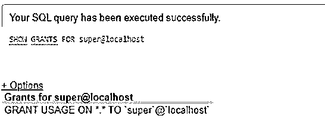
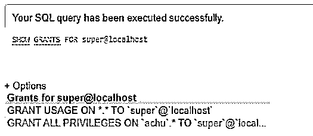

# MySQL 超级特权

> 原文：<https://www.educba.com/mysql-super-privilege/>

## MySQL 超级特权介绍

MySQL super Privilege 是一个 GRANT 语句，它提供了允许用户帐户进行管理更改和在数据库表中执行不同操作的许可权限。MySQL 中的超级权限允许 MySQL 用户应用管理员级别的操作和查询，包括删除、清除二进制日志、设置全局、更改主服务器以及 mysqladmin 命令。MySQL 中提供了基于 SQL 查询和命令提示符执行操作的权限。这由定义的权限级别组成，有助于控制权限的实现级别。基本上，它是一种 MySQL GRANT 语句，支持不同的权限级别，如全局、数据库、表、列、存储例程和代理类型。

### MySQL 超级特权的语法

让我们看看在 MySQL 中使用超级权限的基本语法，并在创建用户后将该命令添加到数据库中:

<small>Hadoop、数据科学、统计学&其他</small>

`CREATE USER super@localhost  IDENTIFIED BY 'pass_super!';`

`GRANT SUPER ON *.* TO ‘user@localhost’ IDENTIFIED BY ‘Password_Name’;`

执行上述语句后，我们需要记住添加以下命令来结束查询:

`FLUSH PRIVILEGES;`

*   这里，符号*。*表示它适用于 MySQL 服务器中的所有数据库。user@lcoalhost 使用 CREATE USER 定义在 MySQL 服务器上创建的用户，类似于 CREATE TABLE 语句。此外，Password_Name 表示在服务器中创建密码时为该用户设置的密码。
*   同样，运行 Flush privilege 语句表示在数据库服务器中重新加载授权表，这使得修改能够生效，而不需要在 MySQl 服务选项上重新启动或重新加载操作。

### MySQL 中的超级特权是如何工作的？

在 MySQL 中，CREATE USER 命令负责创建一个或多个没有权限的用户帐户。这意味着用户帐户可以登录到服务器，但仍然没有权限执行任何操作，如从数据库表中查询数据和选择任何数据库。

要使用户帐户执行数据库对象，应该授予它权限。这是通过使用 GRANT 语句来实现的，该语句允许一个用户帐户拥有一个或多个特权来在 MySQL 服务器中进行任何操作。

下面是授权查询的基本语法:

`GRANT privilege [,privilege],…
ON privilegelevel
TO accountname;`

例如，假设我们希望将数据库中表产品的 SELECT 权限提供给用户帐户 achu@localhost:

`GRANT SELECT
ON Products
TO achu@localhost;`

对于特权级别，让我们看看 MySQL 支持的主要级别如下:

*   **全局特权:**它实现到服务器 MySQL 中所有现有的数据库。我们需要申请*。ON 关键字后的结构代码。
*   **数据库特权:**它实现所有可用的数据库对象，包括索引、表、视图等。使用 ON 之后的语法作为 DatabaseName。*
*   **表权限**:实现对数据库中所有表列的权限。

语法是:

`DatabaseName.TableName`

*   **Column Privileges:** 它实现了一个表列，但是应该为 GRANT 关键字之后使用的每个特权指定一个或多个列。
*   **存储例程特权:**它实现存储函数和过程。
*   **代理用户权限:**将一个用户代理给另一个用户。代理用户的所有权限已经交付给代理用户。我们需要在 root 语法中的 GRANT 之后添加代理。

应该注意的是，在使用授权查询之前，您应该确认用户拥有授权选项特权以及将要授予的权限。如果启用了系统变量 read_only，则必须具有超级权限才能运行 GRANT 语句。

### MySQL 超级权限示例

下面给出的是 MySQL 超级特权的例子:

通常，我们将构建一个新的用户帐户，最初使用 CREATE USER 查询，然后实现 GRANT 语句，以允许该用户帐户拥有在数据库服务器中进行更改的权限。

假设我们通过 MySQL 中的 CREATE TABLE 命令创建一个用户 super@localhost，如下所示:

**代码:**

`CREATE USER super@localhost IDENTIFIED BY 'pass_super!';`

接下来，让我们使用 SHOW GRANTS 命令显示分配给 super@localhost 用户的特权，如下所示:

**代码:**

`SHOW GRANTS FOR super@localhost;`

**输出:**

这里，这种用法表示名为 super@localhost 的用户能够登录数据库服务器，但仍然没有特权。

在第三步中，我们现在将为用户 super@localhost 提供当前 MySQL 数据库服务器中所有可用数据库的所有权限。

**代码:**

`GRANT ALL
ON achu.*
TO super@localhost;`

接下来，再次通过执行如下所示的 SHOW GRANTS 查询语句来查看详细信息:

**代码:**

`SHOW GRANTS FOR super@localhost;`

**输出:**

结果显示，超级用户拥有服务器 MySQL 中本地主机上所有数据库的所有权限。这意味着超级权限将允许使用所有授予的权限并在服务器中进行操作。可允许的特权可用于 REVOKE 和 GRANT 语句。

MySQL 中的超级权限影响 MySQL 服务器的操作和行为:

*   它通过改变全局系统变量来修改服务器配置。像设置一个会话变量，我们也需要有超级特权。
*   它允许对全局事务功能进行更改，以及启动帐户、停止复制和组复制。
*   它允许使用 CREATE SERVER、DROP SERVER 和 ALTER SERVER 等语句。此外，允许实现 mysqladmin 调试查询。
*   它允许 InnoDB 加密和密钥轮换。此外，它还可以借助 DES_ENCRYPT()函数读取 DES 密钥。
*   它提供对客户端连接的控制，并允许执行版本令牌 MySQL 用户定义的函数。
*   当允许二进制日志记录时，您应该拥有超级权限，以创建或修改 MySQL 中的存储函数。

### 结论

最初，我们需要在 MySQL 中拥有超级特权来运行 GRANT 语句查询。全局级权限被定义为在 MySQL 中实现和使用超级权限的管理权限。MySQL 中的超级权限有助于避免未经授权的访问，并允许向 MySQL 数据库服务器的管理员管理的有效用户帐户授予权限。因此，这对于 MySQL 服务器的安全性和维护来说是一个重要的因素。

### 推荐文章

这是一个 MySQL 超级特权的指南。这里我们讨论一下引言，超级特权在 MySQL 中是如何工作的？和示例。您也可以看看以下文章，了解更多信息–

1.  [MySQL DATE_ADD()](https://www.educba.com/mysql-date_add/)
2.  [MySQL 日志文件](https://www.educba.com/mysql-log-file/)
3.  [MySQL Binlog](https://www.educba.com/mysql-binlog/)
4.  [MySQL DISTINCT](https://www.educba.com/mysql-distinct/)

