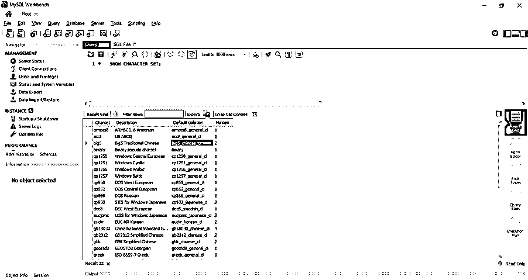
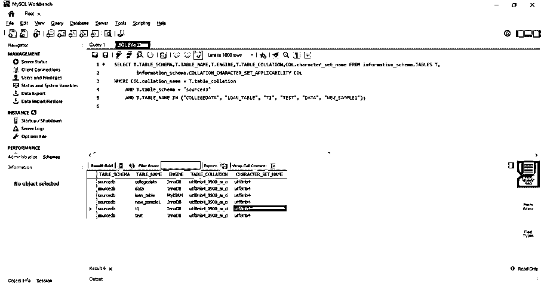
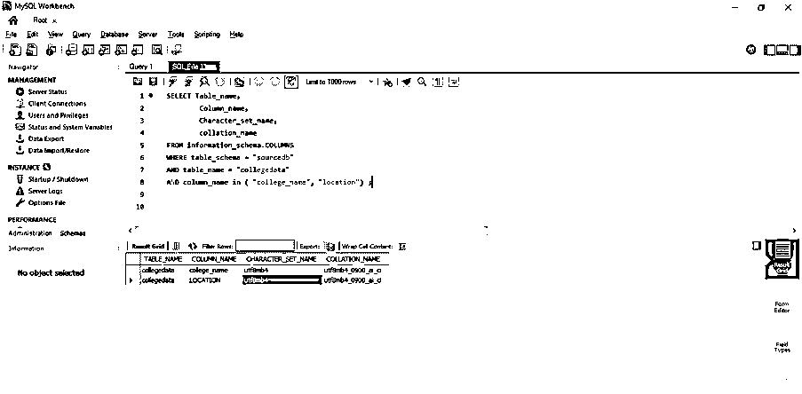
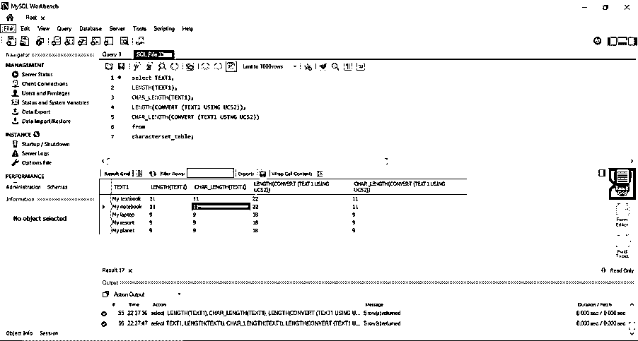

# MySQL 字符集

> 原文：<https://www.educba.com/mysql-character-set/>

## MySQL 字符集介绍

MySQL 中的字符集是一组字符。MySQL 中的字符集可以有一个或多个排序规则。MySQL 中的字符集可以在数据库级、表级和列级看到。默认字符集是“LATIN1”。Unicode 字符集用于在一列中存储多种语言。字符集可以保存单字节字符和多字符集。拉丁 1、拉丁 2 等。，是单字节字符集。字符集的转换可以在 MySQL 中完成。我们的 char_length 函数是用来获取字符串中字符的长度。

**语法#1**

<small>Hadoop、数据科学、统计学&其他</small>

下面是检查字符集的语法:

`SHOW CHARACTER SET;`

**语法#2**

下面是检查数据库级使用的字符集的语法:

`SELECT * FROM information_schema.SCHEMATA;`

**语法#3**

下面是检查表级别中使用的字符集的语法:

`SELECT T.*,COL.character_set_name FROM information_schema.TABLES T,
information_schema.COLLATION_CHARACTER_SET_APPLICABILITY COL
WHERE COL.collation_name = T.table_collation
AND T.table_schema = "<SCHEMA_NAME>";`

**语法#4**

下面是检查列中使用的字符集的语法:

`SELECT * FROM information_schema.COLUMNS
WHERE table_schema = "<SCHEMA_NAME>"
AND table_name = "<TABLE_NAME>"
AND column_name = "<COLUMN_NAME>";`

### 字符集在 MySQL 中是如何工作的？

现在让我们检查存在于此的同一事物。这可以通过查询找到:

**代码:**

`SHOW CHARACTER SET;`

**输出:**

让我们从表中得到同样的结果:

**代码:**

`SELECT T.TABLE_SCHEMA,T.TABLE_NAME,T.ENGINE,T.TABLE_COLLATION,COL.character_set_name
FROM information_schema.TABLES T, information_schema.COLLATION_CHARACTER_SET_APPLICABILITY COL
WHERE COL.collation_name = T.table_collation
AND T.table_schema = "sourcedb"
AND T.TABLE_NAME IN ("COLLEGEDATA", "LOAN_TABLE", "T1", "TEST", "DATA", "NEW_SAMPLE1");`

**输出:**

**Code:** 下面是检查列中使用的相同语法:–

`SELECT Table_name,
Column_name,
Character_set_name,
collation_name
FROM information_schema.COLUMNS
WHERE table_schema = "sourcedb"
AND table_name = "collegedata"
AND column_name in ( "college_name", "location") ;`

**输出:**

### 例子

现在让我们创建一个包含字符类型列的表，并检查“character_set”。我们可以执行字符集的转换。

**代码#1**

`create table characterset_table
(
id int,
text1 varchar(30),
text2 varchar(30),
text3 varchar(30),
text4 varchar(30)
);`

现在让我们将数据插入到表格中

`insert into characterset_table values (1, 'My textbook', 'character set table', 'how are you', 'same to you');
insert into characterset_table values (2, 'My notebook', 'character set', 'hello!', 'same too');
insert into characterset_table values (3, 'My laptop', 'et table', 'hello my world', 'text needed');
insert into characterset_table values (4, 'My resort', 'table', 'my world', 'entered random data');
insert into characterset_table values (5, 'My planet', 'character table', 'world', 'example for character set');
select * from characterset_table;`

**代码# 3-**查询以从表中获取字符集详细信息

`SELECT Table_name,
Column_name,
Character_set_name,
collation_name
FROM information_schema.COLUMNS
WHERE table_schema = "sourcedb"
AND table_name = "characterset_table"
AND column_name in ( "text1", "text2", "text3", "text4") ;`

这里我们将字符集从 utf8mb4 转换成 ucs2。我们可以看到它们之间的尺寸差异。

`select TEXT1,
LENGTH(TEXT1), /* -- actual size with character set utf8mb4 -- */
CHAR_LENGTH(TEXT1), /* -- actual size with character set utf8mb4 -- */
LENGTH(CONVERT (TEXT1 USING UCS2)), /* -- size with character set ucs2 -- */
CHAR_LENGTH(CONVERT (TEXT1 USING UCS2)) /* -- size with character set uc2 -- */
from
characterset_table;`

这里的 LENGTH 是以字节为单位获取字符串的长度，char_length 是以字符为单位获取字符串的长度。要转换字符集，我们使用下面的语法:-

**代码#5**

`CONVERT (column_name USING character_set_name)`

CAST 函数类似于 CONVERT 函数。它将字符串转换成不同的字符集。下面是相同的语法:–

**代码#6**

`CAST(string AS character_type CHARACTER SET character_set_name)`

### 结论

MySQL 中的字符集是一组字符。这在 MySQL 中是一个或多个排序规则。字符集可以在数据库级、表级和列级看到。默认字符集是“LATIN1”。Unicode 字符集用于在一列中存储多种语言。这可以保存单字节字符和多字符集。拉丁 1、拉丁 2 等。，是单字节字符集。可以进行字符集的转换。我们有 char_length 函数是为了得到字符串中字符的长度。

### 推荐文章

这是一个 MySQL 字符集的指南。这里我们讨论一个 MySQL 字符集的介绍，语法，它是如何工作的例子。您也可以浏览我们的其他相关文章，了解更多信息——

1.  [MySQL 中的运算符](https://www.educba.com/mysql-in-operator/?source=leftnav)
2.  [就像 MySQL 中的](https://www.educba.com/like-in-mysql/?source=leftnav)
3.  [MySQL 中的任何一个](https://www.educba.com/any-in-mysql/?source=leftnav)
4.  [MySQL 中的光标](https://www.educba.com/cursor-in-mysql/?source=leftnav)

