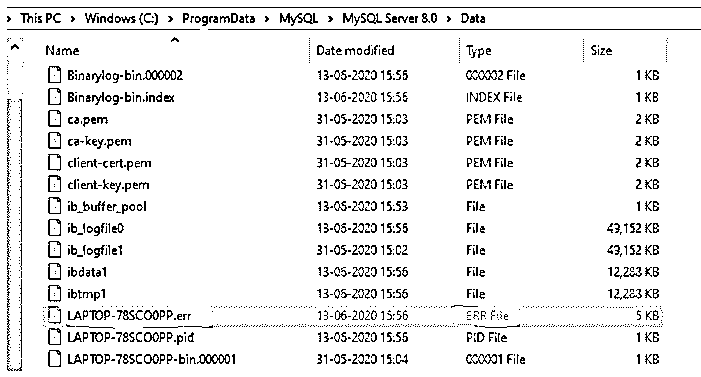
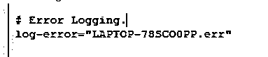
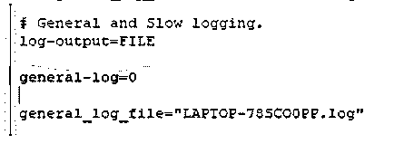
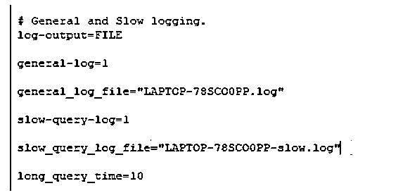
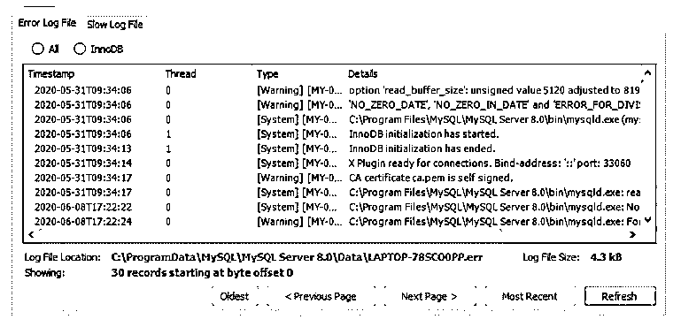
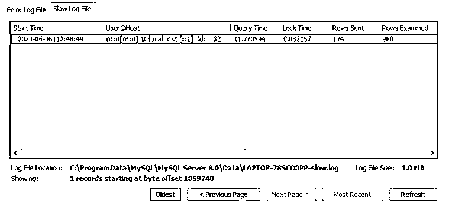

# MySQL 日志文件

> 原文：<https://www.educba.com/mysql-log-file/>

## MySQL 日志文件介绍

MySQL 日志文件由已经执行的操作记录组成。MySQL server 根据所执行的操作生成日志文件。日志文件有不同的类型:–错误日志、ISAM 日志、常规查询日志、更新日志、二进制日志和慢速查询日志。

*   **错误日志文件:**包含运行、启动或停止 mysql 时遇到的所有记录。
*   **ISAM 日志文件:**它记录了对 ISAM 表所做的所有更改。仅用于 ISAM 代码调试。
*   **通用查询日志文件:**包含关于建立的连接和执行的查询的信息。
*   **更新日志文件:**包含对数据进行的所有更改的信息。
*   **二进制日志文件:**包含数据库中发生的所有修改
*   **慢速查询日志文件:**存储执行时间超过“long_query_time”的查询的所有详细信息。

### MySQL 日志文件的语法

要在 shell 中检查日志位置并设置错误日志文件，请执行以下操作:

<small>Hadoop、数据科学、统计学&其他</small>

`mysql -se "SHOW VARIABLES" | grep -e log_error`

要在 shell 中检查日志位置并设置常规日志文件，请执行以下操作:

`mysql -se "SHOW VARIABLES" | grep-e general_log`

要在 shell 中检查日志位置并设置慢速查询日志文件:

`mysql -se "SHOW VARIABLES" | grep -e slow_query_log`

### MySQL 日志文件是如何工作的？

现在让我们看看错误日志，它记录了运行、启动或停止 mysqld 时遇到的错误信息。在 windows 中，我们有一个名为“C:\ program Data \ MySQL \ MySQL Server 8.0 \ Data”的路径，它由下面截图中提到的错误日志组成。错误日志文件的类型是“err”。下面我们也强调了这一点。

#### 1.错误日志文件

我们可以在路径中的“config”文件(my.ini)中看到错误日志文件的详细信息

`“C:\ProgramData\MySQL\MySQL Server 8.0”.
# Error Logging.
log-error="LAPTOP-78SCO0PP.err"`

#### 2.常规日志文件

包含有关建立的连接和执行的查询的信息。我们可以从路径“C:\ program data \ MySQL \ MySQL Server 8.0”的“config”文件(my.ini)中看到一般日志文件的详细信息。

`# General and Slow logging.
log-output=FILE
general-log=0
general_log_file="LAPTOP-78SCO0PP.log"`

此处“general-log”= 0，这意味着通用日志未启用。要启用，我们需要将值设置为“general-log”= 1。

#### 3.二进制日志文件

`Show BINARY LOGS`

**输出:**

| **日志名称** | **文件大小** | **加密的** |
| 笔记本电脑-78SCO0PP-bin.000001 | One hundred and seventy-nine | 不 |
| 笔记本电脑-78SCO0PP-bin.000002 | Two million one hundred and twenty-nine thousand nine hundred and twelve | 不 |

mysqlbinlog 日志文件| mysql -h 服务器名

#### 4.ISAM 日志文件

myisamlog 进程包含 MyISAM 日志文件的信息。为了创建 ISAM 日志文件，我们使用–log-isam = log _ file 选项启动服务器。我们只需要如下调用 myisamlog:

myisamlog[Options][文件名[tbl 名称] …]选项可以是–c、-f、-F、-i、-o 等

#### 5.更新日志文件

更新日志被二进制日志取代。当服务器启动时，我们提到文件名为“–log-update[= file _ name]”的选项，mysqld 会写入一个日志文件，其中包含所有更新数据的 SQL 命令，如 UPDATE 或 DELETE。如果列值已经存在，它将跳过 UPDATE 语句。

#### 6.慢速查询日志文件

存储执行时间超过“long_query_time”的查询的所有详细信息。下面的查询显示了执行时间最长的查询。

我们可以从路径“C:\ program data \ MySQL \ MySQL Server 8.0”的“config”文件(my.ini)中看到一般日志文件的详细信息。

`# Slow logging.
slow-query-log=1
slow_query_log_file="LAPTOP-78SCO0PP-slow.log"
long_query_time=10`

#### 7.错误日志文件

打开“错误”日志文件后，我们会得到以下数据信息:-

*   InnoDB 初始化已开始。
*   InnoDB 初始化已结束。
*   x 插件准备连接。绑定地址:“::”端口:33060
*   CA 证书 ca.pem 是自签名的。

| **时间戳** | **线程** | **类型** | **详情** |
| 2020-05-31T09:34:06 | Zero | [警告][MY-000081][服务器] | 选项“read_buffer_size”:无符号值 5120 调整为 8192。 |
| 2020-05-31T09:34:06 | Zero | [警告][MY-010915][服务器] | “NO_ZERO_DATE”、“NO_ZERO_IN_DATE”和“ERROR _ FOR _ DIVISION _ BY _ ZERO”SQL 模式应与严格模式一起使用。在未来的版本中，它们将与严格模式合并。 |
| 2020-05-31T09:34:06 | Zero | [系统][MY-010116][服务器] | c:\ Program Files \ MySQL \ MySQL Server 8.0 \ bin \ mysqld . exe(mysqld 8 . 0 . 20)从进程 16316 开始 |
| 2020-05-31T09:34:06 | One | [系统] [MY-013576] [InnoDB] | InnoDB 初始化已开始。 |
| 2020-05-31T09:34:13 | One | [系统] [MY-013577] [InnoDB] | InnoDB 初始化已结束。 |
| 2020-05-31T09:34:14 | Zero | [系统][MY-011323][服务器] | x 插件准备连接。绑定地址:“::”端口:33060 |
| 2020-05-31T09:34:17 | Zero | [警告][MY-010068][服务器] | CA 证书 ca.pem 是自签名的。 |
| 2020-05-31T09:34:17 | Zero | [系统][MY-010931][服务器] | c:\ Program Files \ MySQL \ MySQL Server 8.0 \ bin \ mysqld . exe:准备连接。版本:“8.0.20”套接字:“端口:3306 MySQL 社区服务器–GPL。 |
| 2020-06-13T10:22:35 | Zero | [系统][MY-013105][服务器] | c:\ Program Files \ MySQL \ MySQL Server 8.0 \ bin \ mysqld . exe:正常关机。 |
| 2020-06-13T10:23:20 | Zero | [系统][MY-010910][服务器] | c:\ Program Files \ MySQL \ MySQL Server 8.0 \ bin \ mysqld . exe:关机完成(mysqld 8.0.20) MySQL 社区服务器–GPL。 |
| 2020-06-13T10:26:03 | Zero | [警告][MY-000081][服务器] | 选项“read_buffer_size”:无符号值 5120 调整为 8192。 |
| 2020-06-13T10:26:03 | Zero | [警告][MY-010915][服务器] | “NO_ZERO_DATE”、“NO_ZERO_IN_DATE”和“ERROR _ FOR _ DIVISION _ BY _ ZERO”SQL 模式应与严格模式一起使用。在未来的版本中，它们将与严格模式合并。 |
| 2020-06-13T10:26:04 | Zero | [系统][MY-010116][服务器] | c:\ Program Files \ MySQL \ MySQL Server 8.0 \ bin \ mysqld . exe(mysqld 8 . 0 . 20)从进程 6292 开始 |
| 2020-06-13T10:26:08 | One | [系统] [MY-013576] [InnoDB] | InnoDB 初始化已开始。 |
| 2020-06-13T10:26:18 | One | [系统] [MY-013577] [InnoDB] | InnoDB 初始化已结束。 |
| 2020-06-13T10:26:25 | Zero | [系统][MY-011323][服务器] | x 插件准备连接。绑定地址:“::”端口:33060 |
| 2020-06-13T10:26:29 | Zero | [警告][MY-010068][服务器] | CA 证书 ca.pem 是自签名的。 |
| 2020-06-13T10:26:30 | Zero | [系统][MY-010931][服务器] | c:\ Program Files \ MySQL \ MySQL Server 8.0 \ bin \ mysqld . exe:准备连接。版本:“8.0.20”套接字:“端口:3306 MySQL 社区服务器–GPL。 |

#### 8.慢速查询日志文件

我们可以从路径“C:\ program data \ MySQL \ MySQL Server 8.0”的“config”文件(my.ini)中看到一般日志文件的详细信息。

现在让我们看看慢速查询日志文件。以下是我们从数据库中获得的详细信息。

| **开始时间** | **用户@主机** | **查询时间** | **锁定时间** | **发送的行数** | **检查的行** | **细节** |
| 2020-06-06T12:48:49 | root[root] @ localhost [::1] Id: 32 | 11.770594 | 0.032157 | One hundred and seventy-four | Nine hundred and sixty | 使用 sourcedb
设置时间戳= 1591447717；
SELECT * FROM information _ schema . ` tables ` T，
information _ schema . ` collation _ CHARACTER _ SET _ application ` CCSA
其中 ccsa . collation _ name = T . table _ collation
限制 0，1000； |

### 推荐文章

这是一个 MySQL 日志文件指南。在这里，我们还讨论了 mysql 日志文件的介绍和工作原理，以及示例和代码实现。您也可以看看以下文章，了解更多信息–

1.  [MySQL BIN()](https://www.educba.com/mysql-bin/)
2.  [MySQL INSTR()](https://www.educba.com/mysql-instr/)
3.  [MySQL WHILE 循环](https://www.educba.com/mysql-while-loop/)
4.  [MySQL 根目录](https://www.educba.com/mysql-root/)

