# MySQL 刷新日志

> 原文：<https://www.educba.com/mysql-flush-log/>

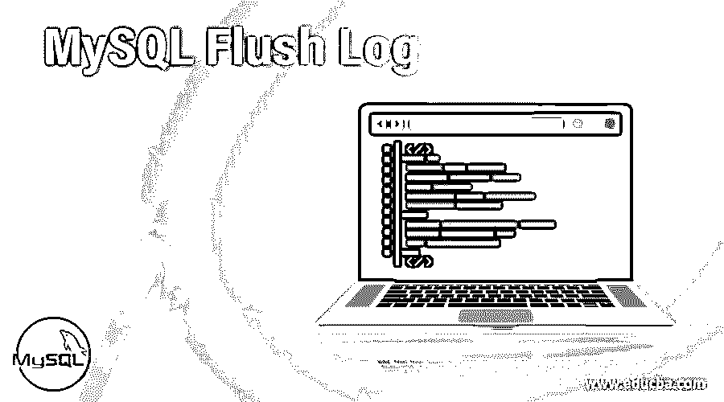

## MySQL 刷新日志简介

刷新日志用于刷新单个日志，如二进制日志、常规日志和错误日志等。mysql 管理实用程序为刷新操作提供了一个命令行界面，使用诸如 flush-logs、flush-status、flush-hosts、flush-privileges 和 flush-tables 等命令。

要执行日志刷新语句或命令，我们需要使用具有“重新加载”权限的帐户连接到服务器。

<small>Hadoop、数据科学、统计学&其他</small>

刷新二进制日志会创建新的二进制日志文件。而刷新一般查询日志会关闭并重新打开日志文件。慢速查询日志和错误日志也是如此，它只是关闭并重新打开日志文件。

**Note:** We can’t use the Flush statements in the store functions or triggers. We may use it in stored procedure.This procedure in turn should not be called by the functions or triggers.

**语法**

下面是同花顺的语法:–

`FLUSH [NO_WRITE_TO_BINLOG | LOCAL] {
[flush_option] [, flush_option] ...
| [tables_option] }`

刷新表的语法如下:–

`FLUSH TABLEStbl_name;
FLUSH TABLES tbl_name [, tbl_name], TABLES WITH READ LOCK;`

这里的 flush_option 和 tables_options 如下所示:

*   **flush_option:** 二进制日志、DES_KEY_FILE、引擎日志、错误日志、常规日志、主机、慢速日志、状态、日志、权限、查询缓存等。,
*   **TABLES _ options:**TABLES _ option:TABLES，Multiple TABLES:–TABLES tbl_name [，tbl_name]，带读锁的表，Multiple TABLES:–TABLES TBL _ name[，tbl_name] …带读锁，TABLES TBL _ name[，tbl_name] …用于导出

### MySQL 刷新日志文件是如何工作的？

flush 语句的工作方式如下:

在刷新日志之前，最好在某个目录中备份日志文件。

#### 1.刷新二进制日志

它用于关闭和重新打开服务器正在写入的二进制日志文件。

**代码:**

`FLUSH BINARY LOGS;`

**输出:**

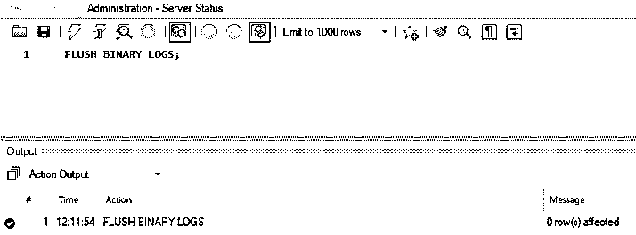

#### 2.刷新常规日志

它用于关闭和重新打开服务器正在写入的常规日志文件。

**代码:**

`FLUSH GENERAL LOGS;`

**输出:**

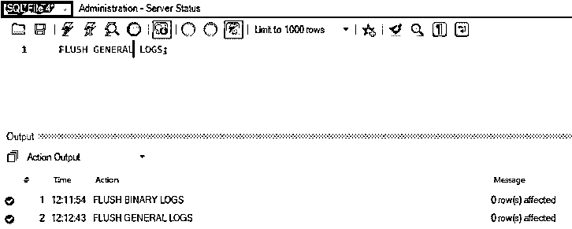

#### 3.刷新错误日志

它用于关闭和重新打开服务器正在写入的错误日志文件。

**代码:**

`FLUSH ERROR LOGS;`

**输出:**

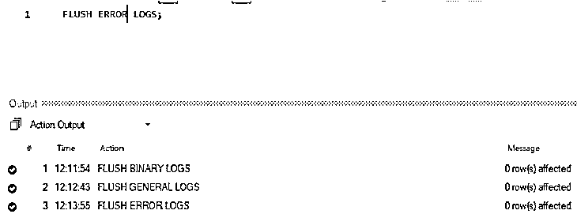

#### 4.刷新引擎日志

它用于关闭和重新打开存储引擎日志文件。

**代码:**

`FLUSH ENGINE LOGS;`

**输出:**

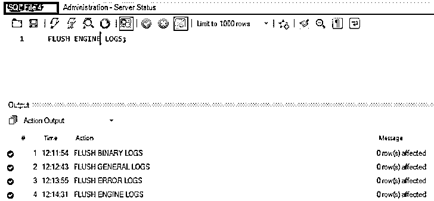

#### 5.刷新密钥文件

在服务器启动时，该选项用于从“DESC 密钥文件”中加载 DES 密钥。

#### 6.刷新主机

它用于刷新主机缓存中的所有信息。

**代码:**

`mysqladmin -u root -p flush-hosts /* -- to flush all host information --*/`

**输出:**

或者

工作台级别语法:–

`FLUSH HOSTS;`

**输出:**

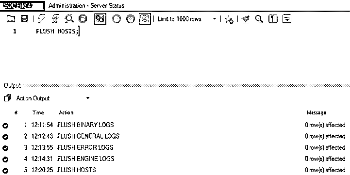

#### 7.刷新日志

它用于刷新所有信息日志。

**代码:**

`mysqladmin -u root -p flush-logs /* -- to flush all logs --*/`

**输出:**

或者

**代码-工作台级别**

`FLUSH LOGS;`

**输出:**

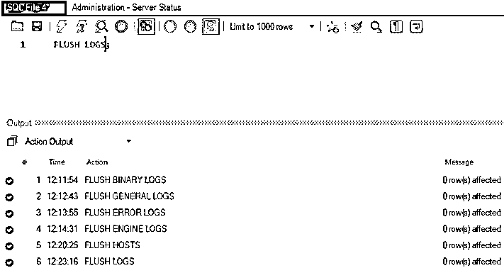

#### 8.刷新权限

它用于重新加载授权表。

**代码:**

`mysqladmin -u root -p flush-privileges /* -- to reload all grant tables --*/`

**输出:**

或者

**代码-工作台级别**

`FLUSH PRIVILEGES;`

**输出:**

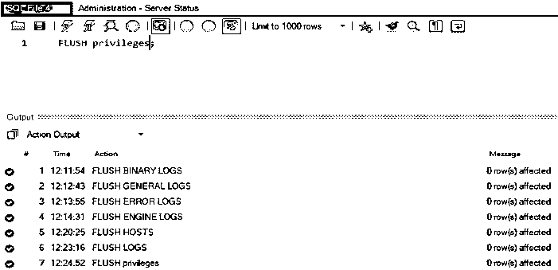

#### 9.齐平螺纹

它用于刷新所有线程缓存。

**代码:**

`mysqladmin -u root -p flush-threads /* -- to flush all threads --*/`

**输出:**

#### 10.刷新查询缓存

它用于对查询缓存进行碎片整理。

#### 11.刷新状态

它用于清除状态变量。

**代码:**

`mysqladmin -u root -p flush-status /* -- to clear all status variables --*/`

**输出:**

或者

**代码-工作台级别**

`FLUSH STATUS;`

**输出:**

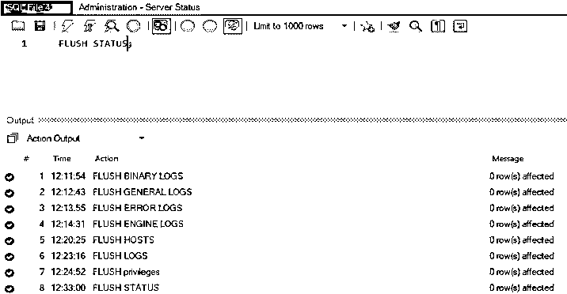

#### 12.刷新中继日志

它用于关闭和重新打开服务器正在写入的中继日志文件。

**代码:**

`FLUSH RELAY LOGS;`

**输出:**

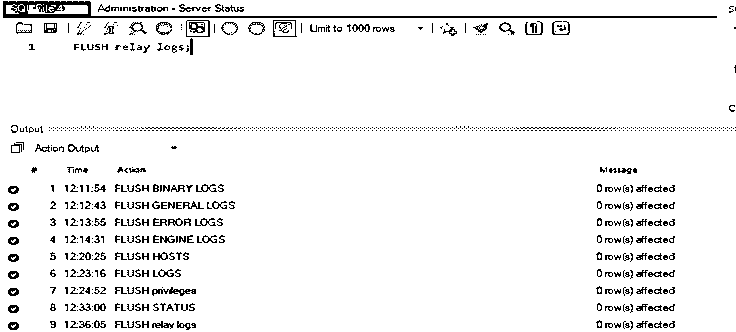

#### 13.刷新慢速日志

它用于关闭和重新打开服务器正在写入的慢速日志文件

**代码:**

`FLUSH SLOW LOGS;`

**输出:**

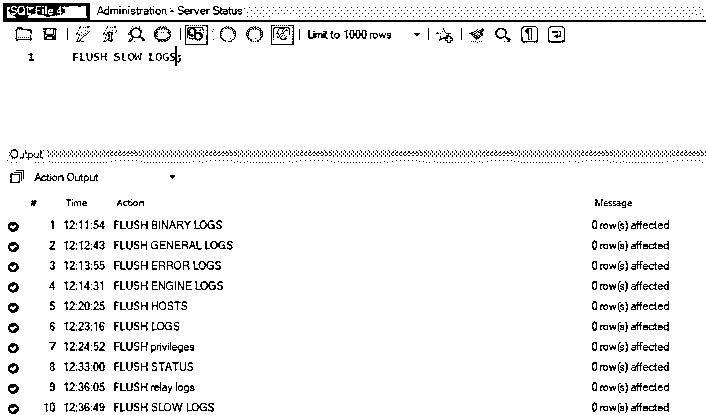

#### 14.刷新表格

它用于根据锁定条件刷新所有表。

**代码:**

`mysqladmin -u root -p flush-tables /* -- to flush all tables --*/`

**输出:**

**代码:**

`FLUSH TABLE TBL_NAME;
EG: -
FLUSH TABLE TEST;`

**输出:**

**例子**

现在让我们使用下面的语句来检查 flush 选项:-

`mysqladmin -help;`

刷新的输出如下所示:

*   flush-hosts 用于刷新所有缓存的主机
*   flush-logs 用于刷新所有日志
*   flush-status 它用于清除状态变量
*   它用于刷新所有的表
*   它用于刷新线程缓存
*   flush-privileges 用于重新加载授权表

让我们看看命令“mysqladmin -help”的输出截图。下面是代表相同的截图。除了 flush，还有很多帮助选项，可以在下面的截图中看到。

**输出:**

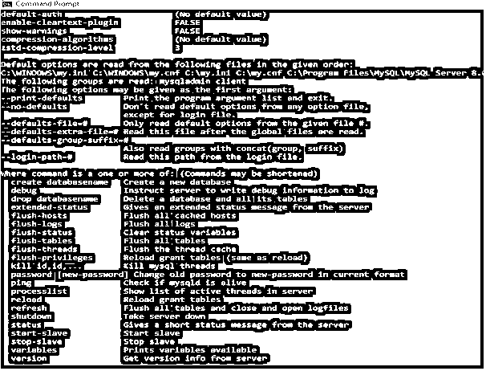

### 结论

*   刷新日志用于刷新单个日志，如二进制日志、常规日志和错误日志等。可以通过使用“mysqladmin”对主机、日志、状态、表、线程和特权进行刷新。
*   要执行日志刷新语句或命令，我们需要使用具有“重新加载”权限的帐户连接到服务器。
*   刷新二进制日志会创建新的二进制日志文件。而刷新一般查询日志会关闭并重新打开日志文件。慢速查询日志和错误日志也是如此，它只是关闭并重新打开日志文件。
*   我们不能在存储函数或触发器中使用 Flush 语句。我们可以在存储过程中使用它。这个过程也不应该被函数或触发器调用。

### 推荐文章

这是一个 MySQL 刷新日志的指南。在这里，我们讨论一个介绍，语法，它是如何与不同的例子。您也可以浏览我们的其他相关文章，了解更多信息——

1.  [MySQL SYSDATE()](https://www.educba.com/mysql-sysdate/)
2.  [MySQL 中的光标](https://www.educba.com/cursor-in-mysql/)
3.  [就像 MySQL 中的](https://www.educba.com/like-in-mysql/)
4.  MySQL 中的 IF 语句

