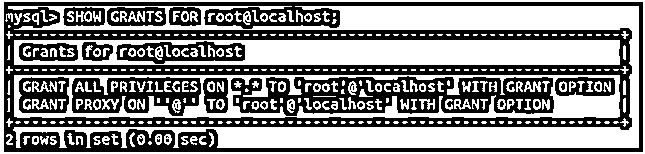
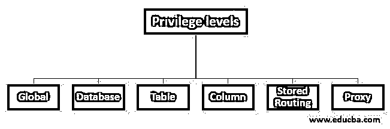
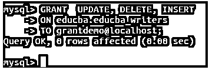

# 授予 MySQL 权限

> 原文：<https://www.educba.com/grant-privileges-mysql/>

## MySQL 权限授予简介

每当使用 CREATE USER 语句在 MySQL 数据库中创建新用户时，所创建的用户没有任何特权，即访问和修改数据库内容的权限。这意味着用户可以登录到数据库服务器，但不能从数据库表中检索数据，也不能使用数据库和创建、更改或修改表。

新创建的用户不能使用 SELECT、INSERT、UPDATE 或 DELETE 语句来获取和修改表的内容。为此，权限必须由其他用户授予，例如 root 用户或有权授予这些权限并且已经被授予了想要授予其他用户的权限的其他用户。在本文中，我们将了解谁可以向其他用户授予特权，如何做到这一点，语法，以及在 MySQL 中授予特权的例子。

<small>Hadoop、数据科学、统计学&其他</small>

### 授予和撤销权限的工作

在机器上安装 MySQL 时，默认情况下会创建一个名为 root 的用户，该用户拥有数据库服务器的所有权限。我们可以使用 SHOW GRANTS 命令检查 MySQL 中授予任何用户的权限。例如，如果我们想要检查授予 root 用户的权限，那么我们可以使用下面的查询语句来获取信息

**查询:**

`SHOW GRANTS FOR root@localhost;`

**输出:**

**说明:**root 用户拥有所有数据库及其表和表的列的所有权限，可以对它们执行任何操作，并且可以将权限授予其他用户。它实际上是@ user 的代理用户。

**语法:**

用于向用户分配权限以允许访问和操作数据库及其实体的 GRANT 命令的语法如下

**查询:**

`GRANT specified_priv [,specified_priv],..
ON specified_priv_level
TO user_name;`

在哪里，

*   **specified_priv:** 它是您希望允许并授予名为 user_name 的用户的操作的权限名称。我们可以使用单个 grant 命令，通过在 grant 关键字后以逗号分隔的方式指定权限，将特定实体上的多个权限授予单个用户。
*   **specified_priv_level:** 权限级别是您要向用户分配权限的实体。可以有六个不同的特权级别，我们可以在这些级别上授予用户权限或特权。
*   **用户名:**这是您要使用 grant 命令授予权限的用户的名称。

### MySQL 中的权限级别

有六个权限级别用于向用户授予权限:全局、数据库、表、列、存储过程或函数以及代理，如下图所示。

#### 授予特权的示例 MySQL

让我们使用下面的 create user 语句创建一个名为 grant demo 的新用户，我们可以使用该语句向

**查询:**

`CREATE USER 'grantdemo'@'localhost' IDENTIFIED BY '123';`

**输出:**

让我们使用下面的查询语句检查该用户被授予的所有权限

**查询:**

`SHOW GRANTS FOR grantdemo@localhost;`

**输出:**

我们可以从输出中看到，新创建的用户没有分配任何授权。它只能登录数据库，但不能访问内容，也不能修改内容。使用 GRANT 语句，让我们授予 educba 数据库的所有 educba_writers 表上的 select 权限。这可以通过使用以下查询语句来完成

**查询:**

`GRANT SELECT
ON educba.educba_writers
TO grantdemo@localhost;`

**输出:**

我们甚至可以使用 GRANT 语句为 grantdemo 用户分配多个特权。例如，让我们在 educba 数据库中的表 educba_writers 上为 grantdemo 用户分配更新、删除和插入权限。为此，我们将使用下面的查询语句，其中要授予的权限以 comm-separated 格式提及

**查询:**

`GRANT UPDATE, DELETE, INSERT
ON educba.educba_writers
TO grantdemo@localhost;`

**输出:**

### 如何在不同的级别上分配权限？

现在让我们一个接一个地看看不同级别的特权是如何分配的。

#### 1.全球一级

我们可以向用户授予某些特权，该用户的特权级别在所有数据库的所有表上都是全局的。这称为在全局级别授予特权。假设我们想将所有数据库的所有表上的 SELECT 特权授予 grantdemo 用户。这可以通过使用以下查询来完成

**查询:**

`GRANT  SELECT
ON *.*
TO grantdemo@localhost;`

**输出:**

*.*用于指定全局权限级别。

#### 2.数据库级别

当我们想在 ceratin 数据库的所有表上授予用户特权时，我们可以使用数据库特权级别。我们需要指定数据库的名称。*提及数据库的特权级别。我们可以使用下面的查询将 educba 数据库的所有表上的 INSERT 特权授予 grantdemo 用户

**查询:**

`GRANT INSERT
ON educba.*
TO grantdemo@localhost;`

**输出:**

#### 3.表特权级别

当我们想要限制对数据库的特定表授予特权时，就授予表级特权。例如，如果我们想授予 grantdemo 用户对 educba_writers 表的删除权限，那么我们可以使用下面的查询--

**查询:**

`GRANT DELETE
ON educba.educba_writers
TO grantdemo@localhost;`

**输出:**

#### 4.列、存储例程和代理级权限授予

如果我们希望将 ceratin 特权限制为授予某个用户，那么我们可以在 GRANT 语句中使用 column 特权级别，方法是以逗号分隔的格式提到列的列表。除此之外，如果我们想要在存储过程、例程和函数上授予特权，那么同样可以通过在授权查询中使用 ON PROCEDURE 或 ON FUNCTION 语句来实现。

我们甚至可以将分配给特定用户的所有权限授予其他用户。这称为代理级权限授予，被授予权限的用户称为被授予权限的原始用户的代理。

### 结论

我们可以在不同的权限级别上为用户创建权限，并使用 MySQL 中的 grant 语句为用户分配不同的权限操作。

### 推荐文章

这是一个授予 MySQL 权限的指南。这里我们讨论了 MySQL 的 Grant Privileges 的介绍和实际例子以及不同的子查询表达式。您也可以浏览我们推荐的文章，了解更多信息——

1.  [MySQL 操作符介绍](https://www.educba.com/mysql-operators/)
2.  [前 23 个 MySQL 字符串函数](https://www.educba.com/mysql-string-functions/)
3.  [MySQL 与 SQLite | 14 大对比](https://www.educba.com/mysql-vs-sqlite/)
4.  [MySQL 时间戳指南](https://www.educba.com/mysql-timestamp/)

