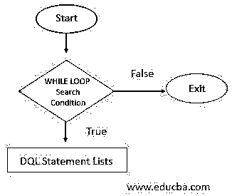
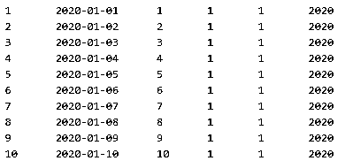

# MySQL WHILE 循环

> 原文：<https://www.educba.com/mysql-while-loop/>

## MySQL WHILE 循环简介

MySQL WHILE 循环允许我们重复执行一个或多个 MySQL 语句查询，除非满足相应的返回结果值的条件。它也是三个循环 MySQL 语句 WHILE、loop 和 REPEAT 中的一个预测试条件循环，因为这里的搜索条件是在代码语句执行之前首先测试的。只要条件表达式为真，WHILE 循环在迭代处理时就会将 SQL 语句作为结果集执行。WHILE 循环中的每条语句都以包含分号结束。每次检查条件时都会发生循环迭代，结果取决于代码流。但是如果当表达式在 WHILE 和 end while 语句之间求值时 MySQL WHILE 循环条件为 FLASE，那么它将退出循环。

### 句法

WHILE 循环的基本语法如下所示:

<small>Hadoop、数据科学、统计学&其他</small>

`[Label_to _begin:] WHILE SearchCondition DO
SQL statement(s)
END WHILE [Label_to_end]`

对上述语法术语的解释:

*   使用标签名，我们可以在 MySQL 执行查询语句的开始或结束时为 WHILE 循环提供一个可选标签。
*   搜索条件是在 WHILE 关键字之后指定的
*   然后进行迭代，从一开始就检查条件。
*   如果计算结果为 TRUE，那么 WHILE 循环将继续执行其他语句列表，直到搜索条件的结果为 TRUE。
*   在 DO 和 END WHILE 循环关键字之间，将执行一个或多个指定的语句。
*   如果 WHILE 的计算结果为 FALSE，则循环终止并结束。
*   循环作用于存储的程序并返回

### 流程图

借助流程图，我们可以更好地理解 MySQL WHILE 循环过程。这个图解说明将使我们对 WHILE 循环和 SQL 语句执行中的真值和假值的概念更加清晰。

该流程图详细说明了 MySQL 中 WHILE 循环迭代过程的基本安排。

### MySQL 中的 WHILE LOOP 是如何工作的？

*   从上面的视觉符号图来看，MySQL 中的 WHILE 循环算法也是以一种简单的设计理念和意义来表示的。
*   首先，开始 WHILE 循环执行，对于每个循环迭代，评估所定义的条件，然后基于 WHILE 条件的结果确定 SQL 语句。当 WHILE 循环的结果为 TRUE 时，将执行代码流语句。
*   其次，根据搜索条件，如果 WHILE 循环的执行趋向于产生任何错误的结果，那么代码流将被撤回，WHILE 循环停止进一步的处理。并且假设，如果任何 SQL 语句在 WHILE 循环之外可用，那么它将被完成。

### 在 MySQL 中实现 WHILE 循环的示例

让我们讨论一些 WHILE 循环 MySQL 语句来执行 SQL 查询代码的例子，如下所示:

*   例如，我们正在考虑一个名为 Calendar_Data 的表来存储 WHILE 循环的值，并相应地执行语句。现在让我们编写 SQL 查询来创建 MySQL 表，该表将存储日期和其他派生信息，如年、月、日和季度。以下是 SQL CREATE 语句:

**代码:**

`CREATE TABLE Calendar_Data (CID INT AUTO_INCREMENT, CDate DATE UNIQUE, CDay TINYINT NOT NULL, CMonth
TINYINT NOT NULL, CQuarter TINYINT NOT NULL, CYear INT
NOT NULL, PRIMARY KEY(CID));`

*   之后，我们需要在 Calendar_Data 表中创建一个新的存储过程来输入一个日期值。MySQL 对此的查询如下:

**代码:**

`DELIMITER $$
CREATE PROCEDURE EntryCalendar(cdt DATE)
BEGIN
INSERT INTO Calendar_Data(CDate, CDay, CMonth, CQuarter, CYear) VALUES(cdt, EXTRACT(DAY FROM cdt), EXTRACT(MONTH FROM cdt), EXTRACT(QUARTER FROM cdt),
EXTRACT(YEAR FROM cdt));
END$$
DELIMITER;
DELIMITER $$`

*   现在，在第三步中，我们将再次生成一个新的存储过程，即 LoadCalendar_Data()，它负责将天数加载到由 start date 初始化的 Calendar_Data 中。

**代码:**

`CREATE PROCEDURE LoadCalendar_Data(startDate DATE, day INT)
BEGIN
DECLARE counter INT DEFAULT 1;
DECLARE cdt DATE DEFAULT startDate;
WHILE counter <= day DO
CALL EntryCalendar(cdt);
SET counter = counter + 1;
SET cdt = DATE_ADD(cdt,INTERVAL 1 day);
END WHILE;
END$$
DELIMITER;`

这里，LoadCalendar_Data 存储过程包含并接受函数中的两个参数:

*   MySQL 中数据类型为 DATE 的 startData 表示插入 Calendar_Data 表中的开始日期。
*   参数将从 startDate 开始的天数加载到表中。

在此装载程序中:

*   在 WHILE 循环开始之前，我们首先声明变量 counter 和 cdtto 来保存立即值。默认情况下，counter 和 cdt 变量值为 1，并相应地开始日期。
*   现在，在 MySQL WHILE 循环的帮助下，我们将在执行时检测计数器变量值是否等于或小于 day 参数值。

如果结果为是，则:

*   调用存储过程(即 EntryCalendar)在 Calendar_Datatable 中输入行值。
*   同样，通过 MySQL 中的 DATE_ADD()函数，循环迭代，计数器增加 1，cdt 也增加一天。

WHILE 循环重复计数器条件，除非计数器变量值与 day 参数值相同，并分别将日期值插入 Calendar_Datatable 的列中。

#### 例子

最后，我们将使用下面的查询语句调用 LoadCalendar_Data()存储过程，该存储过程从 2020 年 1 月 1 日 st 开始将 15 天的行值记录保存到 Calendar_Data 表中。

**代码:**

`CALL LoadCalendar_Data('2020-01-01',10);`

使用 SELECT 关键字，我们可以使用 WHILE 循环和存储程序来查看 Calendar_Data 记录。

`SELECT * FROM Calendar_Data;`

**输出:**

### 结论

MySQL 中的 WHILE 循环在搜索条件或 say WHILE 循环条件保持为真时执行一组代码语句。当代码部分具有规定的条件时，循环继续执行 SQL 部分。否则，如果没有任何 WHILE 条件发生，则循环结束。WHILE loop 是一个 MySQL 存储程序结构，实现了快速运行。

### 推荐文章

这是一个 MySQL WHILE 循环的指南。这里我们讨论一个 MySQL WHILE 循环的介绍，包括循环的工作原理和相应的例子。您也可以浏览我们的其他相关文章，了解更多信息——

1.  [MySQL 中的运算符](https://www.educba.com/mysql-in-operator/)
2.  [MySQL 中的唯一键](https://www.educba.com/unique-key-in-mysql/)
3.  [MySQL 子查询](https://www.educba.com/mysql-subquery/)
4.  [MySQL 中的任何一个](https://www.educba.com/any-in-mysql/)

