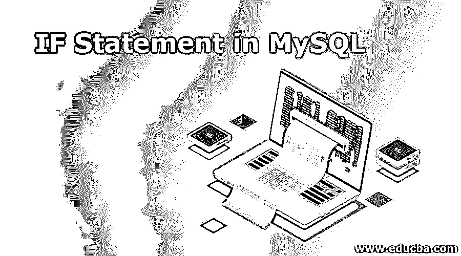
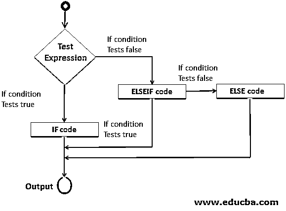
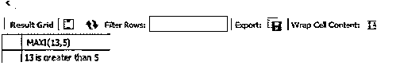
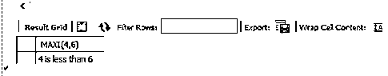
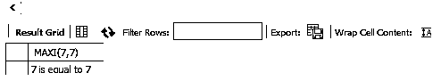
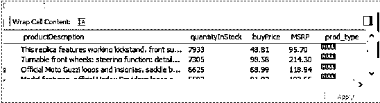
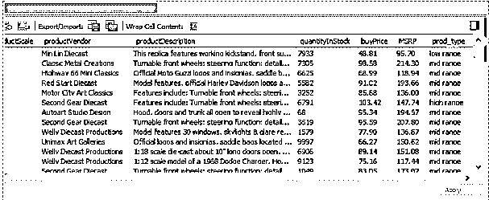

# MySQL 中的 IF 语句

> 原文：<https://www.educba.com/if-statement-in-mysql/>

## MySQL 中**到** IF 语句介绍

MySQL 中的“IF”语句是一个条件语句，用于测试条件或生成基于条件的输出。IF 语句后面只跟 ELSEIF，ELSE 语句后面再跟 ELSE 语句。if 语句按顺序工作，例如，如果 IF 本身的条件测试为正，则后续的 ELSEIF 不会执行，如果 ELSEIF 的条件为真，则后续的 ELSE 不会执行。IF 语句是一种控制流语句。在查询语言的上下文中，控制流语句非常重要，因为它们允许检查重要度量的条件。

**语法:**

<small>Hadoop、数据科学、统计学&其他</small>

MySQL 中 IF-ELSEIF-ELSE 语句的语法如下。

`IF <search_condition_1> THEN
Block of statement(s) that will execute when search_condition_1 is TRUE.
[ELSEIF <search_condition_2> THEN
Block of statement(s) that will execute when the search_condition_2 is TRUE.] [ELSE
Block of statement(s) that will execute when no condition is met.] ENDIF`

**Note:** In the above syntax, ELSEIF and ELSE have been shown enclosed in square brackets, which means that these statements will execute only if the condition on the IF statement turns out to be FALSE.

### MySQL 中 IF-ELSEIF-ELSE 的流程图

MySQL 中 IF 语句的流程图如下所示。

### IF 语句在 MySQL 中如何工作？

当在 IF 语句中传递一个条件时，它将评估该条件是否为真。如果发现为真，则执行一组语句。如果条件评估为假，则它传递到 ELSEIF，在那里评估另一个条件。如果满足，则执行 ELSEIF 下的块语句，否则执行 ELSE 下的块语句。

必须注意，语句块不能为空，因为 MySQL 不允许这样做。

#### 示例#1

在本例中，我们将找到两个值中的最大值。为此，我们将在 MySQL 中创建一个简单的函数 MAXI。该函数将利用 IF 语句来生成正确的输出。实现该函数的代码如下所示。

**代码:**

`DELIMITER //
CREATE FUNCTION MAXI(x INT, y INT)
RETURNS VARCHAR (20)
BEGIN
DECLARE s VARCHAR (20);
IF x > y THEN SET s = 'is greater than';
ELSEIF x = y THEN SET s = 'is equal to';
ELSE SET s = 'is less than';
END IF;
SET s = CONCAT(x, ' ', s, ' ', y);
RETURN s;
END //
DELIMITER;`

我们对一些随机值进行函数评估，以检查每个条件，并获得如下所示的结果。

**实例 1**

`SELECT MAXI (13, 5);`

**输出:**

**实例 2**

`SELECT MAXI (4, 6);`

**输出:**

**实例 3**

`SELECT MAXI (7, 7);`

**输出:**

因为我们可以发现代码给了我们正确的结果。让我们看看代码是如何工作的。代码有两个重要的方面，首先是语法，其次是逻辑。我们探索虽然简单却很重要的逻辑。我们将两个整数值传递给函数。注意，函数返回字符串，所以我们使用 VARCHAR。在函数内部，我们比较变量，并根据条件给字符变量' s '分配适当的语句。使用 IF 语句检查条件。最后，当 IF 语句结束时，我们连接变量和赋给变量 s 的语句。

我们用上面显示的三个样本输入验证了结果，这样获得的结果在选择代码后的屏幕截图中显示。为了执行这个函数，我们必须用 SELECT 语句来执行它。

#### 实施例 2

我们现在将要看到的示例演示了一种开箱即用的方法。我们有一个产品表，其中包含各种细节，如价格、供应商、产品类型、各种类型车辆的产品类别，即。老爷车、摩托车、飞机、轮船、卡车和公共汽车以及老爷车。我们打算根据价格对产品进行分类。分类必须是:价格高于 100 英镑的产品将被归类为“高档”，价格高于 50 英镑但低于或等于 100 英镑的产品将被归类为“中档”，最后，价格低于 50 英镑的产品将被归类为“低档”。

我们没有将产品类型作为表中的一列。因此，首先，我们需要将它添加到表中。如下所示。

`ALTER TABLE products
ADD prod_type VARCHAR(20)`

让我们加载 products 表，检查是否正确添加了列。下面的截图显示了这一点。

**输出:**

正如我们在上面看到的，列 prod_type 已经成功地添加到表中。

现在，我们打算让这个列中的值基于 buyprice 的值。下面的代码考虑了我们前面讨论的分类，并使用 IF 语句根据购买价格对产品进行分类。仔细看看代码。

**代码:**

`DELIMITER //
CREATE FUNCTION product_category(p DECIMAL)
RETURNS VARCHAR (20)
BEGIN
DECLARE product_typeVARCHAR (20);
IF p > 100 then set product_type = 'high range';
ELSEIF p > 50 then set product_type = 'mid range';
ELSE set product_type = 'low range';
END IF;
RETURN product_type;
END//
DELIMITER`

浏览代码，我们发现我们创建了一个函数，它将一个十进制变量作为参数，本质上返回一个字符结果。IF 代码使我们能够根据参数值给字符串变量分配合适的字符串值。

下面的 UPDATE 语句利用了我们上面定义的 product_category()函数。

`UPDATE products
SET prod_type = product_category (buyPrice);`

上面的代码将根据 buyPrice 的值为 prod_type 列的每个条目分配适当的值。这里，我们没有使用 WHERE 子句，而是通过使用函数来使用 IF 语句。因此，我们采用了一种开箱即用的方法来完成任务。

下面的屏幕截图显示了上面的代码是如何成功更新表的。

**输出:**

### 结论

对于如何在 MySQL 中使用 IF 这样的条件流语句没有限制。MySQL 中 IF 语句的实现并不像 C、C++、Java、VBA 等任何编程语言那么容易。这是由于 MySQL 的查询处理特性。

### 推荐文章

这是一个 MySQL 中 IF 语句的指南。这里我们讨论 MySQL 中 IF 语句的介绍以及实际例子和不同的子查询表达式。您也可以浏览我们推荐的文章，了解更多信息——

1.  [MySQL 操作符介绍](https://www.educba.com/mysql-operators/)
2.  [最大差异——吉拉 vs Github](https://www.educba.com/jira-vs-github/)
3.  [前 23 个 MySQL 字符串函数](https://www.educba.com/mysql-string-functions/)
4.  [MySQL 与 SQLite | 14 大对比](https://www.educba.com/mysql-vs-sqlite/)

