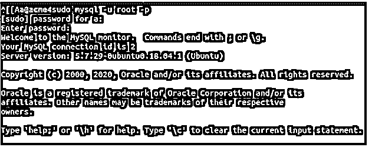
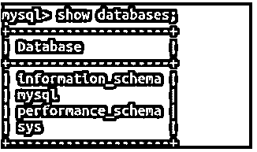
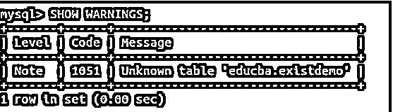
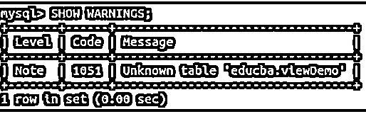

# MySQL 如果存在

> 原文：<https://www.educba.com/mysql-if-exists/>

## MySQL 介绍(如果存在)

在 Mysql 中存在和是否存在是两个不同的规定。EXISTS 子句用于测试子查询中记录的存在。如果子查询至少包含一条记录，EXISTS 子句返回 true，否则返回 false。这在主查询中用作执行和检索记录的决定因素。另一方面，在删除数据库、表和视图时使用了 IF EXISTS 子句。当我们在那时使用 IF EXISTS 子句以防我们试图删除的对象不存在时，防止了错误的发生，并且一旦 MySQL 识别出实体不存在并发出警告，执行就被终止。

### 如果存在如何使用 MySQL？

在本文中，我们将学习如何在使用 DROP DATABASE、DROP TABLE 和 DROP VIEW 命令时使用 IF EXISTS 子句，并提供语法和示例。

<small>Hadoop、数据科学、统计学&其他</small>

#### 1.如果存在则删除数据库命令

**语法:**

`DROP DATABASE [IF EXISTS] name_of_database;`

其中，数据库名称有助于指定您希望完全删除的数据库的名称，包括其内容，如表、存储过程、触发器等。

每当执行 DROP DATABASE 命令时，如果 MySQL 数据库服务器中不存在名为 name_of_database 的数据库，那么在执行该命令时，它会抛出一个错误，指出不存在这样的数据库。在这种情况下，如果我们在命令中使用了 IF EXISTS 子句，则会发出一条通知，而不是错误消息，指出具有指定名称的数据库不存在，并且 DROP DATABASE 命令的执行会在该处自行终止。IF EXISTS 子句用于防止在指定名称的数据库不存在时发出错误。

首先，我们必须使用以下命令打开 MySQL 连接

`mysql -u root -p`

如果您希望以 root 作为用户名登录，并且如果设置了密码，它会提示您输入密码。

执行上述命令将得到以下输出:

然后，您必须执行以下命令来列出 MySQL 数据库服务器中存在的所有数据库。

`SHOW DATABASES;`

在我的例子中，它给出了以下输出:

现在，让我们尝试删除数据库服务器上不存在的数据库，并查看输出–

`DROP DATABASE educba;`

执行上述命令会产生以下输出:

可以看到，抛出了一个错误代码为 1008 的错误，指出不能删除“educba”数据库，因为不存在这样的数据库。

现在，让我们研究一下在查询语句中添加 IF EXISTS 子句后的输出

`DROP DATABASE IF EXISTS educba;`

执行上述查询的输出如下所示

从输出中可以看出，即使 educba 命名的数据库在我们的数据库中不存在，也没有出现错误。它显示查询很好，没有任何行受到影响，并显示有一个警告。

#### 2.如果存在则删除表命令

**语法:**

`DROP TABLE [IF EXISTS] name_of_table;`

其中 name_of_ table 帮助指定您希望完全删除的数据库的名称，包括其内容(如表)及其由索引、分区、约束等组成的结构。

每当执行 DROP TABLE 命令时，如果 MySQL 数据库中不存在名为 name_of_table 的表，那么在执行该命令时，它会抛出一个错误，指出不存在这样的表。在这种情况下，如果我们在命令中使用了 IF EXISTS 子句，则会发出警告，而不是错误消息，指出具有指定名称的表不存在，并且 DROP TABLE 命令的执行会在该处终止。IF EXISTS 子句用于防止在具有指定名称的表不存在时发出错误。

##### 例子

让我们尝试删除名为 existdemo 的表，该表在我们当前使用的名为 educba 的数据库中不存在，我们使用简单的 drop 命令的以下查询语句--

`DROP TABLE existdemo;`

执行上述查询的输出如下所示

它会引发一个错误，指出该表未知，因为它不存在于 educba 数据库中。让我们尝试在同一个查询语句中使用 IF EXISTS 子句

`DROP TABLE IF EXISTS existdemo;`

上述查询的执行输出如下所示，表示查询成功执行，没有影响任何行，同时显示警告-

要查看警告，我们可以执行以下命令

`SHOW WARNINGS;`

在执行查询语句后，它会给出以下输出–

请注意，如果要删除的表存在于数据库中，那么上述两个 DROP TABLE 查询会给出相同的输出，并且不会受到语句中是否存在 IF EXISTS 子句的影响。这同样适用于数据库和视图的删除。

#### 3.如果存在则删除视图命令

**语法:**

`DROP VIEW [IF EXISTS] name_of_view;`

其中视图名称有助于指定您希望完全删除的视图的名称，包括其内容。请注意，定义视图的原始表保持不变。

每当执行 DROP VIEW 命令时，如果 MySQL 数据库中不存在名为 name_of_view 的视图，那么在执行该命令时，它会抛出一个错误，指出不存在这样的视图。在这种情况下，如果我们在命令中使用了 IF EXISTS 子句，则会发出一条警告，而不是错误消息，指出具有指定名称的视图不存在，并且 DROP VIEW 命令的执行会在该处自行终止。IF EXISTS 子句用于防止在具有指定名称的视图不存在时发出错误。

##### 例子

让我们尝试删除名为 viewDemo 的视图，该视图在我们当前使用的名为 educba 的数据库中不存在，我们使用简单的 drop 命令的以下查询语句--

`DROP VIEW viewDemo;`

执行上述查询的输出如下所示

它会引发一个错误，指出该表未知，因为它不存在于 educba 数据库中。视图是逻辑表，但实际上并不存在于内存中。在发出错误和警告时，它们在 Mysql 中也被称为表。让我们尝试在同一个查询语句中使用 IF EXISTS 子句

`DROP VIEW IF EXISTS viewDemo;`

上述查询的执行输出如下所示，表示查询成功执行，没有影响任何行，同时显示警告-

要查看警告，我们可以执行以下命令

`SHOW WARNINGS;`

在执行查询语句后，它会给出以下输出–

### 推荐文章

这是一个 MySQL 的指南，如果有的话。这里我们也讨论一下 mysql 的入门和如何使用如果存在？以及不同的示例及其代码实现。您也可以看看以下文章，了解更多信息–

1.  [MySQL IF 函数](https://www.educba.com/mysql-if-function/)
2.  [MySQL 新的](https://www.educba.com/mysql-uuid/)
3.  [MySQL sum()](https://www.educba.com/mysql-sum/)
4.  [MySQL 分区](https://www.educba.com/mysql-partition/)

