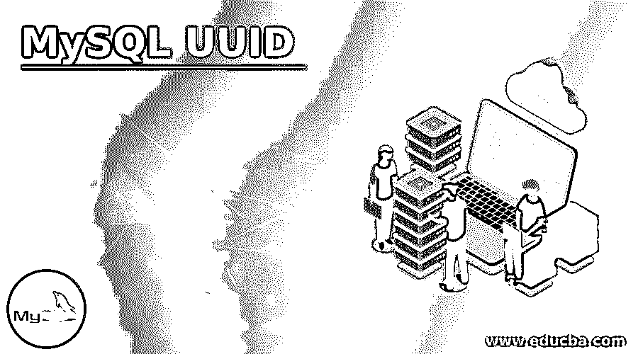
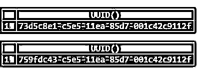
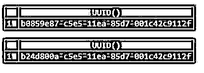
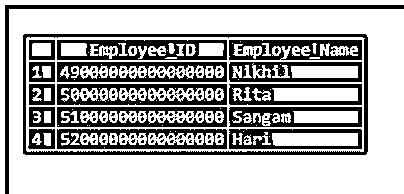

# MySQL UUID

> 原文：<https://www.educba.com/mysql-uuid/>

## MySQL UUID 简介

MySQL UUID 被定义为“通用唯一标识符”,它显示了表的主键的用法。基本上，它是在 RFC 4122 的基础上描述的，RFC 4122 是一个 URN 命名空间，即通用唯一标识符(UUID)。这里，我们将展示 UUID 作为主键，以及它在 MySQL 查询中应用的优缺点。UUID 被认为是一个在宇宙和时间范围内都是独一无二的数字。如果 UUID 是在两个相互关联的独立服务器上生成的，那么这两个 UUID 值预计也是唯一的。

### MySQL UUID 的语法

UUID 值被定义为 128 位数字，表示五个十六进制数字的 utf8 字符串，其格式如下:

<small>Hadoop、数据科学、统计学&其他</small>

`dddddddd-eeee-ffff-gggg-hhhhhhhhhhhh`

为了生成 UUID 值，我们需要应用如下所示的 UUID 函数:

`UUID()`

这里，函数 UUID()给出了与 RFC 4122 中定义的 UUID 版本 1 一致的 UUID 值。

这可以通过使用 UUID()函数来说明，如下所示:

`SELECT UUID();`

**输出:**

**<u>

</u>** 

应该注意，该函数对于基于语句的应用程序来说是不安全的。如果在 binlog_format 固定为语句时实现该函数，它将记录一个警告。

### UUID 如何在 MySQL 中工作？

UUID()函数的用法可能类似于数据库中表的主键。让我们来看看 MySQL UUID 与数据库中带有 AUTO_INCREMENT INT 属性的主键的比较。

**MySQL UUID 作为主键的优势如下:**

*   跨数据库、表以及服务器的 UUID 值是不同的，这使我们能够将多个记录中的行联合起来，或者说跨 MySQL 服务器的分布式数据库。
*   UUID 不描述关于任何数据的信息，因此它们更安全地用于 URL。假设如果员工 id 为 05 的员工使用 URL:http://www.test.com/employees/05/then,访问他/她的帐户，其他人也很容易猜到并使用 07、08 等。因此，它将为任何破坏安全和增加风险的有害攻击提供目标。
*   为了避免往返数据库服务器，UUID 值可以在任何地方产生。类似地，它是应用程序中的一个桥接逻辑。假设要将记录输入到父表和子表中，那么我们首先需要插入到基表(即父表)中，接收生成的 id，然后将数据插入到子表中。因此，通过应用 UUID，我们可以首先创建基表的主键的值，然后在一个事务中同时向父表和子表输入行。

**除了使用 UUID 关联主键的优点之外，下面还简要介绍了缺点:**

*   如果我们使用整数，即 4 个字节或大整数，即 8 个字节，那么它比 UUID 值占用更少的存储容量，即存储 16 个字节。
*   恢复可能更成问题。比如表达式 WHERE Employee_ID = 05 容易而不是 WHERE Employee _ ID = ' FD 7 BC 2 FB-9ve 4-10t 7-49yy-p 9 vbc 73 CB xyf '。
*   使用 UUID 值时，由于其大小和无序形式，可能会引发性能问题。

**MySQL 中的 UUID 解决方案如下:**

MySQL 为您提供了以二进制格式或压缩格式存储 UUID 值的选项，并且可以以人类可读的格式显示，即 VARCHAR 格式。

这可以通过使用以下与 UUID 相关的 MySQL 函数来实现:

*   **UUID _ 托 _ 宾** **:** 此函数负责将 UUID 值从人类可读的 VARCHAR 格式转换为压缩的二进制格式以便存储。
*   **BIN_TO_UUID:** 和上一个正好相反。BIN_TO_UUID 函数将 UUID 从压缩形式或二进制格式转换为 VARCHAR 格式，便于演示。
*   **IS_UUID:** 当自变量是有效的字符串格式 UUID 时，该 IS_UUID 函数提供 1。但是如果参数不是合法的字符串格式 UUID，那么函数给出 0 作为结果。此外，如果参数为 NULL，IS_UUID 函数将返回 NULL。

以下格式是 MySQL 中使用的有效字符串 UUID 排列:

`dddddddd-eeee-ffff-gggg-hhhhhhhhhhhh`

`ddddddddeeeeffffgggghhhhhhhhhhhh`

`{ dddddddd-eeee-ffff-gggg-hhhhhhhhhhhh }`

需要记住的是，这些函数，IS_UUID、UUID _ 托 _ 宾和宾 _ 托 _UUID，只在 MySQL 版或说更高版本中存在或支持。

### MySQL UUID 的例子

让我们评估一些 UUID 作为 MySQL 数据库服务器中一个表的主键的例子:

#### 示例#1

假设，我们在这里展示了一个实验，让 UUID 在同一台服务器上每隔一段时间具有唯一的值，因此，我们执行了一个 UUID 值，给出了以下结果，并在 MySQL 中使用 SLEEP()提供了一个 gab，时间间隔为 3 秒。

**代码:**

`SELECT UUID(); do sleep(3); SELECT UUID();`

**输出:**

<u>

</u> 

现在，在那之后，当我们再次执行 UUID 值时，发现它是不同的，就像这样。

#### 实施例 2

我们将使用 CREATE statement 查询在数据库中创建一个新表，如下所示。

**代码:**

`CREATE TABLE Employees (Employee_IDBINARY(16) PRIMARY KEY, Employee_Name VARCHAR(255));`

执行上述命令后，将在数据库中创建一个表结构。接下来，我们将向其中插入一些数据。主键列是用没有字符和排序规则的 binary (16)指定的。

让我们在 Employees 表的 Employee_ID 列中输入几个 UUID 值。

为了实现这一点，我们也将使用函数 UUID()和 UUID _ 到 _ 斌()的帮助下插入查询如下。

**代码:**

`INSERT INTO Employees (Employee_ID, Employee_Name) VALUES
('1','Nikhil'), ('2', 'Rita'),('3', 'Sangam'), ('4', 'Hari');`

现在通过下面的查询查看表的内容。

**代码:**

`SELECT * FROM Employees;`

**输出:**

或者，您可以在 MySQL 版本 8.0 及更高版本中使用此查询函数。

**代码:**

`INSERT INTO Employees (Employee_ID, Employee_Name) VALUES
(UUID_TO_BIN(UUID()), 'Nikhil'), (UUID_TO_BIN(UUID()), 'Rita'),
(UUID_TO_BIN(UUID()), 'Sangam'), (UUID_TO_BIN(UUID()), 'Hari');`

您可以看到，具有二进制数据类型的雇员 id 在表中有 16 位数字。

现在，为了从表中的 UUID 列查询信息，我们将应用函数 BIN_TO_UUID()将二进制数据值转换为人类可读的形式，如下所示。

**代码:**

`SELECT BIN_TO_UUID(Employee_ID) ID , Employee_Name FROM Employees;`

在这里，您可以查看表中主键列值的 UUID 值，从二进制数字到保护主值的人类字符可读结构。

### 结论

虽然 UUID()值被设计成不同的，但它们可能本质上不是不可预测的。如果不可预测性是强制性的，我们可以以某种更进一步的方式创造 UUID 价值。因此，我们已经看到了如何将 UUID 应用于带有主键的列。因为 UUID 值在 URL 中应用更安全，并且可以在任何不需要往返 MySQL 数据库服务器的地方产生。

### 推荐文章

这是一个 MySQL UUID 的指南。这里我们讨论 MySQL UUID 的介绍，UUID 是如何工作的，以及相应的查询示例。您也可以看看以下文章，了解更多信息–

1.  [MySQL 全文本](https://www.educba.com/mysql-fulltext/)
2.  [MySQL 分区](https://www.educba.com/mysql-partition/)
3.  [MySQL 撤销](https://www.educba.com/mysql-revoke/)
4.  [MySQL 集群](https://www.educba.com/mysql-cluster/)

