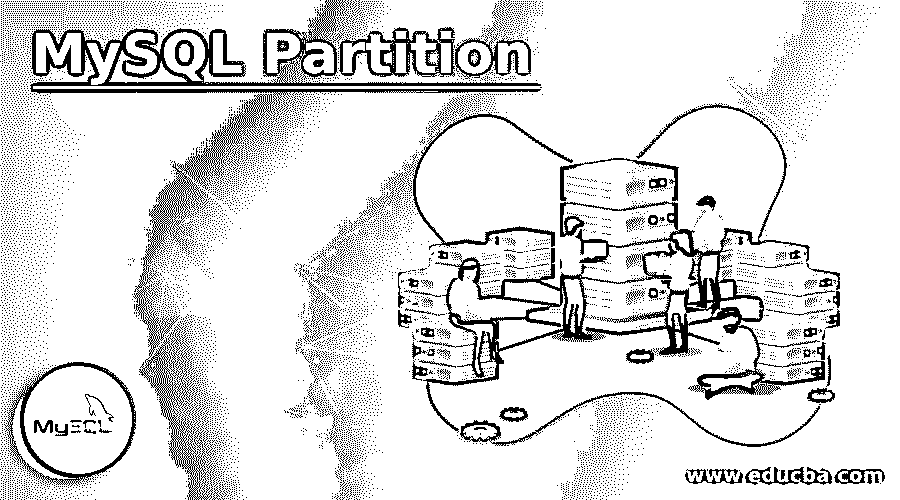
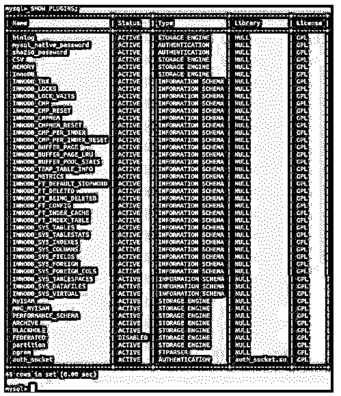
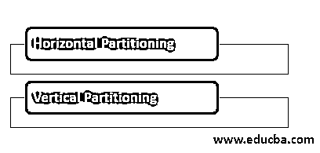
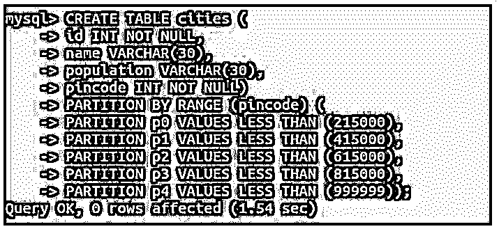
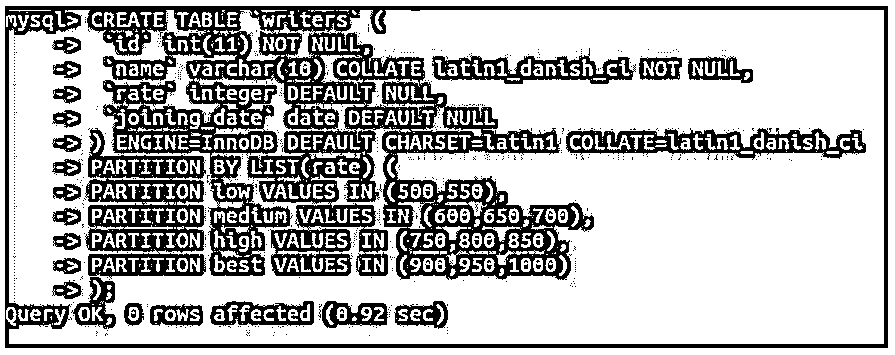
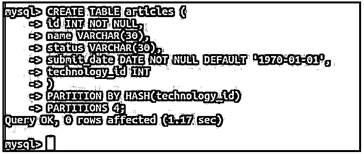
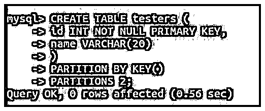

# MySQL 分区

> 原文：<https://www.educba.com/mysql-partition/>

## MySQL 分区介绍

以下文章提供了 MySQL 分区的概要。分区是可以在存储大量记录的数据库表中创建的分隔符。分区带来了可伸缩性，并提高了数据库访问和数据检索的性能，只需要很少的额外资源。在表中实现分区有助于在创建适当的查询和分区时更快地检索数据。

在表中创建分区所依据的列或参数必须始终出现在对该表构造的 insert、update、delete 和 select 查询的 where 子句中。如果不这样做，将导致扫描整个表记录，而不是该记录所属的单个分区，这将被证明是非常耗费时间和资源的。

<small>Hadoop、数据科学、统计学&其他</small>

### 检查 MySQL 中对分区的支持

我们可以通过使用下面的查询检查 information_schema 模式中插件表的内容来检查 MySQL 是否支持分区。

**代码:**

`SELECT PLUGIN_STATUS,PLUGIN_NAME,PLUGIN_VERSION FROM INFORMATION_SCHEMA.PLUGINS WHERE PLUGIN_TYPE='STORAGE ENGINE' and PLUGIN_NAME = "partition";`

**输出:**

如果您的 MySQL 分区支持处于活动状态，将给出以下输出:

或者，您可以启动以下命令来检查分区插件是否处于活动状态，以及您的 MySQL 版本是否支持它。

**代码:**

`SHOW PLUGINS;`

**输出:**

给出以下输出，其中包含一个名为 partition 的插件及其状态，以及数据库的所有其他插件:

### MySQL 中的分区类型

分区可以大致分为两种类型:

*   水平分割
*   垂直分割

#### 1.水平分割

在水平分区中，通过划分表的行数来拆分和分区数据。

例如，假设一个表包含 150000 行，那么我们可以在该表上创建任意数量的分区，比如 10 个分区，这样每个分区将包含 15000 行。水平分区减少了在该表上执行任何数据库操作时要管理的行数。水平分区根据用于分区的键的类型进一步分类。

#### 2.垂直分割

垂直分区处理列的分离，而不是行的分离。因此，产生的分区将包含与它们先前在原始表中相同数量的行，但是列的数量将减少。这类似于规范化，但是垂直分区实现了比规范化更高级的一些概念。

### 分割技术

下面给出了分区技术:

#### 1.范围划分

在这种类型的分区中，我们根据值的范围创建分区。此范围需要是连续的，同时任何范围都不应与另一个范围重叠。其列值将落入特定范围值的所有记录都将被添加到该分区中。对于基于范围值创建分区，小于子句用于在创建时定义分区范围。

例如，让我们创建一个存储该国城市的表，并根据 pin 码创建 5 个分区。

**代码:**

`CREATE TABLE cities (
id INT NOT NULL,
name VARCHAR(30),
population VARCHAR(30),
pincode INT NOT NULL)
PARTITION BY RANGE (pincode) (
PARTITION p0 VALUES LESS THAN (215000),
PARTITION p1 VALUES LESS THAN (415000),
PARTITION p2 VALUES LESS THAN (615000),
PARTITION p3 VALUES LESS THAN (815000),
PARTITION p4 VALUES LESS THAN (999999));`

**输出:**

#### 2.列表分区

列表分区的工作方式与范围分区非常相似。这两种分区技术之间的唯一区别是，在列表分区中，您需要以逗号分隔的格式为每个分区指定一组值，而不是定义整个范围的值。请注意，提到的分区值应该是离散的。PARTITION BY LIST (expression)子句用于表示表达式，该表达式可以是任何具有整数数据类型的列，也可以是任何其他将产生整数值的列表达式。此外,(值列表)中的值用于指定将落入该分区的离散整数值的集合。

例如，我们将创建一个名为 writers 的表，它将包含列 name、id、rate 和 joining_date，我们将基于 rates 创建四个分区。假设固定汇率值为 500、550、600、650、….1000。因此，这里我们将根据速率值创建 4 个分区。

**代码:**

`CREATE TABLE `writers` (
`id` int(11) NOT NULL,
`name` varchar(10) COLLATE latin1_danish_ci NOT NULL,
`rate` integer DEFAULT NULL,
`joining_date` date DEFAULT NULL
) ENGINE=InnoDB DEFAULT CHARSET=latin1 COLLATE=latin1_danish_ci
PARTITION BY LIST(rate) (
PARTITION low VALUES IN (500,550),
PARTITION medium VALUES IN (600,650,700),
PARTITION high VALUES IN (750,800,850),
PARTITION best VALUES IN (900,950,1000)
);`

**输出:**

#### 3.哈希分区

在散列分区中，我们不需要指定分区所考虑的值，哪个值属于哪个分区由 MySQL 自己决定。我们只需要提到将要进行哈希运算的表达式以及要创建的分区数量。我们可以提到，我们希望通过使用 PARTITION BY HASH (expression)来执行哈希分区，其中 expression 应始终返回整数值，并进一步使用 PARTITIONS 来提及要创建的分区数量。

例如，我们将使用散列分区技术在 technology_id 列上创建 articles 表和 4 个分区。

**代码:**

`CREATE TABLE articles (
id INT NOT NULL,
name VARCHAR(30),
status VARCHAR(30),
submit_date DATE NOT NULL DEFAULT '1970-01-01',
technology_id INT
)
PARTITION BY HASH(technology_id)
PARTITIONS 4;`

**输出:**

#### 4.键划分

这种技术类似于散列分区，只是列的散列是由 MySQL 内部完成的，我们不需要提到散列表达式。取而代之的是只提及 KEY()的分区。这些键列不必是整数类型。

我们可以使用键分区，如下例所示，其中使用键分区技术为表测试者的键创建了两个分区。

**代码:**

`CREATE TABLE testers (
id INT NOT NULL PRIMARY KEY,
name VARCHAR(20)
)
PARTITION BY KEY()
PARTITIONS 2;`

**输出:**

### 结论

当表中有太多数据时，我们可以在数据库中实现分区。各种技术可用于分区。选择哪一个取决于用例及需求。分区为 MySQL 数据库带来了巨大的性能和可伸缩性。

### 推荐文章

这是一个 MySQL 分区指南。这里我们讨论 MySQL 分区的介绍，检查对分区的支持，分区的类型和技术。您也可以看看以下文章，了解更多信息–

1.  [MySQL 数据库修复](https://www.educba.com/mysql-database-repair/)
2.  [MySQL 时间戳](https://www.educba.com/mysql-timestamp/)
3.  [MySQL 中的运算符](https://www.educba.com/mysql-in-operator/)
4.  [MySQL 约束](https://www.educba.com/mysql-constraints/)

