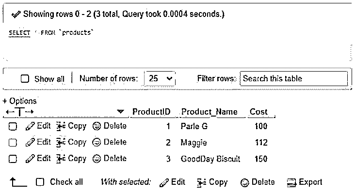
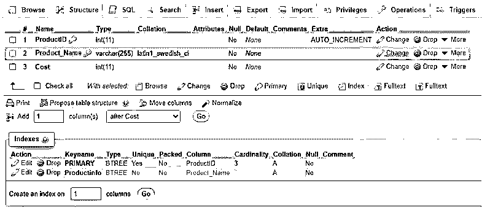

# MySQL 性能调优

> 原文：<https://www.educba.com/mysql-performance-tuning/>

## MySQL 性能调优简介

MySQL 性能调优是一项 MySQL 技术，用于增强 MySQL 查询，以提高数据库的速度和性能。在 MySQL 中，使用特殊语言 SQL(结构化查询语言)在服务器中编写命令或进行编程，以便我们可以在 MySQL 数据库中创建、插入、更新、修改、删除和获取数据记录。SQL 编程在许多关系数据库中得到实现和应用，如 MySQL、SQL Server、Oracle、Postgres 等。

通过应用 SQL 查询语句，程序员可以轻松地执行不同的功能性服务器操作，如数据上的 CRUD 事件、创建触发器等。现在，随着数据量的增长和技术的日益复杂，对 MySQL 数据库进行适当的优化是有益的。这将确保最终用户的理解，并最大限度地降低下部结构的成本。

<small>Hadoop、数据科学、统计学&其他</small>

### 如何在 MySQL 中进行性能调优？

*   随着不断增长的数据维度增加了工作负载的复杂性，MySQL 性能调优和数据库查询增强对于最大化系统呈现和资源消耗至关重要。
*   MySQL 调优过程对开发人员来说有点困难，原因可能有很多，因为最初可能需要广泛的技术能力来编码和识别几种执行策略。这是一个人的任务，他可以利用知识，同时编写干净和全面的 MySQL 语句。
*   除了它的复杂性，调谐被认为是非常时间压倒性的。它有各种各样的好处。一旦 MySQL 调优正确完成，数据库将产生合理的性能和大量的功能，快速的数据检索最终会降低成本并改善服务器中的数据存储。这种性能调优将改善 MySQL 服务器中查询执行的内存带宽、磁盘寻道、读写、CPU 周期和网络利用率，因为这些元素基本上是系统性能可能受阻或变慢的根源。

### MySQL 性能调优示例

以下是 MySQL 性能调优和维护数据库操作和查询执行需要实现的几个因素:

#### 示例#1

MySQL 中的查询优化过程。

我们必须遵循最佳实践，使 MySQL 性能调优过程对数据库速度和维护有效。

**a .索引在 WHERE、ORDER BY、GROUP BY &连接子句**中应用的所有列

索引不仅唯一地评估数据库中的记录，还允许服务器更快地从执行的 MySQL 查询中检索结果。

假设我们有表产品，我们可以使用下面的查询在 MySQL 中创建一个索引:

**代码:**

`select * from products;`

**输出:**

**语法:**

`CREATE INDEX IndexName ON TableName(ColumnName1, ColumnName2,….);`

`CREATE INDEX Productinfo ON Products (Product_Name);`

**输出:**

不正确的查询索引可能会导致表扫描，从而导致锁定类型问题和性能下降。

**b .使用函数对列进行转义**

如果一个列有一些预定义的函数，那么 MySQL 数据库将不会使用与之相关的索引。

为了说明，让我们考虑一个查询:

**代码:**

`SELECT * FROM TableA WHERE UCASE(ColumnA) = ‘XYZ’ ;`

由于函数 UCASE()的原因，数据库不会对 ColumnA 应用索引。您需要建立一个新的基于函数的索引，否则产生自定义列来优化性能。

**c .不要在开头使用带有通配符(%)的 LIKE 表达式**

像' %ghj '这样谓词将导致全表扫描，从而导致性能下降。

**例如:**

`SELECT * FROM TableName WHERE ColumnA LIKE ‘%GHJ’;`

**d .转义 SELECT 子句中的无意义字段**

我们应该指定需要从查询中获取的列名，而不是所有的列，其中有些列可能不需要使用 SELECT *选项获取。这可能会降低数据库的速度和执行负载。

**e .应用内部连接而不是外部连接**

我们必须在 MySQL 中只在需要的时候应用外部连接，否则在不需要的时候可能会降低执行速度并影响数据库的性能。

f .如有必要，添加 DISTINCT 和 UNION 选项

如果没有任何主目标，尽量避免使用 UNION 和 DISTINCT MySQL 操作符，这将带来不希望的排序和缓慢的服务器执行。但是我们可以用 UNION ALL 代替 UNION，以提高效率。

**g .对排序列表使用 ORDER BY MySQL 子句**

为了获得有影响的结果，我们可以使用 ORDER BY 子句对 used columns 类型中的行进行排序，这有利于优化性能。

**h .转义空值的使用**

我们可能有一些包含空输入的列值，这可能会在所有记录的查询执行过程中损害 MySQL 结果。为此，我们也可以使用 IFNULL 语句来提供替代结果。

#### 实施例 2

避免使用 MySQL 作为队列。

使用队列可能会增加工作负载，从而影响数据库性能，并且不会使任务完成，因为它会产生额外的加载时间，而没有任何理由来管理数据库资源。

#### 实施例 3

接受四大 MySQL 资源。

我们需要处理使数据库正常运行的四个主要资源，以便进行性能调优。它们是内存、CPU、网络和磁盘。我们必须小心选择硬件和解决任何问题，以避免服务器性能受到影响。

#### 实施例 4

MySQL 查询的分页。

应用程序中使用的分页往往显示服务器速度慢。这可以通过用户界面来优化，我们可以显示下一页的链接，而不是显示精确的页数和无关的链接。

#### 实施例 5

来改进 MySQL 子查询。

子查询给服务器带来了繁重的工作，我们必须更喜欢使用 JOIN 子句作为帮助数据库优化的替代方法。

#### 实施例 6

MySQL 中的查询缓存。

缓存数据库中的内容，如选择查询文本，同时获取结果是最大化性能的一个重要因素。

我们可以通过以下方式做到这一点:

**代码:**

`SET GLOBALquery_cache_size = 30000;`

#### 实施例 7

在 MySQL 中使用 Memcached 进行缓存。

Memcached 使用分布式内存缓存系统帮助加速包含巨大动态数据库的网站。这里，数据库对象在动态内存中进行排序，以减轻服务器的压力。

### 结论

MySQL Performance regulation 负责创建有效的查询语句，并为您的数据库提供易于维护的结构良好的设计。不仅如此，它还为网站或软件应用程序提供了恒定性。MySQL 性能调优过程提供了一些工具，可以支持数据库专业人员通过分析查询代码计划来快速识别瓶颈、不适当的目标操作，并消除任何预测游戏。

### 推荐文章

这是一个 MySQL 性能调优指南。这里我们讨论一下入门，如何在 MySQL 中进行性能调优？和示例。您也可以看看以下文章，了解更多信息–

1.  [MySQL 修复表](https://www.educba.com/mysql-repair-table/)
2.  [MySQL 删除连接](https://www.educba.com/mysql-delete-join/)
3.  [MySQL 交易](https://www.educba.com/mysql-transaction/)

