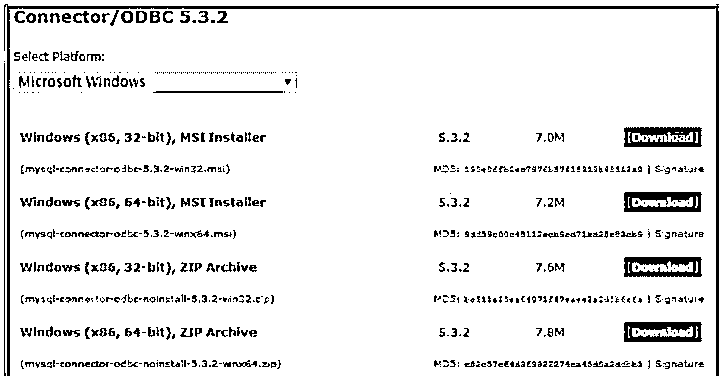
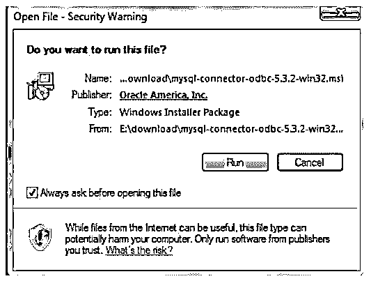
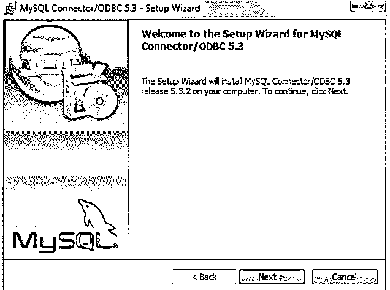
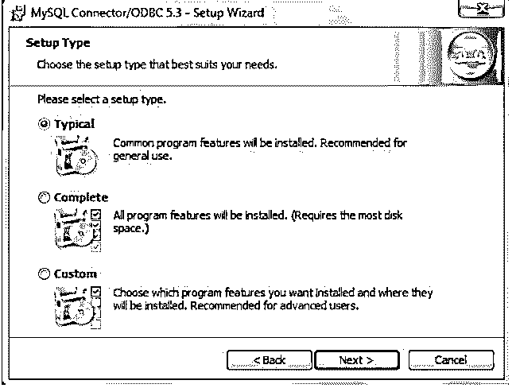
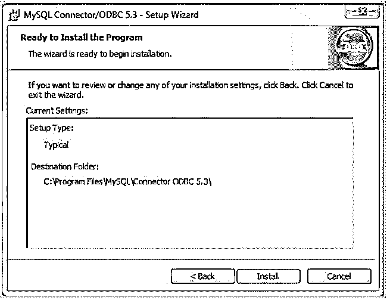
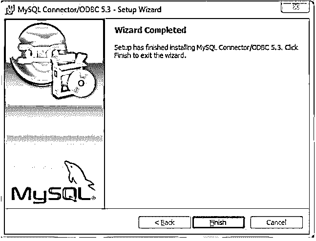
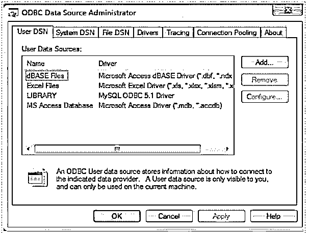
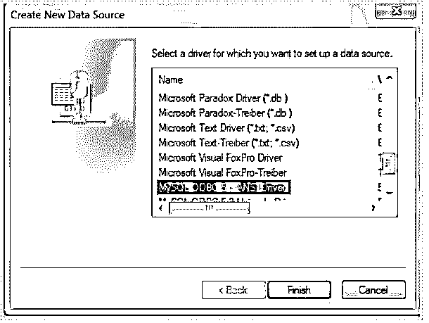
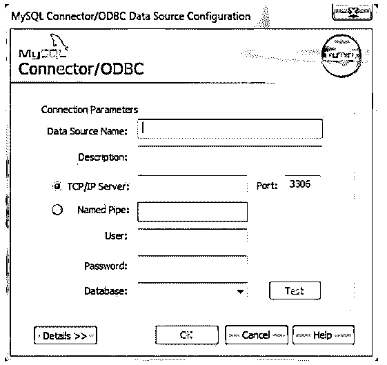
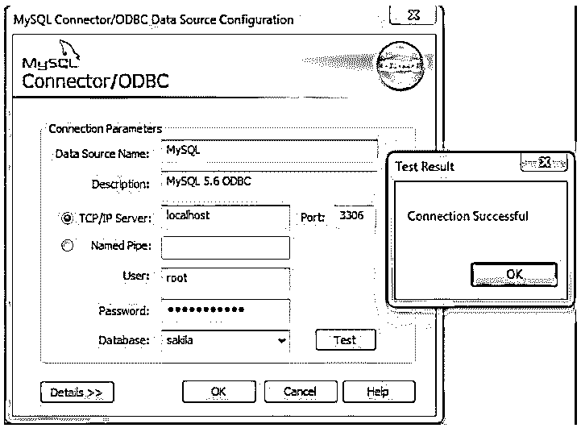

# MySQL ODBC 驱动程序

> 原文：<https://www.educba.com/mysql-odbc-driver/>

## MySQL ODBC 驱动程序介绍

ODBC 或 MySQL 连接器代表 MySQL ODBC 驱动程序的集合。MySQL ODBC 驱动在早期被称为 myODBC 驱动。MySQL ODBC 驱动程序负责在开放式数据库连接 API (ODBC API)的帮助下访问 MySQL 数据库。ODBC 的最新版本，即 ODBC 8.0，具有 Unicode 和 ANSI 驱动程序的功能。当我们使用 MySQL ODBC 驱动程序时，我们可以使用基于驱动程序管理器的接口的本机接口来连接到 MySQL 数据库。这个驱动程序提供了对所有 MySQL 功能的完整支持，比如事务和存储过程。如果我们使用 5.1 或更高版本的 ODBC 驱动程序，我们也可以完全兼容 MySQL。

当我们在机器上使用 Windows 平台时，我们需要安装 ODBC 驱动程序，以便从某个应用程序连接到 MySQL。在使用 Mac 或 Linux/Unix 平台时，本地 MySQL 网络的命名管道可用于应用程序和 MySQL 数据库之间的通信。有时，您在 Linux/Unix 或 Mac os 上使用的应用程序需要使用 ODBC 接口来与数据库通信，这时也需要在这些平台上安装 MySQL ODBC 驱动程序。Filemaker Pro、Microsoft office 和 ColdFusion 等应用程序需要 ODBC 才能与 MySQL 通信。

<small>Hadoop、数据科学、统计学&其他</small>

### 下载 ODBC 连接器/驱动程序

您可以通过以下链接下载最新版本的 ODBC 驱动程序，该驱动程序将支持您所使用平台的 MySQL 版本—[https://downloads.MySQL.com/archives/c-ODBC/](https://downloads.mysql.com/archives/c-odbc/)。

您需要指定要下载的 ODBC 驱动程序的版本，并说明您正在使用的操作系统以及操作系统的版本。选择完所有这些参数后，您的文件就可以下载了。你所需要做的就是点击下载按钮。MySQL ODBC 驱动程序是 GPL 许可的，并且是完全开源的。对于 windows 机器，我们根据我的平台输入了以下详细信息。

### 安装方法

您可以使用下面提到的两种方法中的任何一种在您的平台上安装 MySQL ODBC 驱动程序:

*   **二进制安装:**这种方法是最可取的，因为它简单，所以大多数时候都在使用。ODBC 驱动程序和其他相关文件所需的所有库都是预先构建的。除此之外，还有一个安装程序和批处理脚本，可以帮助自动复制和配置文件和其他东西。
*   **Source Installation:** 当您想要在没有二进制安装包的平台上安装 ODBC 驱动程序，或者在其他情况下，假设您想要对安装过程进行一些更改，并在安装前自定义 MySQL ODBC 驱动程序时，可以使用此方法。

### **I** 安装步骤

下面给出了安装步骤:

**步骤# 1-**双击以 MSI 格式下载的文件。在我的例子中，下载的文件名为 MySQL-connector-ODBC-5 . 3 . 2-win32 . MSI。双击后可以看到的输出如下——单击 run。

**步骤# 2-**接下来，您将看到 ODBC 驱动程序向导的设置，如下所示。点击下一步。

**第 3 步-**同意许可协议，然后单击下一步。

**第 4 步-**您可以根据需要选择任何选项——典型、定制或完整。选择典型选项，然后单击下一步。

第五步-这就对了。程序已准备好安装。单击安装按钮。

**第 6 步–**现在，点击“完成”按钮完成安装。

### ODBC 驱动程序的配置

完成安装后，我们需要配置 ODBC 驱动程序及其相关的连接。

为此，我们需要遵循以下步骤:

#### 第一步

我的平台是 Windows 7，所以要配置 ODBC 连接，必须启动按钮，点击它，然后选择控制面板选项。然后选择系统和安全选项，进一步打开一个列表，我们需要从中选择管理工具，最后单击数据源(ODBC)。这将导致弹出以下窗口。

#### 第二步

现在，您需要单击 Add 按钮并从列表中选择 ODBC 5.3 选项，如下所示。

#### 第三步

单击 finish 按钮后，您需要使用如下所示的连接参数窗口指定配置 DSN 连接所需的字段。

*   **数据源名称:**要访问具有特定名称的数据源，您必须在数据源名称字段中提供该名称。
*   **描述:**为了识别连接以便将来使用，您可以在该输入字段中添加一些描述。
*   **TCP/IP 服务器:**默认情况下，localhost 用于访问数据库服务器。如果您想使用其他主机，那么您可以在这个字段中指定 MySQL 的服务器主机。
*   **用户:**该字段用于指定在尝试连接 MySQL 的数据库服务器时应该使用哪个用户。
*   **密码:**您可以在此字段中输入 MySQL 数据库连接的密码。
*   **数据库:**该字段将显示您在上面输入的用户可以访问的所有数据库。您可以在此字段中选择要连接的数据库的名称。
*   **端口:** 3306 是用于连接的默认端口。对于除此之外的端口，您可以在此字段中提及 TCP/IP 端口。

#### 第四步

现在，在输入上述详细信息后，单击 test 按钮，检查数据库连接是否正常，如下所示。

#### 第五步

如果您想输入其他 DSN 详细信息，请单击下面的“详细信息”按钮，如下所示。

#### 第六步

您甚至可以通过单击下面显示的 ssl 按钮来指定与安全套接字层相关的其他网络详细信息。

现在连接准备好了。您可以在不同的应用程序(如 Microsoft Excel、Word)中使用该连接来连接数据库、检索数据并对其进行操作。

### 结论

我们可以使用 MySQL 的 ODBC 驱动程序从任何应用程序建立与 MySQL 数据库的连接。在 windows 平台下，只要按照上面的步骤，想用的时候就可以轻松安装。

### 推荐文章

这是一个 MySQL ODBC 驱动指南。这里我们讨论如何下载 ODBC 连接器/驱动程序，以及 ODBC 驱动程序的安装方法、步骤和配置。您也可以看看以下文章，了解更多信息–

1.  [MySQL CTE](https://www.educba.com/mysql-cte/)
2.  [MySQL 检查约束](https://www.educba.com/mysql-check-constraint/)
3.  [MySQL 索引](https://www.educba.com/mysql-index/)
4.  [MySQL 日期函数](https://www.educba.com/mysql-date-functions/)

