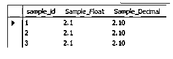
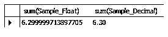

# MySQL Float vs Decimal

> 原文：<https://www.educba.com/mysql-float-vs-decimal/>

## MySQL Float 和 Decimal 的区别

MySQL 为用户提供了不同类型的数据类型，float 和 decimal 就是 MySQL 提供的数据类型。通过使用 float 数据类型，我们可以表示近似的数值，在 MySQL float 数据类型中，4 个字节用于存储单精度值，8 个字节用于存储双精度值。另一方面，我们在数字数据类型下有一个十进制数据类型；我们可以用 DEC 作为小数。通常使用 decimal 将固定值存储到数据库中。在 decimal 中，我们需要定义小数点精度，而 float 数据类型不需要指定精度点。

### MySQL Float 与 Decimal 的直接比较(信息图表)

以下是 MySQL Float 与 Decimal 之间的 5 大区别:

<small>Hadoop、数据科学、统计学&其他</small>

### MySQL Float 与 Decimal 的主要区别

现在让我们来看看 MySQL 中 float 和 decimal 数据类型的主要区别。

*   基本上浮点和十进制数据类型是一样的；这是浮点和小数之间的混淆。浮点和十进制数据类型的这种相似性是基于数学的。但它们之间的关键区别是内存和精度。
*   混淆可能会导致浮点数被汇总，而不是作为精确值保存。写在 SQL 语句中的浮点值可能不等同于 SQL 语句的内部表示。试图将浮点数视为相关性中的精确数字可能会引发问题。它们同样依赖于执行条件的阶段。FLOAT 和 DOUBLE 数据类型依赖于这些问题。对于小数部分，MySQL 执行精度为 65 位小数的活动，这应该可以解决最基本的不正确问题。
*   十进制数据类型用于存储确定的数值。这也称为“定点”或“精确值”类型，通常在保存精确值的精确点至关重要时使用，例如保存物品成本等财务信息。在 MySQL 中，NUMERIC 作为 DECIMAL 执行。
*   当发音一个十进制或数字段时，精度和标度可以确定为十进制(P，S)或数字(P，S)，其中 P 是精度，S 是标度。精确度表示该部分中可以存储的最大位数(计算小数点后的位数)，尽管刻度表示小数点后可以存储的位数。例如，值 DECIMAL (8，2)段可以存储范围从–222222.22 到 222222.22 的任何八位数和两位小数的值。
*   换句话说，我们可以说 decimal 数据类型具有更高的精度点，并且基本上在财务软件中使用，以避免数学中的舍入误差。但是与 float 数据类型相比，decimal 类型的性能较慢。但是关于十进制还有一件更重要的事情，那就是它提供了数字的 100 %正确表示，而另一方面 float 数据类型不能提供数字的准确表示，即使数字是特定的格式。基本上，float 数据类型用于图形库中。
*   现在，让我们通过使用如下 MySQL 语句，来看看 float 和 decimal 数据类型的不同示例，以理解它们之间更重要的区别。

### 例子

首先，我们需要使用下表创建一个新表，如下所示。

`create table sample_F_D (sample_id int, Sample_Float float, Sample_Decimal decimal (4,2));`

**解释:**通过使用上面的语句，我们创建了一个新的表名 sample_F_D，它具有不同的属性，例如具有整数数据类型的 sample_id、具有浮点数据类型的 Sample_Float 和具有小数数据类型的 Sampl_Decimal，我们还在这里指定了精度点，如上面的语句所示。最后我们用下面的截图来说明上面的陈述。

现在插入一些值来标识浮点和十进制数据类型之间的基本区别。

`Insert into sample_F_D(sample_id, Sample_Float, Sample_Decimal)  values(1, 2.1, 2.1), (2, 2.1, 2.1), (3, 2.1, 2.1) ;`

**解释:**看这里我们用 insert into 语句将浮点数和十进制值插入到样表中。

现在查看如下插入的记录。

`select * from sample;`

**解释:**在上面的语句中，我们使用 select 语句来显示样本表中的行。它显示浮点数和十进制数。最后我们用下面的截图来说明上面的陈述。

现在执行两列的求和，并查看它们之间的差异，如下所示。

`select sum(Sample_Float), sum(Sample_Decimal) from sample;`

**解释:**执行上述语句后，float 和 decimal 的区别如下图所示。

最终输出不一样；注意这里的 Sample_Deciamal 列更加精确。

### MySQL 浮点与十进制对照表

现在我们来看看 MySQL 上 float 和 decimal 数据类型的对比表如下。

| **浮动** | **Decimal** |
| 浮点数据类型用于存储近似精度点。 | 在十进制数据类型中，我们可以存储精确且相同的精度点。 |
| 我们可以在小数点后改变浮点数 | 在十进制数据类型中，我们可以做这样的改变。 |
| 实际上在 float 数据类型中，不需要定义精度点。当我们指定浮点数据类型来存储 6 位数字时，它能够存储 25.32 和 43.365 | 在十进制数据类型中，我们需要定义精度点。例如，25.32 和 45.364 应该使用十进制精度点。 |
| 默认情况下，浮点数据类型的范围是 24 位 | 默认情况下，十进制数据类型的范围对应于一个字节。 |
| 基本上，浮点数据类型是单精度的，这意味着它使用 32 位浮点数据类型。 | 在十进制数据类型中，我们可以使用 128 位浮点数据类型。 |

### 结论

我们希望从这篇文章中你能了解 MySQL 的浮点数和十进制数。从上面的文章中，我们已经了解了 mysql 中的 float 和 decimal，我们也看到了 MySQL float 和 decimal 的不同例子。从本文中，我们了解了如何以及何时使用 MySQL float vs decimal。

### 推荐文章

这是 MySQL Float vs Decimal 的指南。在这里，我们还讨论了 MySQL 的 Float 和 Decimal 键的区别，包括信息图和比较表。您也可以看看以下文章，了解更多信息–

1.  [MySQL vs SQLite](https://www.educba.com/mysql-vs-sqlite/)
2.  [后端编程语言](https://www.educba.com/back-end-programming-languages/)
3.  [MySQL 表转储](https://www.educba.com/mysql-table-dump/)
4.  [SQLite 数据类型](https://www.educba.com/sqlite-data-types/)

