# MySQL 联盟 vs 联盟所有

> 原文：<https://www.educba.com/mysql-union-vs-union-all/>

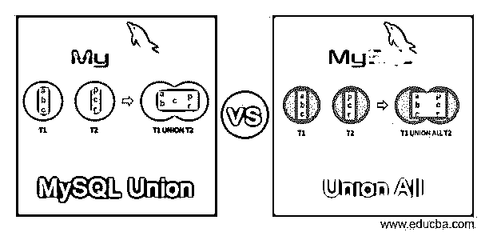

## MySQL Union 与 Union All 的区别

Mysql union 和 union all 操作符用于获得两个或多个表的组合结果集，这两个表用于两个子查询，这两个子查询涉及使用 select 子句从两个子查询中检索相同数量和类型的列。union 和 union all 子句具有相同的要求和目的，只是在检索最终结果集的方式上有所不同。

在本文中，我们将研究 union 和 union all 子句的语法和用法，以及它们之间的异同。我们还将借助一个例子来了解 mysql 中 union 和 union all 的实现。

<small>Hadoop、数据科学、统计学&其他</small>

**Union 子句的语法:**

mysql 中 union 子句的语法如下所示:

`First select query
UNION
Second select query`

union 运算符的工作原理可以从下面的维恩图示例中理解，在该示例中，从第一个子查询中检索到的数据集之一给出了输出 a、b、c，而从另一个查询中检索到的数据集是 p、c、r，当这两个查询在最终结果集之间用 union 运算符组合时，只给出了一个在两个结果集中重复出现的 c。因此，可以说 union 运算符只组合结果并检索唯一值。

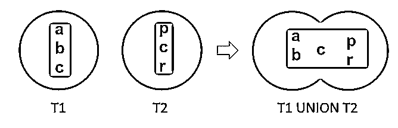

### Union 运算符示例

这里考虑两个表，即 employee_details，用于存储与雇员相关的数据，另一个是 customer_details，用于存储表中与联系人相关的信息。这两个表都包含雇员的姓名和雇员 id。让我们先看看每个表格的内容是什么——

`SELECT * FROM [employee_details]`

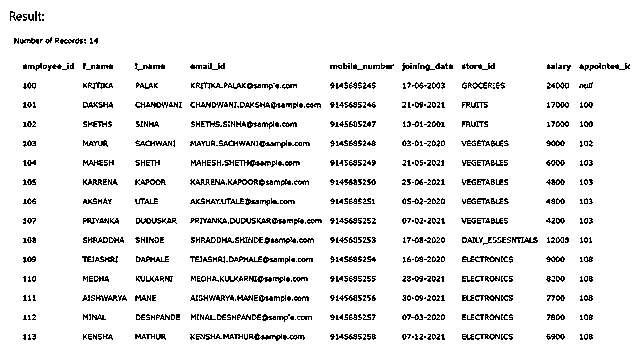

`SELECT * FROM [contact_details]`

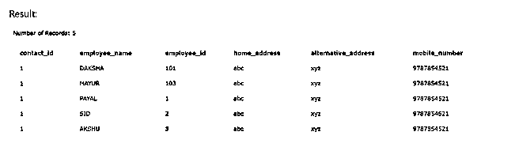

如果我们使用下面的查询对两个表执行 union，则只检索唯一的结果集数据值，合并两个表的数据，如下所示

`SELECT employee_id, f_name FROM employee_details
UNION
SELECT employee_id, employee_name FROM contact_details
ORDER BY employee_id;`

上述查询语句的输出如下所示

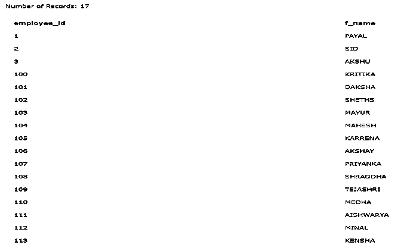

Union All 子句的语法–

mysql 中 union 子句的语法如下所示

`First select query
UNION ALL
Second select query`

当考虑相同的示例并且在两个查询之间应用 union all 运算符时，它给出元素 a、b、c、p、c、r 的输出，该输出包含重复出现的 c 值，因为它出现在两个数据集中。因此，该联合组合结果，但也检索重复值。

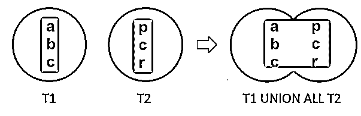

### Union All 运算符示例

我们实现 union 运算符的一个例子如下所示

`SELECT employee_id, f_name FROM employee_details
UNION ALL
SELECT employee_id, employee_name FROM contact_details
ORDER BY employee_id;`

上述查询语句的输出如下所示

雇员 id 为 101 和 103 的记录在两个表中具有相同的 employee_id 以及相同的 f_name 列值，这就是为什么它的两次出现都保存在 union all 运算符的输出中。

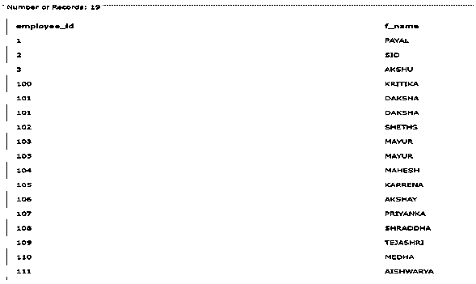

### MySQL Union 与 Union All 的直接对比(信息图)

以下是 MySQL Union 与 Union All 的 8 大区别:

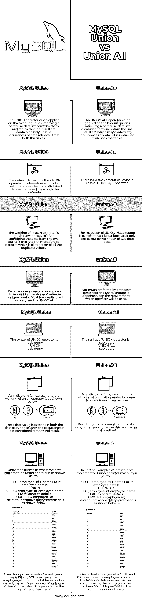

### MySQL Union 与 Union All 的主要区别

MySQL Union 与 Union All 之间的一些关键区别是:

这里需要指出的最重要和最关键的特性是，在合并来自两个源的数据时使用 union 运算符，它会消除从两个数据集中检索到的重复条目，只保留其中一个条目。在 union all 运算符的情况下，不执行任何消除操作，重复值仍按原样保留在最终结果集中。

### MySQL Union vs Union All 对照表

让我们讨论一下 MySQL Union 与 Union All 之间的主要比较:

| **工会** | **工会所有人** |
| UNION 运算符应用于检索特定数据集的两个子查询时，会将它们组合起来，并返回只包含从两个表中检索到的唯一数据的最终结果集。 | UNION ALL 运算符应用于检索特定数据集的两个子查询时，会将它们组合起来并返回最终结果集，该结果集可能包含从两个表中检索到的任何数据值。 |
| UNION 运算符的默认行为包括从两个数据集检索的组合数据集中消除所有重复值。 | 在 UNION ALL 运算符的情况下，没有这样的默认行为。 |
| UNION 操作符的工作要慢得多，因为在合并两个表中的数据之后，还需要执行一个步骤，即消除所有重复的值。 | UNION ALL 操作符的执行相对较快，因为它只执行两个数据集的组合。 |
| 数据库设计者和用户更喜欢使用 union 运算符，因为它可以检索唯一的结果。与 UNION ALL 相比，最常用。 | 数据库设计者和用户不太喜欢。尽管这取决于将使用哪个操作符的要求。 |
| The syntax of the UNION operator is –`sub query
UNION
sub query` | The syntax of the UNION ALL operator is –`sub query
UNION ALL
sub query` |
| Venn diagram for representing the working of union operator is as shown below –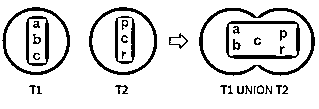

c 数据值出现在两个数据集中，因此，对于最终结果，只考虑它的一个出现。 | Venn diagram for representing the working of union all operator for same data sets is as shown below –

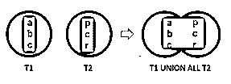

即使 c 出现在两个数据集中，这两个事件都会保留在最终的结果集中。

 |
| One of the examples where we have implemented union operator is as shown below –`SELECT employee_id, f_name FROM employee_details
UNION
SELECT employee_id, employee_name FROM contact_details
ORDER BY employee_id;`上述查询语句的输出如下所示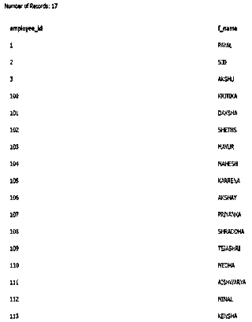

尽管雇员 id 为 101 和 103 的记录在两个表中具有相同的 employee_id 以及相同的 f_name 列值，但在 union 运算符的输出中仍然只保留了其中一个实例。 | One of the examples where we have implemented union operator is as shown below –`SELECT employee_id, f_name FROM employee_details
UNION ALL
SELECT employee_id, employee_name FROM contact_details
ORDER BY employee_id;`上述查询语句的输出如下所示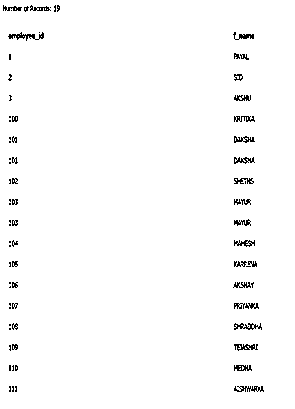

雇员 id 为 101 和 103 的记录在两个表中具有相同的 employee_id 以及相同的 f_name 列值，这就是为什么它的两次出现都保存在 union all 运算符的输出中。 |

### 结论

union 运算符和 union 运算符都执行相同的合并结果集的工作。它们工作中唯一的主要区别是 union 操作符从最终结果集中删除重复条目，而 union all 操作符也保存重复条目。

### 推荐文章

这是 MySQL Union vs Union All 的指南。在这里我们也讨论了 MySQL Union 与 Union 的所有关键区别，并提供了信息图表和比较表。您也可以看看以下文章，了解更多信息–

1.  [MySQL vs SQLite](https://www.educba.com/mysql-vs-sqlite/)
2.  [后端编程语言](https://www.educba.com/back-end-programming-languages/)
3.  [MySQL 表转储](https://www.educba.com/mysql-table-dump/)
4.  [SQLite 数据类型](https://www.educba.com/sqlite-data-types/)

