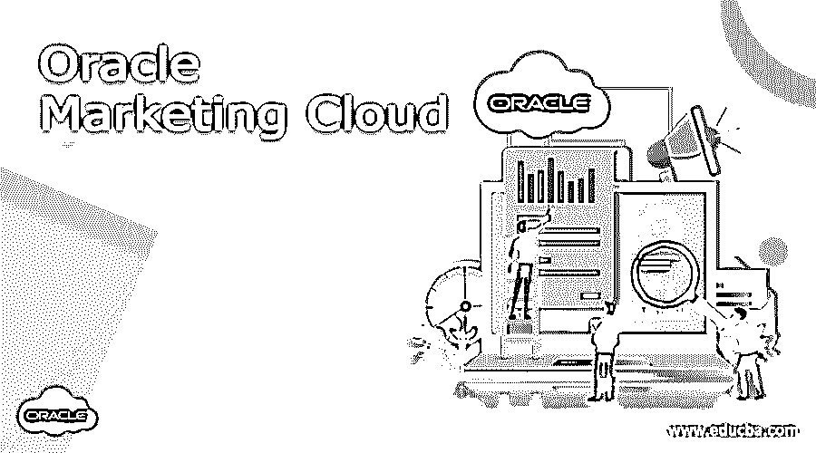

# Oracle 营销云

> 原文：<https://www.educba.com/oracle-marketing-cloud/>

## Oracle 营销云简介

软件即服务平台将云作为营销和销售自动化的接口，以便可以通过云平台本身监控内容创建和销售改进，这种平台称为 Oracle 营销云。这有助于营销专业人员了解客户的需求，并根据他们的需求提供产品。可以进行客户调查，并且可以直接查看结果，这使得营销人员遵循更透明的途径来营销他们的产品并增加他们的销售额。B2B 和 B2C 营销人员可以利用 Oracle 营销云来提高绩效和满足客户需求。

### 我们为什么需要 Oracle 营销云？

数字营销:数字营销的主要优势是我们可以识别客户的需求，并在几个小时到几天内立即满足他们。与传统营销相比，完成一个订单不需要几个月。在这里，营销云是一个福音，所有的细节都存储在服务器上，当需要时，数据就在手边。我们不需要随身携带这些数据，这样我们就可以更加了解我们的客户，我们可以用他们想到的产品来取悦他们。

<small>Hadoop、数据科学、统计学&其他</small>

B2B 营销:营销云通过云中的可用数据使企业对企业的对话变得更加容易。借助 Oracle 营销云，与不同的业务专业人员共享文件和建立联系变得非常简单。这有助于改善与不同买家的关系，从而加强与同一买家的商业计划书。测试数据的真实性并优化数据以采购更多产品来满足客户需求，可以通过营销云以及所有可用的数据工程平台来完成。

B2C 营销:通过 Oracle 的 B2C 营销方法向客户提供个性化体验，这样他们对任何产品的评论都会被直接捕获并加载到数据库中。这有助于了解顾客的行为以及新推出的产品。可以根据这些数据轻松创建活动和调查，这有助于放大客户的需求和需要，并帮助营销专业人员采取相应的行动。可以向客户提供个性化的营销体验，以改善他们对公司和他们提供的产品的反馈。这将有利于客户根据自己的需求选择准确的产品，也有利于营销人员为客户提供无缝体验。

### Oracle 营销云是如何工作的？

Oracle Marketing Cloud 通过获取旧电子邮件并向他们发送邮件来联系老客户，以检查他们的当前状态，让他们感觉受到公司的喜爱。这种先进的智能有助于公司全面提高销售额。这一自动化过程有助于营销专业人员节省联系客户的时间。此外，这还可以用来识别最活跃的客户，并向他们发送礼品作为惊喜。

可以根据客户偏好自动进行实时调整，从而轻松识别市场趋势。这种改进有助于提高产品质量，并比客户预期的交付时间更快地交付产品，使销售团队觉得值得，从而有助于销售。所有的活动都被记录下来并作为数据服务器，这样所有的数据都可以被识别并用于营销活动和产品预测。所有数据都会自动输入云服务，无需任何外部专业人员。创建的内容可以重用，以减少工作量。

工具:可以使用不同的工具来监控销售和客户关系管理，从而改善产品的供应链，大幅降低库存。任何外部应用程序都可以与 Oracle 营销云连接，这样，如果对产品质量或交付有任何投诉，就可以向客户发送即时消息和电子邮件。

### 优点和缺点

**客户满意度:**

通过营销云为客户提供的完美体验使他们重复购买同一家公司的产品。我们可以根据客户的心态为他们提供相关的产品建议，并根据他们之前的购买选择提供替代品。这种一致而周到的营销建议会让客户满意并尊重营销专业人员提供的建议。营销云还有助于向客户传递个性化信息，让他们觉得自己对公司很重要。我们可以通过云轻松管理信息，这样客户就可以随时收到信息。

**效率:**

不需要总是管理工具，因为云计算将通过系统管理的工具提高效率来处理这些工具。当我们需要根据需要将市场数据转换为利润或任何其他 ROI 因素时，转换因素会实时发挥作用。通过向客户提供他们可用的数据，并向他们提供他们想要的产品的流行评论，可以提高效率。

**隐私更少:**

要注意的一个缺点是顾客生活的隐私较少。当他们浏览任何东西时，他们在公司网站或互联网上搜索的任何产品都会被捕获并用来对付他们。这将迫使顾客购买现有规格的产品。所有被捕获的数据都会让顾客感到被需要，或者像营销专业人员一样窥探他们的私人生活。

**价格和安装:**

Oracle 营销云的价格高达每月 2000 美元，这对于普通企业和初创企业来说过于昂贵。此外，购买 Oracle 营销云后的实施需要时间，这使得企业在购买软件后遭受损失。与谷歌广告的整合是不可用的，很难做到投资回报率。

凭借 Oracle 营销云的高声誉和充分暴露的设计，营销人员很乐意采用这种云设置并满足他们的营销需求。此外，任何人都可以建立微型网站来创建内容，并与他人分享来讨论业务目标。

### 推荐文章

这是 Oracle 营销云指南。在这里，我们讨论“Oracle 营销云是如何工作的？我们为什么需要 Oracle 营销云？各有利弊。您也可以看看以下文章，了解更多信息–

1.  [甲骨文截止日期](https://www.educba.com/oracle-to_date/)
2.  [desc 的甲骨文订单](https://www.educba.com/oracle-order-by-desc/)
3.  [甲骨文数据库管理员](https://www.educba.com/oracle-dba/)
4.  [甲骨文编号](https://www.educba.com/oracle-number/)

