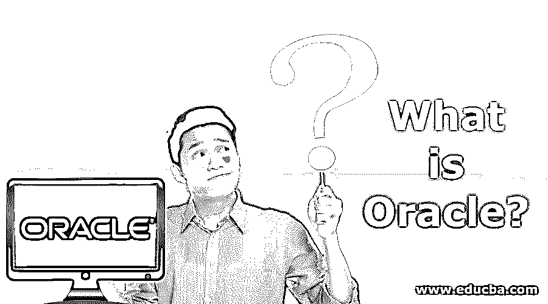
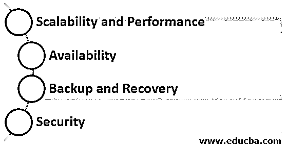
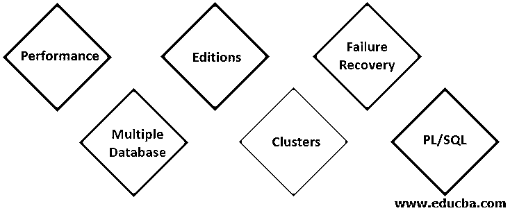

# 甲骨文是什么？

> 原文：<https://www.educba.com/what-is-oracle/>

## Oracle 简介

Oracle 是 Oracle 公司的产品，提供关系数据库管理系统。RDBMS 支持任何类型的数据模型。它有不同的产品版本，包括标准版、企业版、快速版和个人版。Oracle 产品可扩展且安全，具有高性能能力。

### 甲骨文是什么？

它的数据库也被称为 Oracle。它是一个多模型关系数据库管理系统，主要是为企业[网格计算](https://www.educba.com/what-is-grid-computing/)和数据仓库而设计的。

<small>Hadoop、数据科学、统计学&其他</small>

它的数据库目前基于可用的特性有五个不同的版本。

*   标准版一:适用于单服务器或高度分支的业务应用，功能有限。
*   标准版:它提供了标准版一中提供的所有功能。此外，它还提供更大的机器支持和 Oracle Real Application clustering 服务。
*   企业版:这个版本包含了安全性、性能、可伸缩性和可用性等特性，是涉及在线事务处理的高度关键的应用程序所必需的。
*   速成版:是入门级版本，可以免费下载、安装、管理、开发和部署。
*   个人版:除了 Oracle Real Application Clustering 之外，它具有与企业版相同的特性。

### 特征

Oracle 数据库提供以下特性来满足强大的数据库管理需求:

*   **可伸缩性和性能:【Real Application Clustering 和可移植性等特性使得数据库可以根据其用途进行伸缩。在多用户数据库中，需要控制 Oracle 所考虑的数据一致性和并发性。**
*   **可用性:**实时应用需要高数据可用性。高性能计算环境被配置为提供全天候数据可用性。在计划内或计划外停机和故障期间，数据是可用的。
*   **备份与恢复:**其布局具有完整的恢复功能，几乎可以从各种故障中恢复数据。如果出现故障，数据库需要立即恢复，以实现高可用性。当受影响的数据正在恢复时，未受影响的数据部分仍然可用。
*   **安全性:**确保数据安全始终是重中之重。它提供了控制数据访问和使用的机制。实现授权和编辑用户操作可以防止未经授权的访问，并允许用户进行不同的访问。

### 甲骨文的重要性

它是最早提供数据库管理解决方案的公司之一。该公司始终专注于企业需求，并认可最新的技术趋势。这就是为什么它的产品总是用新功能来点缀。例如，最新的 Oracle database 19C 也可以在 Oracle Cloud 上使用。它让用户从不同的数据库版本中进行选择，以满足他们的需求，从而提供一个经济高效的解决方案。

### 利益

我们已经讨论了它的数据库的特征。这些特性使甲骨文比其他竞争对手更有优势。现在，我们来看看优势。

**1。绩效:**它有实现高绩效的方法论和原则。我们可以在它的数据库中实现性能调优，以更快地检索和更改数据，从而缩短查询执行时间，进而改善应用程序操作。

**2。多数据库:**其数据库支持在单台服务器上管理多个数据库实例。它提供了一个实例绑定方法来管理运行数据库实例的服务器上的 CPU 分配。实例绑定与数据库资源管理器一起管理多个实例上的服务。

**3。版本:**正如我们上面讨论的，关于 Oracle 提供的不同版本，用户根据他们的应用需求购买版本是有益的。如果他们的需求在未来发生变化，他们可以无缝地更新版本。如果您想学习和动手操作 Oracle，可以下载并安装完全免费的 express edition 数据库。

**4。集群:**它使用真正的应用集群来提供高数据可用性系统。与传统数据库服务器相比，采用 RAC 的数据库具有以下优势:

*   在多个实例上扩展数据库。
*   负载平衡
*   数据冗余和可用性
*   灵活增加处理能力

**5。故障恢复:** RMAN(恢复管理器)是 Oracle DB 的一个特性，它在停机和中断期间恢复或还原数据库文件。它支持在线存档备份和连续存档。用户也可以 SQL* PLUS 进行恢复，称为用户管理的恢复，这是它所支持的。数据库中有一个导出实用程序可用于添加用户管理的备份。

**6。PL/SQL:** 数据库支持过程化编程的 PL/SQL 扩展。

### 我们为什么使用 Oracle？

这是一个数据库管理软件产品。数据库包含有组织的信息集合。数据库管理系统用于存储数据并提供高性能、授权访问和故障恢复功能。它提供了一个易于使用和管理数据库操作的软件解决方案，从个人到企业级应用。

### 结论

我们可以得出结论，Oracle 是一个强大的数据库服务器管理软件，它也可以满足企业级和小型应用程序的需求。它包括支持现代应用程序所需的几乎所有功能，并得到广泛应用。

### 推荐文章

这是一本关于什么是甲骨文的指南？在这里，我们讨论了如何使用 oracle，它的特性、重要性和好处。您也可以阅读以下文章，了解更多信息——

1.  [Oracle 中的内部连接](https://www.educba.com/inner-join-in-oracle/)
2.  [在 Oracle 中选择](https://www.educba.com/select-in-oracle/)
3.  [加入甲骨文](https://www.educba.com/joins-in-oracle/)
4.  [关系数据库|用 R 访问 SQL 数据](https://www.educba.com/relational-database/)
5.  [7 大 Oracle 运营商(示例)](https://www.educba.com/oracle-operators/)
6.  [关系数据库模型概念指南](https://www.educba.com/relational-database-model/)
7.  [关系数据库的八大优势](https://www.educba.com/relational-database-advantages/)

