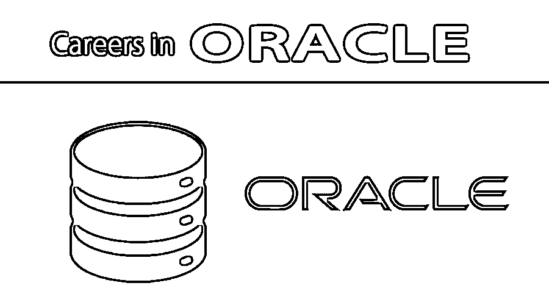

# 在甲骨文的职业生涯

> 原文：<https://www.educba.com/career-in-oracle/>

## 甲骨文职业简介

为了在 Oracle 开创并维持职业生涯，一个人至少应该拥有计算机科学或数学专业的学士学位。除此之外，还必须具备一些其他技术技能，包括 SQL & PL/ SQL 的实践经验或工作知识、核心 Java 的编程经验、数据库概念和工作流的基础知识、熟悉数据库管理工作等。Oracle 还提供各种认证，以提高有意在 Oracle 发展职业生涯的人的素质。

### 在甲骨文工作所需的教育

了解 Oracle 数据库对于任何求职者在不同领域的职业生涯来说都是一个关键的转变。在数据库管理方面有很强背景的人，特别是喜欢数据结构或关于如何维护一个数据库表的基本想法的人，对他们总是有帮助的。一名培训师希望掌握一些关于 [SQL 和 PL/SQL](https://www.educba.com/pl-sql-vs-sql/) 的专业知识。Java 知识将永远是一个额外的优势。来自软件编程背景的人将有很强的能力灵活地参与和学习所有与 Oracle 相关的任务，并在未来有一个非常好的职业生涯。清楚地学习是理解甲骨文的关键要求之一。

<small>Hadoop、数据科学、统计学&其他</small>

### 甲骨文的职业道路

毫无疑问，在甲骨文工作的经历总是一个很好的职业转换。Oracle 总是附带一个优秀的数据库管理系统，它非常支持各种编程语言，尤其是 Java。由于这种巨大的利用，Oracle 计划从 sun microsystem 购买整个 Java 生态系统，并将 sun java 改为 oracle java。如果你真的想深入了解 Oracle，仅仅学习 SQL 和 PL/SQL 是不够的。候选人应该采取一些额外的主动措施来理解和学习数据库管理员部分，这是对希望在 Oracle 继续其职业生涯的候选人的主要吸引力。oracle 在数据库管理系统和 Java 上提供了不同种类的证书。

证书包括:

*   **SQL 认证**:这是证明 SQL 查询专家的考生需要清楚的非常基础的考试之一。对于特定的考试，需要编写许多多个关键的查询，有时它会给出一些查询，输出需要由考生确认。这是 Oracle 中最容易通过的考试之一。新人和有经验的人都可以以同样的目标来确定自己是 SQL 开发人员。
*   **PL/SQL 认证**:候选人应需要在 PL/SQL 部分获得提升。这次考试与上述考试是相互关联的。考生应在参加 PL/SQL one 之前通过 SQL 考试。候选人需要面对一些关于包装，功能，程序，异常部分的关键问题，并对这些答案更有信心。它通常有多种选择的问题。通过同样的测试后，候选人可以考虑成为数据库开发人员。
*   数据管理员认证:通常有经验的候选人会申请这种认证。这绝对与数据库管理相关的问题有关，而且一点也不容易。真正掌握 SQL、PL/SQL 专业知识并对数据库环境有清晰概念的考生可以参加这次考试。

### Oracle 职业生涯的工作职位或应用领域

甲骨文专家的工作是巨大的。他们对此没有任何限制。如果有经验的候选人真的有兴趣提升他们在甲骨文方面的知识，他们不需要考虑他们即将到来的职业生涯。Oracle 数据库管理系统中的工作岗位各不相同，一种工作纯粹是 SQL 或 PL/SQL 开发人员的工作，而另一种工作完全是数据库管理人员的工作，毫无疑问，比较后两种工作比第一种工作更有吸引力。Oracle 专家知识在当前市场上有以下几种工作用途或职位:

*   SQL 和 PL/SQL 开发人员:面试官希望应聘者对 SQL 和 PL/SQL 技术有全面清晰的了解。他们必须了解复杂的 SQL 查询、连接多个表、表完整性常量知识，以及事务管理，特别是提交和回滚、函数、过程、异常、包、游标，每一种理解都是实现这些的关键要求。
*   数据库管理员角色:通常有经验和认证的候选人可以得到这种机会。这一点也不容易，因为面试官需要对表空间、索引管理、性能调优等关键部分有非常深入的了解，他们需要正确地学习这些知识。

### 薪水

同样，工资对甲骨文技术公司来说没有任何约束力。如果有人真的精通 SQL 或 PL/SQL，薪水会自动增加。所以，无论你需要什么，都不用担心包裹。作为一个寻找这种从不考虑一揽子计划的专家的组织，他们总是期望一些在这方面有适当深度知识的关键人物。但是正如所料，SQL 或 PL/SQL 开发人员不会得到那么多的包，而一个数据库管理员可以在他们未来的职业生涯中破坏任何类型的包。因此，已经从事 SQL 或 PL/SQL 开发的预期人员总是需要将他们的职业目标定为转换到管理员级别，那么唯一的工资将毫无疑问地自动增加。他们没有任何具体的规模，但根据目前的传言，根据经验和角色的不同，甲骨文的工资可能从 6 万美元到 16 万美元不等。

### 职业前景

Oracle 对任何人来说都是一个非常有吸引力的职业规划，不管他是 SQL PL/SQL 领域的新手还是老手。任何一个 SQL 开发人员都可以通过学习一些关键的课程来转换到数据库管理员的角色。并且总是把做一些认证作为他们职业生涯中额外优势的目标。

### 结论

Oracle 技术目前正在升级，几乎每年他们都会推出一些新版本的软件，这些软件具有各种各样的功能，其中大部分功能是开发者所不具备的。无论如何，对于开发人员来说，这不是关键要求，因为普通的 SQL、PL/SQL 开发不需要类似的知识。但是如果这个人担任数据库管理员的角色，他必须知道每个版本的管理员级别的变化，甚至 Oracle 已经给出了基于可用版本的认证。所以让你保持更新，享受美好的未来。

### 推荐文章

这是甲骨文的职业指南。这里我们讨论了简介、学历、在甲骨文的职业道路、工作岗位、薪资和职业前景。您也可以阅读以下文章，了解更多信息——

1.  [星火中的惊人职业](https://www.educba.com/career-in-spark/)
2.  [sales force 中的职业](https://www.educba.com/careers-in-salesforce/)
3.  [信息领域的职业](https://www.educba.com/careers-in-informatica/)
4.  [Hadoop 职业生涯](https://www.educba.com/career-in-hadoop/)
5.  [什么是查询和 Oracle 查询的类型](https://www.educba.com/oracle-queries/)

