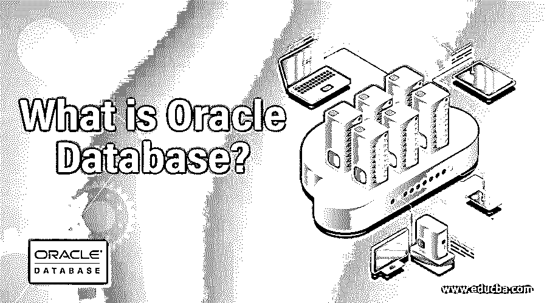
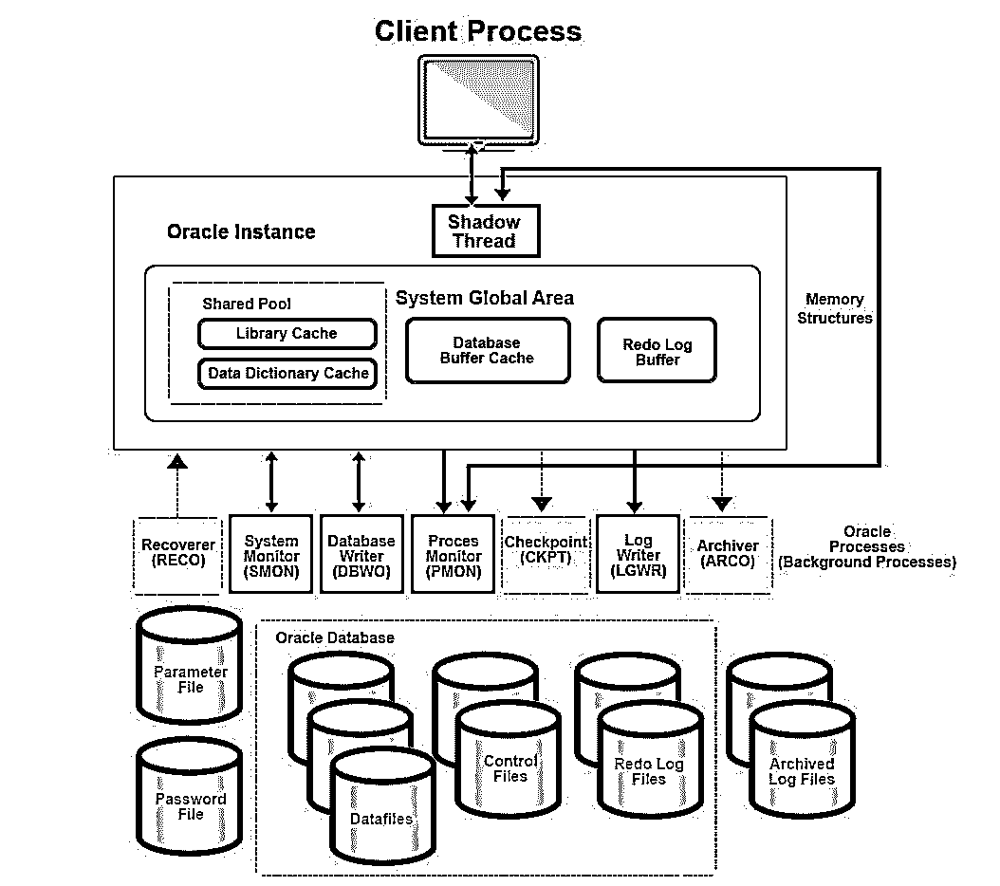

# 什么是 Oracle 数据库？

> 原文：<https://www.educba.com/what-is-oracle-database/>

## Oracle 数据库简介

Oracle 数据库是 Oracle Corporation 的专有产品，可以定义为以结构化格式存储的数据集合，该数据集合由表格格式/结构中的行和列组成，用户可以根据他们的业务或个人需求编辑/检索或删除数据，方法是允许他们创建自己的表，将数据插入到那些创建的表中，在结构级和数据级修改那些表，删除那些插入的数据，或者使用称为 SQL(结构化查询语言)的查询语言删除表的整个结构。

它也被称为 Oracle 关系数据库管理系统(RDBMS)或简称为 Oracle。它是一个多模型数据库，其所有权归 Oracle 公司所有。它是用汇编语言、 [C 和 C++](https://www.educba.com/c-vs-c-plus-plus/) 开发的。根据维基百科，Larry Ellison、Bob Miner 和 Ed Oates 于 1977 年成立了一家名为软件开发实验室(SDL)的咨询公司，并开发了 Oracle 软件的原始版本。

<small>Hadoop、数据科学、统计学&其他</small>

Oracle 数据库查询语言非常类似于 MySQL。

以下是一些查询示例:

**创建表格** 

`CREATE TABLE customers (cust_id number (10) NOT NULL, cust_name varchar2(50) NOT NULL, city varchar2(50), CONSTRAINT cust_pk PRIMARY KEY (cust_id));`

**更改表格**

`ALTER TABLE customers ADD customer_age varchar2(50);`

**下降表**

`DROP TABLE customers;`

**从表格中选择**

`DROP TABLE customers;`

**插入表格**

`INSERT INTO suppliers (supplier_id, supplier_name) VALUES (50, 'Flipkart');`

**从表格中删除**

`DELETE FROM customers WHERE name = ‘Teddy’;`

像这样，数据库支持各种动作，如更新、联合、排序、分组、有条件、交集、连接、触发器和 MySQL 会给出的所有其他操作。

### **A** 应用

企业客户将它用于以下目的

1.  在银行和金融、电子商务、贸易等领域运行在线事务处理(OLTP)。
2.  将历史数据存档的数据仓库；不管是结构化的还是非结构化的。
3.  以及混合数据库工作负载，这些工作负载将数据仓库和 OLTP 结合起来用于分析目的。
4.  它的最新版本 18c 也可用于公共云、私有云和混合云。

除此之外，Oracle 还推出了一种名为“Oracle 自治数据库”的产品，它消除了创建、调整、安全、备份、更新和其他管理生命周期任务中的人工劳动，或者传统上由数据库管理员(DBA)执行的例行工作。

### Oracle 数据库架构

Oracle 数据库服务器由 Oracle 数据库和 Oracle 实例组成。Oracle 实例是后台进程(每次启动数据库时，通过调用系统全局区(SGA)来调用)和内存缓冲区的组合。

它开创了企业网格计算。这是一种非常经济高效、灵活的信息和应用程序管理方式。它为符合行业标准的模块化存储和服务器形成了大型池。从这些池中，可以快速调配新资源。资源可以像云模型一样进行扩展。

它有逻辑和物理结构。这些结构相互独立，这就是为什么可以管理物理存储，使逻辑存储不受变化的影响。

下图展示了数据库的物理方面。

### Oracle 数据库的优缺点

以下是优点和缺点:

#### 优势

它有许多使其在企业商业世界中闻名的特性。Oracle 一直在努力为数据库技术世界增加价值。

以下是一些众所周知的优势:

1.  所有的数据库大多是向后兼容的。这确保了企业升级时不必担心数据库的迁移。这种方法很划算，也很安全。
2.  它们能够承担几乎所有的企业数据库工作负载。此外，它是作为一种解决方案交付的，客户可以以即插即用的方式使用。因此，独自完成所有繁重的安装和部署工作。
3.  他们非常可靠和有弹性。它确保了每个数据库必须按照标准保证的酸性测试(原子性、一致性、隔离性和持久性)。此外，它是弹性的，这意味着它可以妥善处理故障，而不会丢失任何数据。
4.  它实施了闪回技术，可以在由于某种中断或任何其他原因而丢失数据的情况下恢复数据。

#### 不足之处

1.  这种方法的主要缺点是它的复杂性。用户(或客户)需要了解整个架构和设置的技术诀窍。
2.  这对于企业(大公司和组织)来说是理想的，但不适合数据库不是很小的中小型商业公司。
3.  此外，数据库的成本是 MS SQL 服务器数据库解决方案的 9-10 倍。

### 这对你的职业生涯有什么帮助？

对世界上被广泛采用的数据库之一的架构和工作有一个透彻的理解将帮助你在好的公司和组织中获得太多好的职位。不仅如此，像 IBM、微软、SAP、Teradata 等公司。是甲骨文的竞争对手，这也将扩大你在这种大型技术工作中的机会视野。

除此之外，理解架构还会让您有机会提出一种新的改进的数据库技术，这种技术可以对该领域做出重大贡献。

### 结论

它可以在所有主流平台上运行，包括 Windows &也支持所有网络协议。Oracle 支持、坚持并遵守行业标准。它还具有其他附加值，如在线备份和恢复、闪回工具、财富发展工具等。这有助于整个开发和管理生命周期。总的来说，这是一个很好的数据库，值得使用，也值得拥有专业知识。

### 推荐文章

这是什么是 Oracle 数据库的指南。这里我们讨论了简介、应用、架构、优点和缺点。您也可以浏览我们推荐的其他文章，了解更多信息——

1.  [MySQL 简介](https://www.educba.com/introduction-to-mysql/)
2.  [Oracle 数据库管理员职业生涯](https://www.educba.com/career-in-oracle-database-administrator/)
3.  [数据仓库架构](https://www.educba.com/data-warehouse-architecture/)
4.  [什么是 SQL](https://www.educba.com/what-is-sql/)
5.  [什么是查询和 Oracle 查询的类型](https://www.educba.com/oracle-queries/)
6.  [9 大 Oracle 子句指南(示例)](https://www.educba.com/oracle-clauses/)
7.  [数据库并行度|前 4 种类型](https://www.educba.com/database-parallelism/)

