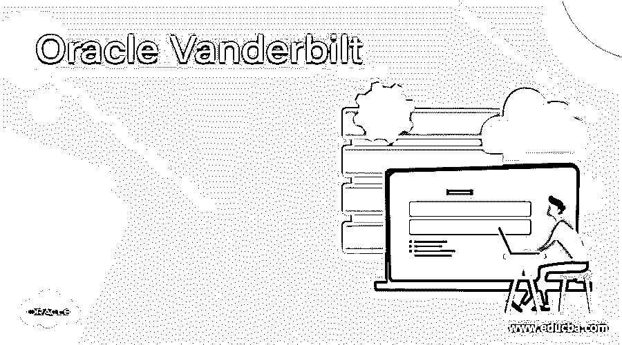
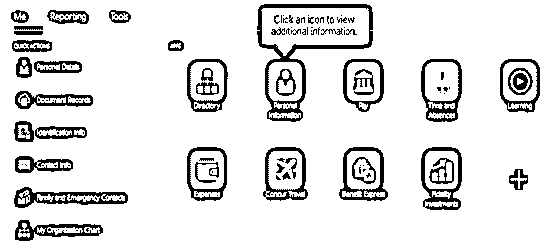

# 甲骨文范德比尔特

> 原文：<https://www.educba.com/oracle-vanderbilt/>

## 甲骨文范德比尔特的定义

Oracle 为组织提供不同类型的云应用程序，以便在云应用程序的帮助下管理其整个系统，如 ERP 意味着企业资源规划、CRM 和 HCM 等。现在，甲骨文将在管理流程和财务工作中引入范德比尔特。Oracle Vanderbilt 不太复杂，在使用系统应用程序时效率更高。Oracle Vanderbilt 财务、行政和研究支持系统没有积极参与组织规模和复杂性的快速增长。引入的原因有很多，例如，它能够为客户提供所需工作的范围和质量，因此 Oracle 云产品将取代许多当前的应用程序，并为客户提供更好的服务。

### 我们为什么需要甲骨文范德比尔特？

每个组织都需要新技术来执行不同类型的操作。他们还需要使用数据质量来获得更好的结果，例如单一应用程序提供不同的选项，他们可以通过智能工作更快地运行他们的组织，他们还需要更高效、更安全地运行他们的组织。另一方面，组织还需要业务透明，还需要更高级别的控制和治理。

<small>Hadoop、数据科学、统计学&其他</small>

### 甲骨文范德比尔特是如何工作的？

让我们看看范德比尔特是如何在 Oracle 云中工作的，如下所示。

基本上，它有如下不同的方法。

**1。采用解决方案驱动的方法**

每个组织都着眼于未来。那就是过程设计、开放性、角色和责任。解决方案驱动的方法意味着 oracle 云项目在特定场景下工作，例如，Oracle 云采用解决方案驱动的方法，而不是需求驱动的方法。

oracle Vanderbilt 采用了解决方案驱动的方法，因为它避免了范围蔓延的可能性，也避免了处理事务的潜在障碍。

**2。利用跨职能设计**

在这种方法中，组织定义未来状态的业务需求，以关联复杂的跨模块功能。因此 Oracle Vanderbilt 组建了一个跨职能设计工作组。工作组由来自中央财务部门、项目管理部门、人力资源部门以及所有相关股东的代表组成。

**3。测试多项技术**

组织应该通过一个业务交互点走向安排和测试的所有部分。这意味着测试一切——除了创新。范德比尔特大学的测试技术包括两个关键部分:会议室试点(CRP)和框架连接测试。

**4。会议室飞行员**

甲骨文范德比尔特公司有三轮**会议室试点。**第一轮基于工作组中产生的主要值。在 Oracle Vanderbilt 确定如何进一步增强配置的同时，测试业务流程是第一轮**会议室试点**的一项重要任务。在第二轮中，它测试了更复杂的场景，在第三轮中执行了相同的过程，并改进了数据。每个组织都有自己的选择来决定他们需要多少轮来适应基本的业务流程。

**5。系统集成测试**

在成功安装云之后，我们需要执行系统集成测试，对于范德比尔特云实施，测试团队通过使用当前转换数据和配置的多个业务流程来测试端到端流程。

他们利用业务周期来管理他们将要测试的大量情况。对于每个商业周期，有用的同事会创造适用于他们工作的情境。情况发展的纲要，范德比尔特利用一个专门的行政程序来存档逐项内容，以再现在每种情况下完成任务的手段。

范德比尔特理解了有效执行的关键，这需要答案驱动的方法、交叉有用的计划和超越创新必要性的测试互动。

### 优点和缺点

**优势**

1.  我们可以在甲骨文云中访问我们的个人信息。
2.  我们可以在甲骨文云中看到我们的工资单。
3.  我们还能够创建和提交 oracle 费用报告。
4.  它帮助我们从安全角度确定正确的云系统访问。
5.  它将多个系统或应用程序替换为一个集成的应用程序。

**缺点**

1.  定义用户的角色和访问控制非常复杂。
2.  每次我们都需要从安全角度定义中心的角色，因为访问控制是分布式的。
3.  它很容易提供快速查找。
4.  它为不同的用户提供不同的控制台。
5.  浏览通用报告格式很容易。

### 例子

现在让我们看看甲骨文范德比尔特的不同例子如下。

请参见上面的屏幕截图，其中显示了不同的选项，如屏幕截图中所示的“我”、“报告”和“工具”,它出现在主页上。在 **Me** 菜单下，我们有不同的选项，如个人详细信息、文档详细信息、身份信息和联系信息。此外，它还在右侧显示了一些选项，如目录、个人信息、薪级相关信息、时间和访问、设施、福利等。根据要求，我们可以选择任何选项，并查看相应选项的详细信息。

在下一个屏幕截图中，我们看到了 Oracle Vanderbilt 的前端示例，如下所示。

我们从官网导入的所有截图。

### Oracle Vanderbilt 的使用

1.  用于维护人力资源工资总额。
2.  它还用于维护与人力资源福利相关的信息、人力资源记录和内部税。
3.  Oracle Vanderbilt 的主要目的是系统优化，即 Oracle 云。
4.  它用于管理请求和提供帮助。
5.  它使用丰富的数据以获得更好的结果。

### 结论

我们希望通过这篇文章，您已经了解了甲骨文公司的范德比尔特。从这篇文章中，我们了解了**甲骨文**的不同例子。我们也看看**甲骨文** **范德比尔特**有什么优缺点。从本文中，我们了解了如何以及何时使用 Oracle Vanderbilt。

### 推荐文章

这是一个甲骨文范德比尔特指南。这里我们讨论一下定义，甲骨文范德比尔特是如何工作的？，各有利弊。您也可以看看以下文章，了解更多信息–

1.  [甲骨文存在](https://www.educba.com/oracle-exists/)
2.  [Oracle XML 类型](https://www.educba.com/oracle-xmltype/)
3.  [甲骨文克隆数据库](https://www.educba.com/oracle-clone-database/)
4.  [Oracle SYS_GUID()](https://www.educba.com/oracle-sys_guid/)

