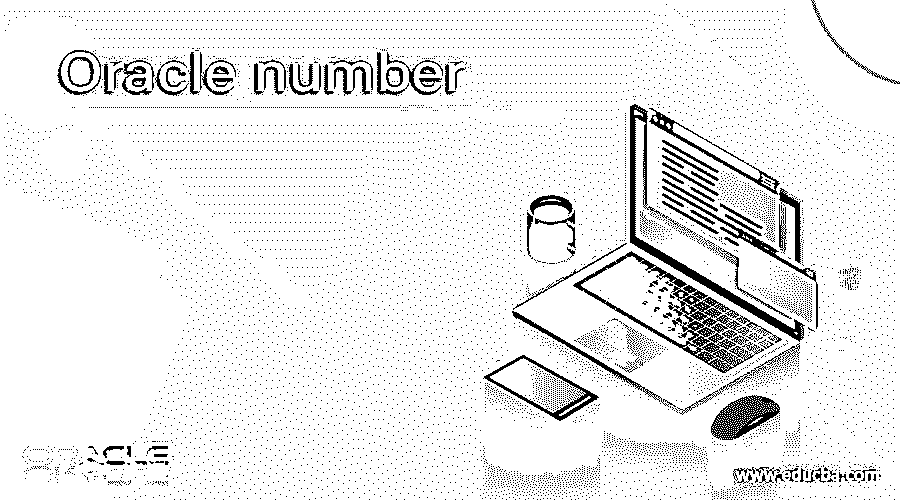
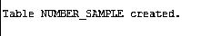
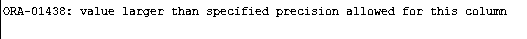

# 甲骨文号码

> 原文：<https://www.educba.com/oracle-number/>

## 甲骨文号码简介

Oracle 向用户提供不同的数据类型；数字类型是我们在应用程序开发过程中使用的数据类型之一。基本上，oracle number 数据类型用于存储正数或负数的数值。通常我们有不同的数据类型，这些数据类型的值可以以加号或减号开始，但不能包含逗号。有时我们需要在负数前加一个逗号，当它跟在另一个数字表达式后面时，或者我们可以说减号是一个减法运算符。十进制值包含小数点。财务数据中重要的一点是，帐户余额必须存储为数字或十进制类型的值。

**语法**

<small>Hadoop、数据科学、统计学&其他</small>

`Number [ (precision_digit [scale_digit] ) ]`

**解释**

请参阅 oracle number 数据类型具有精度和小数位数。数字数据类型的精度是几个数字，精度数字的范围是 1 到 38。在标度数字系统中小数点右边的位数和标度范围，数字是-84 到 127。

### Oracle 中的数字类型是如何工作的？

现在让我们看看 oracle 中的数字系统是如何工作的，如下所示。

基本上，数字数据类型用于精度和销售数字系统，但这两种数字系统都是可选的十进制数字。

数字数据类型是数字数据类型中的超级数据类型，它是一种内部数据类型，意味着 oracle 在内部执行数学运算。数值数据类型的性能较慢，但是非常便于移植。

这里，我们将用于存储最大范围和精度的数值的数字定义如下。

`number`

我们也可以使用下面的语句来定义定点数。

`number(PN, SN)`

**Shortdecimal:** 在 Shortdecimal 数据类型中，我们可以使用 7 个有效数字，该数据类型的范围是-(10 * * 38)到+ (10**38)。

**Number:** 在该数据类型中，我们可以使用最多 38 位有效数字的十进制数，以及该数据类型 id 的范围—(10**125)到(10 * * 125)。

**通过使用 Longinteger 值**

如果值超出范围，则数值数据类型返回 NA。在长整数中，我们没有溢出保护，它将返回不正确的值。

**通过使用数值:**

当我们需要使用数字数据类型时，我们必须指定精度和小数位数。这里，精度是有效数字的个数，而标度用于正数或负数。正刻度用于定义小数点右边的数字位数，负刻度用于定义小数点左边的数字位数。oracle 数据库支持数字数据类型，我们可以像使用 SQL 一样使用它。

**数字数据类型的别名如下。**

在 oracle 中，我们有几个别名可以用来定义数字数据类型，如下所示。

**Int:** 相当于数值数据类型中的 number (38)。

**Decimal (p，s):** 相当于数值数据类型中的 number (p，s)。

**Samllint (p，s):** 这个别名我们可以称为数字数据类型中的 number (p，s)。

**Number (p，s):** 这个别名相当于数字数据类型中的 Number (p，s)。

这里这些都只是化名；它们在 oracle 中不是真正的数据类型。Oracle 在内部将这些别名映射到各自的数字数据类型。

**例题**

现在让我们来看看数字数据类型的不同示例，如下所示。

`CREATE TABLE num (
no_value NUMERIC(5, 2) );`

**解释**

在上面的示例中，我们使用 create table 语句，在这里我们创建了一个新的表名 number_sample，属性 no_value，数据类型为数字，如上面的语句所示。当我们执行上面的查询时，我们使用下面的快照来展示最终的输出。

现在使用 insert into 语句将一些记录插入上表，如下所示。

`insert into num values(857.99);`

**解释**

在上面的例子中，我们使用 insert into 语句将记录插入 num 表，如上面的语句所示。当我们执行上面的查询时，我们使用下面的快照来展示最终的输出。

如果我们超出了数字数据类型的范围，那么它会显示如下的错误消息。

`INSERT INTO num VALUES(1000.99);`

**解释**

在本例中，我们尝试插入表示超出范围的大值，如上面的语句所示。但是由于范围的原因，它会显示一条错误消息。当我们执行上述查询时，我们通过使用下面的快照来展示最终输出。

在第一个示例中，我们成功地插入了，因为插入的数字在我们为该列定义的范围内。但是在第二个示例中，显示了由于数据类型范围而导致的错误消息。

这样，我们可以根据需要使用不同的数值，同样的例子，我们可以通过使用具有不同精度和小数位数的别名来实现。

### 号码的规则和规定

现在让我们来看看数字数据类型的不同规则和规定，如下所示。

1.  插入的数字必须在指定的范围内，否则会显示数字上溢或下溢的错误信息。
2.  我们可以使用别名来代替数字数据类型。
3.  通过使用数字数据类型，我们可以存储定点或浮点数。
4.  如果插入浮点数，由于小数点的原因，我们无法指定精度或小数位数。
5.  常量和变量不允许精确和缩放。
6.  如果我们不指定精度值，它会自动将默认值设置为 38 或我们系统支持的最大值。

### 结论-甲骨文号码

我们希望从这篇文章中你已经了解了甲骨文号码。从这篇文章中，我们学习了数字数据类型的基本语法，也看到了数字数据类型的不同例子。从本文中，我们了解了如何以及何时使用 Oracle number 数据类型。

### 推荐文章

这是一本甲骨文号码指南。这里我们讨论数字数据类型的基本语法，我们也看到不同的例子。您也可以看看以下文章，了解更多信息–

1.  [Oracle 表空间](https://www.educba.com/oracle-tablespace/)
2.  [甲骨文索引](https://www.educba.com/oracle-index/)
3.  [甲骨文授予](https://www.educba.com/oracle-grant/)
4.  [Oracle Synonyms](https://www.educba.com/oracle-synonyms/)

