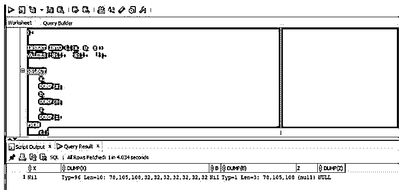
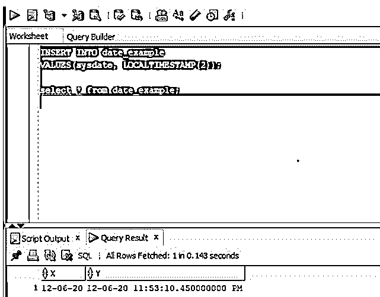
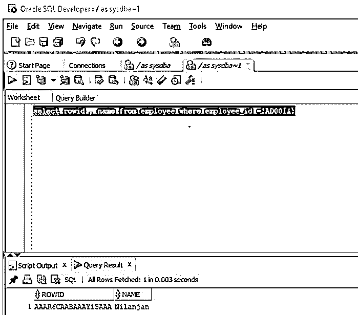

# Oracle 数据类型

> 原文：<https://www.educba.com/oracle-data-types/>

## Oracle 数据类型简介

Oracle 数据库中的数据类型可以定义为与每列的每个值相关联的固定属性集，从更广泛的意义上来说，这意味着每个值都有一个数据类型，它与特定类型的存储或内存属性(如内存空间)相关联，与该特定数据类型相关联的值可以扩展的特定范围，与它相关联的特定约束集，并且它是为数据库表中存在的每列指定的。

### Oracle 数据类型列表

下面列出了 oracle 数据类型:

<small>Hadoop、数据科学、统计学&其他</small>

#### 1.字符数据类型

下面给出了不同的字符数据类型。

*   **char(size):** 用于存储定长字符串。它的最大大小为 2000 字节。
*   **varchar2(size):** 用于存储变长字符串。它的最大大小从 1 字节到 4KB。
*   **nvarchar2(size):** 用于存储变长 Unicode 字符串。上限是 4000 字节。
*   **long:** 也用于存储变长字符串，向后兼容。它可以用来存储高达 2gb 的数据。
*   **raw:** 是变长二进制字符串。它的最大大小为 2000 字节。
*   **long raw:** 是可变长度的二进制字符串，向后兼容。它的最大大小为 2GB。

**举例:**

在本例中，我们将创建一个包含三列的表 t1，每一列都有不同的字符数据类型，然后在这些列中插入一行数据。完成后，我们将使用 DUMP()函数来查找每一列的详细信息。

**代码:**

正在创建表格:

`CREATE TABLE t1 (
x CHAR(10),
b VARCHAR2(10),
z raw(10)
);`

将值插入表格:

`INSERT INTO t1(x, b, z )
VALUES('Nil', 'Nil', '');`

选择表格:

`SELECT
x,
DUMP(x),
b,
DUMP(b),
z,
DUMP(z)
FROM
t1;`

让我们在 SQL developer 中执行查询并检查结果。

**输出:**

正如我们在上面的屏幕截图中看到的，DUMP 函数返回 x、b 和 z 列的详细信息。

#### 2.数字数据类型

下面给出了 Oracle 中不同的数字数据类型:

*   **number(p，s):** 这是一个数字数据类型，它有参数“p”表示精度，“s”表示小数位数。例如，如果 number(8，3)表示它在十进制之前有五个数字，在十进制之后有三个数字。精度范围从 1 到 38，刻度范围从-84 到 127。
*   **dec(p，s):** 是浮点型数值数据类型，其中“p”是精度，“s”是小数位数。精度范围从 1 到 38。这里 dec(3，1)也表示小数点前两位和小数点后一位。

**举例:**

在本例中，我们将创建一个名为 number_example 的表，该表包含 x 和 y 两列，数据类型为 number 和 dec。一旦创建了该表，我们将插入一些数据，然后使用 SELECT 命令检查该表的内容。

**代码:**

正在创建表格:

`CREATE TABLE number_example (
x NUMBER(6, 2), y dec(6,2)
);`

将值插入表格:

`INSERT INTO number_example
VALUES(100.99, 101.99);
INSERT INTO number_example
VALUES(80.552, 11.552);`

选择表格:

`select * from number_example;`

让我们在 SQL developer 中运行查询并检查结果。

**输出:**

正如我们在屏幕截图中看到的，大小被声明为(6，2)，因此第二行内容被四舍五入到小数点后两位数。

#### 3.日期数据类型

我们将声明日期数据类型。

*   **date:** 顾名思义，它用于存储日期类型的字符串值。
*   **时间戳:**给出小数秒的精度，它将是一个 0 到 9 之间的数字。

**举例:**

在本例中，我们将创建一个表 data_example，其中 x 列和 y 列的数据类型分别为 DATE 和 TIMESTAMP。然后，我们将插入一个包含两列值的行，然后使用 SELECT 语句查看表的内容。

**代码:**

正在创建表格:

`CREATE TABLE date_example (
x DATE, y TIMESTAMP(2)
);`

将值插入表格:

`INSERT INTO date_example
VALUES(sysdate, LOCALTIMESTAMP(2));`

选择表格:

`select * from date_example;`

让我们在 SQL Developer 中执行查询并检查结果。

**输出:**

正如我们所看到的，与日期类型相比，时间戳数据类型的列为我们提供了更准确的时间分数。

#### 4.大型对象数据类型

这种类型的数据类型也称为 LOB 数据类型。

*   **blob:** 它是一种存储非结构化二进制大型对象的数据类型，最多可存储 4 GB 的二进制数据。
*   **clob:** 用于存储单字节和多字节字符数据，也可以存储高达 4 GB 的字符数据。
*   **nclob:** 用于存储 Unicode 数据。它可以存储高达 4 GB 的字符文本数据。
*   **ROWID 数据类型:** Rowid 为定长二进制数据，格式为 BBBBBBB。其中 BBBBBBB 是数据库文件中的块，RRRR 是块中的行，FFFFF 是数据库文件。

**举例:**

oracle 数据库中的每行都有一个地址。在本例中，我们将通过查询 rowid 类型的伪列 ROWID 来获取行地址。

**代码:**

`select rowid , name from employee where employee_id ='AD001';`

现在让我们在 SQL developer 中执行查询并检查结果。

**输出:**

### 推荐文章

这是 Oracle 数据类型指南。这里我们分别讨论 Oracle 数据类型的介绍以及数据类型的列表。您也可以看看以下文章，了解更多信息–

1.  [Oracle 锁表](https://www.educba.com/oracle-lock-table/)
2.  [Oracle REGEXP_REPLACE](https://www.educba.com/oracle-regexp_replace/)
3.  [Oracle 检查约束](https://www.educba.com/oracle-check-constraint/)
4.  [Oracle 基数](https://www.educba.com/oracle-cardinality/)

