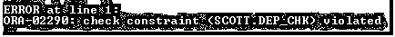
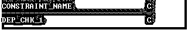

# Oracle 检查约束

> 原文：<https://www.educba.com/oracle-check-constraint/>

## Oracle 检查约束简介

Oracle Check 约束用于定义完整性约束条件，该条件限制数据库表中每一行的值。包含 Check Constraint 的表的列对每一行强制实施条件，并限制 Check Constraint 中未声明的值。简而言之，表中的每一行都必须使检查约束条件为真或未知。

### Oracle 检查约束的声明样式

它可以通过两种方式声明。他们是

<small>Hadoop、数据科学、统计学&其他</small>

*   列级(内嵌)样式:
*   它可以声明为单个列或属性定义的一部分。
*   通常在约束仅特定于该列时应用。
*   表格级别(不一致)样式:
*   它可以被声明为表定义的一部分。
*   它可以在列的组合中一起声明。

#### 集中点

*   Oracle CHECK Constraint 定义了每行必须满足的条件。
*   为了满足约束，表中的每一行都必须使条件为真或未知。
*   Oracle 不会验证检查条件是否互斥。
*   在单个用户或模式中，不能有两个同名的检查约束。
*   如果用户没有提供约束名称，ORACLE 会将约束与名称相关联。

最好提供一个约束名称。

#### 限制

*   不能包含的结构有:
*   引用其他行中的值的查询。
*   对函数 SYSDATE、UID、user 和 USERENV 的调用。
*   伪列 CURRVAL、NEXTVAL、LEVEL 或 ROWNUM。
*   未完全指定的日期常数。
*   Check 约束条件可以引用同一表中的任何列，但不能引用其他表中的列。
*   一个列可以有多个 Check 约束，这些约束可以在定义中引用该列。
*   可以在一个列上定义的 Check 约束的数量没有限制。
*   可以在列级(行内)或表级(行外)定义检查约束。

### 句法

对于内联 Oracle 检查约束:

`CREATE TABLETable_Name**(**col_1 Datatype (width), col_2 Data type (width)   CONSTRAINT constraint_name CHECK (column_name Condition) [DISABLE]);`

对于离线 Oracle 检查约束:

`CREATE TABLETable_Name**(**col_1 Datatype (width), col_2 Datatype (width), col_2     Datatype (width), CONSTRAINT constraint_nameCHECK(column_name Condition) [DISABLE]);`

**说明:**

*   **Col_1/2/n:** 根据您的要求进行计算的列。
*   **表名:**根据您的要求
*   **constraint_name:** 它可以是任何名称，但在同一模式中必须是唯一的。
*   **column_name:** 可以是任何列名，但必须在要应用条件的同一个表中。
*   **条件:**将应用于该列的条件。
*   **DISABLE:** 可选关键字。如果使用 DISABLE 关键字创建了任何 Check 约束，将会创建该约束，但不会强制执行条件。

### 实施 Oracle 检查约束的示例

在本节中，我们将看到 Oracle 检查约束的实现及其行为。

#### 1.检查约束/列级别(内嵌)样式

**代码:**

`SQL> CREATE TABLE Mydept(Deptno NUMBER(2) CONSTRAINT Dep_chk CHECK(Deptno in(10,20,30,40)),Dname VARCHAR(16));`

**输出:**

**解释:**在上面的 CREATE 语句中创建了一个有两列的表，其中 Deptno 列包含 CHECK 约束，该约束带有一个条件来检查 Deptno 是否属于指定条件中的给定编号。现在我们将在表中插入一些数据，并观察其行为。

**代码:**

`SQL>INSERT INTO Mydept VALUES (30,’SALES’);`

**输出:**

**代码:**

`SQL>INSERT INTO Mydept VALUES (50,’SALES’);`

**输出:**

**解释:**上面两条 INSERT query 第一条语句在表(Mydept)中插入一条记录，但是第二条语句抛出一个错误。为什么？因为每当对该列运行查询时，Check Constraint 都会强制执行该条件。在第一个示例中，Deptno 值是 30，这满足检查约束条件，但是在第二个示例中，Deptno 值是 50，这违反了检查约束条件。这就是为什么第二个 INSERT 语句抛出一个错误。

#### 2.禁用检查约束

DISABLE 选项什么都不是，但是它禁用声明的约束，直到它被启用。如果 DISABLE 关键字与约束一起使用，则约束不强制检查条件。

**代码:**

`SQL>CREATE TABLE Mydept_1 (Deptno NUMBER (2) CONSTRAINT Dep_chk_1 CHECK (Deptno in (10,20,30,40)) DISABLE,Dname VARCHAR2 (16));`

**输出:**

**解释:**上面的 CREATE 语句创建了一个新表 Mydept_1，Deptno 列由带有 DISABLE 关键字的 Check 约束组成。现在我们将插入值并检查行为。

**代码:**

`SQL>INSERT INTO Mydept_1 VALUES (30,’SALES’);`

**输出:**

**代码:**

`SQL>INSERT INTO Mydept_1 VALUES (50,’SALES’);`

**输出:**

**说明:**上面两条 INSERT 语句成功插入了两个不同的 deptno 值。第一个 deptno 值 30 满足检查条件，但是第二个值 50 不满足，但是仍然被插入。为什么？因为 check 约束中的 DISABLE 关键字使其处于禁用模式，所以 Check 条件不会强制执行。

#### 3.表级别(不一致)样式的检查约束

**代码:**

`SQL >CREATE TABLE Mydept_2 (Deptno NUMBER (2),Dname VARCHAR2 (16),
CONSTRAINT Dep_chk_2 CHECK (Deptno in (10, 20, 30, 40)));`

**输出:**

**解释:**上面的 CHECK 语句创建了一个带有 Check 约束的表 Mydept_2，但是该约束是在表级(行外)样式上声明的，其行为与列级样式声明相同。

#### 4.检查约束维护

**指导方针**

*   可以添加、删除、启用或禁用 Check 约束，但不能修改表的物理结构。
*   检查约束名可以从
*   用户约束
*   用户 _ CONS _ 列数据字典视图

#### 5.查看检查约束

**代码:**

SQL>SELECT constraint_name，constraint _ type FROM USER _ CONSTRAINTS 其中 TABLE_NAME='MYDEPT_1 '。

**输出:**

**解释:**显示约束名称和类型的输出。这里 C 表示检查约束。

#### 6.添加检查约束

**代码:**

`SQL>ALTER TABLE samp_pk ADD CONSTRAINT chk_sampid CHECK(samid in(8,9,4,3));`

**输出:**

**说明:**早期的 SAMP_PK 表没有检查约束。现在有了。

#### 7.删除检查约束

**代码:**

`SQL>ALTER TABLE Mydept_1 DROP CONSTRAINT DEP_CHK_1;`

**输出:**

**解释:**在上面的例子中，来自 Mydept_1 表的检查约束(DEP_CHK_1)被删除。现在 Emp_1 没有任何检查约束(见下图)。

**代码:**

`SQL>SELECT constraint_name, constraint_type FROM USER_CONSTRAINTS WHERE                     TABLE_NAME='MYDEPT_1';`

**输出:**

也可以禁用或启用检查约束。

**代码:**

`SQL>ALTER TABLE Table_Name ENABLE / DISABLE CONSTRAINT <Constraint Name>];`

**解释:**一列可以有多个 Check 约束。

### 结论

Oracle Check Constraint 一种约束，使我们能够定义一个规则或条件来强制限制一列或多列中的值。为了保持完整性并在加载数据之前验证条件，可以使用 Check 约束。

### 推荐文章

这是 Oracle 检查约束的指南。在这里，我们讨论 Oracle 检查约束、声明风格、语法、代码示例和输出的介绍。您也可以浏览我们的其他相关文章，了解更多信息——

1.  [Oracle 唯一约束](https://www.educba.com/oracle-unique-constraint/)
2.  [Oracle 约束条件](https://www.educba.com/oracle-constraints/)
3.  [甲骨文条款](https://www.educba.com/oracle-clauses/)
4.  [Oracle 外键](https://www.educba.com/oracle-foreign-key/)

