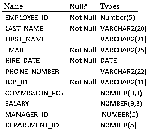
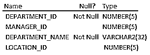
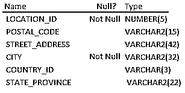

# Oracle 中的内部联接

> 原文：<https://www.educba.com/inner-join-in-oracle/>

## Oracle 内部联接简介

Oracle 中的内部联接是一种联接类型，其中第一个表和第二个表基于某种联接谓词或条件进行匹配，方法是将第一个表的每一行与第二个表的行进行比较，以找到满足联接条件的行对，然后将查询中提供的满足联接条件的所有行对(在比较行时也包括非空值)组合成一行，以形成作为输出显示的结果集。

**内部连接的语法**

<small>Hadoop、数据科学、统计学&其他</small>

`SELECT column [ , column ] FROM t1
INNER JOIN t2
ON t1.column = t2.column;`

下图显示了内部联接的可视化表示，因为在下图中，阴影区域返回 Oracle 内部联接的结果

结果，Oracle 内部连接返回 t1 和 t2 的交集记录。

### 内部联接的查询示例

让我们借助一些查询示例来详细理解内部连接:

#### 示例#1

内部联接的查询示例

`SELECT employee.employee _id, employee.employee_name, department. department_name
FROM employee
INNER JOIN department
ON employee.employee _id = department.employee _id;`

上面的 Oracle INNER JOIN 示例将返回 employee 表和 department 表中 employee _id 值匹配的所有行。

我们在这里考虑 hr 模式，它是 oracle 数据库的样本模式。hr 模式包含国家、员工、部门、JOB_HISTORY、JOBS、LOCATIONS、REGIONS 表，我们对这些表感兴趣或者需要员工、部门和位置表。

这些表格的描述如下

**表员工**

**表格部门**

**工作台位置**

#### 实施例 2

两个表的内部联接示例

这里，我们想从两个表 EMPLOYEES 和 DEPARTMENTS 中检索数据。在这里，我们编写查询来从雇员的表中检索雇员的雇员 id 和雇员的名字，从部门的表中检索部门的名称

`SELECT employees. employee_id , employees. first_name, departments.department_name
FROM   employees , departments
WHERE  employees. employee_id = departments. department_id;`

**输出**

表中的列名以 Oracle SELECT 子句开头。如果一个列是两个表共有的，那么为了清楚起见，列名必须以表名为前缀。从中检索数据的表在 from 子句中用逗号分隔。在 WHERE 子句中指定连接条件。employees 表和 department 表之间的关系由两个表中的 employee_id 公共列中的值决定，两个表中的值必须相等，这种关系称为等价联接。通常[主键和外键](https://www.educba.com/primary-key-vs-foreign-key/)都涉及到这个关系。

#### 实施例 3

具有别名的两个表的内部联接示例

让我们通过使用表别名重写上面的示例，如下所示

`SELECT e. employee_id , e. first_name,
d. department_name
FROM   employees e , departments d
WHERE  e. employee_id = d. department_id;`

**输出**

在上面的查询中，表别名是在列名之后的 from 子句中创建的，在上面的查询中，使用表别名作为 e 和 d，而不是在每列之前的 select 子句中编写完整的表名。

#### 实施例 4

带有添加附加子句的两个表的内部连接示例

在下一个查询示例中，我们向 where 子句中的 Oracle SELECT 语句添加附加子句，用于添加聚合、限制返回的行、定义排序顺序等。下面是一个示例查询，它检索在财务、制造和建筑部门工作的所有雇员。

`SELECT e. employee_id , e. first_name,
d. department_name
FROM   employees e , departments d
WHERE  e. employee_id = d. department_id
AND d. department_name in ( 'Finance', 'Manufacturing', 'Construction' );`

**输出**

#### 实施例 5

带有 order by 子句的两个表的内部联接示例

下一个查询示例，我们通过添加 order by 子句重写了上面的查询，因此显示了按部门名称排序的雇员数据。

`SELECT e. employee_id , e. first_name,
d. department_name
FROM   employees e , departments d
WHERE  e. employee_id = d. department_id
AND d. department_name in ('Finance', 'Manufacturing', 'Construction')
ORDER BY d. department_name;`

**输出**

#### 实施例 6

多个表连接的内部连接示例

有时为了获得信息，我们可能需要连接两个以上的表。接下来，我们编写查询示例来连接多个表。考虑这样一个示例，我们希望从 employee 表中检索雇员的名字，从 department 表中检索部门的名称，并在 location 表中检索该雇员工作地点的国家 id。

`SELECT e. first_name, e. salary , d. department_name, l. city, l. country_id
FROM  employees e , departments d , locations l
WHERE e. employee_id = d. department_id
AND
d. location_id = l. location_id;`

**输出**

要连接四个或更多的表，同样的概念适用于在 oracle 的 FROM 子句中添加表名，并在 oracle 的 WHERE 子句中应用连接条件。

### 结论

内部连接是 oracle 数据库中的[连接类型之一。用于联接多个表并返回联接条件为真的那些行的内部联接。通常主键和外键都包含在内部连接中，以创建表之间的关系。](https://www.educba.com/types-of-joins-in-sql/)

### 推荐文章

这是 Oracle 内部连接的指南。在这里，我们讨论了内部连接的介绍以及一些详细的例子。您也可以浏览我们推荐的其他文章，了解更多信息——

1.  [加入 MySQL](https://www.educba.com/joins-in-mysql/)
2.  [Oracle 查询](https://www.educba.com/oracle-queries/)
3.  [甲骨文数据仓库](https://www.educba.com/oracle-data-warehousing/)
4.  [什么是 Oracle 数据库](https://www.educba.com/what-is-oracle-database/)
5.  [了解不同类型的 Oracle 版本](https://www.educba.com/oracle-versions/)
6.  [内部连接与外部连接|主要差异](https://www.educba.com/inner-join-vs-outer-join/)
7.  [学习 MySQL 外部连接](https://www.educba.com/mysql-outer-join/)

