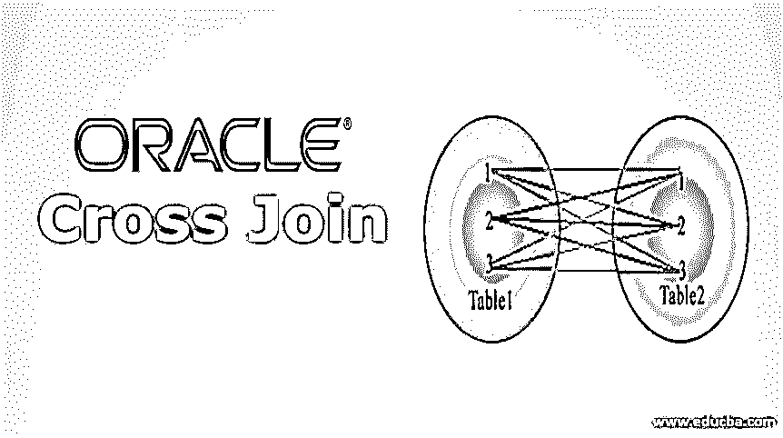
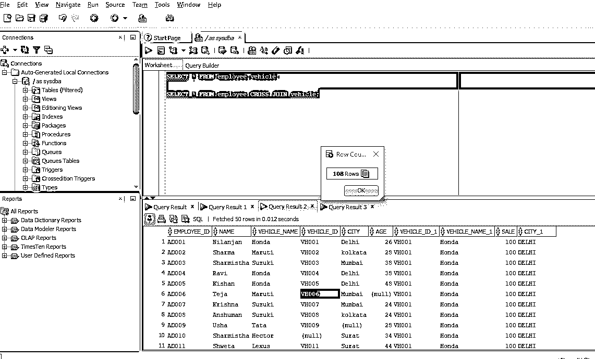
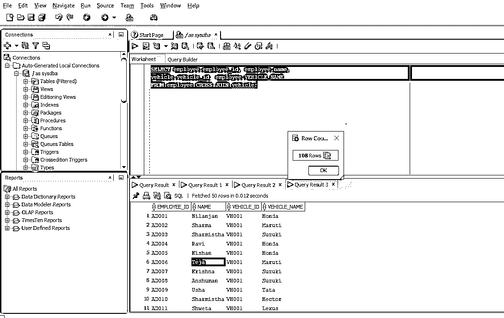
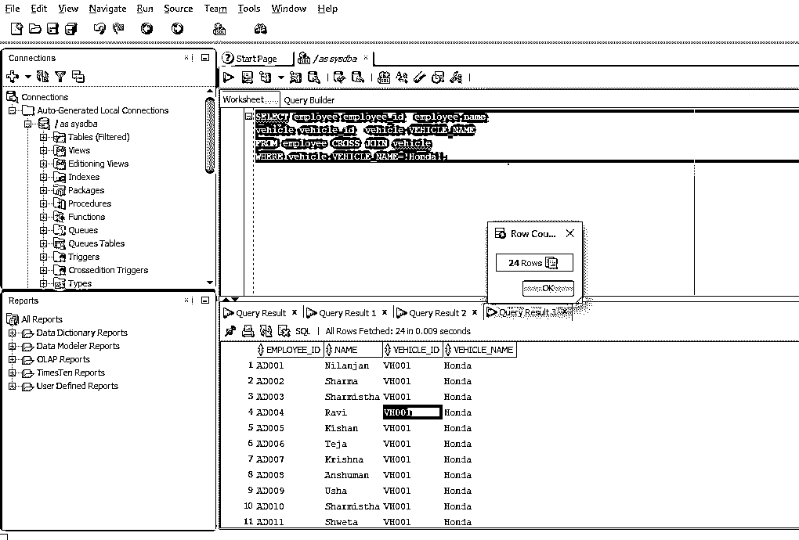

# Oracle 交叉连接

> 原文：<https://www.educba.com/oracle-cross-join/>

## Oracle 交叉连接简介

交叉连接也称为笛卡儿积，因为它是一种连接函数，通过将一个表的每一行项目与另一个表的每一项连接起来返回结果集。如果表 A 与另一个表 B 交叉联接，其中表 A 有 10 条记录，表 B 有 10 条记录，则结果集将有 100 条记录。Oracle 中的交叉连接可以有一个可选的 WHERE 条件。

**语法**:

<small>Hadoop、数据科学、统计学&其他</small>

`SELECT *
FROM table1
CROSS JOIN table2
[where condition];`

**参数**:

*   **table1:** 这里我们提供第一个表的名称
*   **table2:** 这里我们提供第二个表的名称
*   **【where condition】:**可选，表示提取满足条件的记录。

正如我们所见，语法非常简单，易于理解。接下来，我们将讨论交叉连接的工作原理。

### Oracle 中的交叉连接是如何工作的？

交叉连接是两个表的叉积，也称为笛卡儿积。在这方面，我们需要理解笛卡尔这个术语。因此，笛卡尔积意味着一个表中的每一行都与另一个表中的所有行相连。假设我们有两个分别有三行和四行的表，这会产生一个笛卡尔积。因此，如果我们在这两个表之间进行交叉连接，我们将得到 4*3 =12 行。概括地说，如果我们有两个分别有 x 行和 y 行的表，那么笛卡儿积将是 x*y，交叉连接也是如此，从两个表中提取的行数等于两个表之间的笛卡儿积，在本例中是 x*y。需要注意的重要一点是，如果我们在查询中有 where 条件，事情可能会发生变化，因为返回的实际行数也将取决于 where 条件是否得到满足。

这向我们解释了 oracle 中交叉连接的工作原理。现在，我们将研究各种示例，以便更好地理解。

### 在 Oracle 中实施交叉连接的示例

现在，我们将通过不同的示例来更好地理解 oracle cross join。因此，我们将使用两个表，一个是 6 列 12 行的雇员表，另一个是 4 列 9 行的车辆表。

#### 示例 1–无条件交叉连接

在本例中，我们将尝试查找存储在数据库中的两个表之间的简单笛卡尔积或交叉连接。这些表是雇员和车辆。如前所述，雇员表有 12 行，车辆表有 9 行。因此，当我们之前讨论交叉连接的工作时，我们讨论了在这种类型的连接中没有提供连接条件，当我们进行外部或内部连接时，我们会得到这种连接条件。对此的查询可以用两种方式编写，这两种方式都为我们提供了相同的输出。在这两者的下面，写有查询

**查询:**

`SELECT * FROM employee, vehicle;
SELECT * FROM employee CROSS JOIN vehicle;`

两个查询表示相同的数据。因此，在这种情况下，我们选择从数据库中提取的所有记录。正如我们已经讨论过的，交叉连接是两个表的笛卡尔乘积。employee 表有 12 行 6 列，而 vehicle 表有 9 行 4 列。根据笛卡尔规则，它应该是 12*9 =108 行 10 列，因为雇员的每一行都将与车辆的每一行相连。

在 [Oracle](https://www.educba.com/install-oracle/) SQL developer 上运行的查询显示如下输出。

**输出:**

如果您看到上面的截图，它显示了 108 行以及两个表中的所有列。

#### 示例# 2–有特定列但没有条件的交叉连接

在本例中，它与前面的示例相似，唯一的区别是，这里只提取两个表之间的特定列。查询的工作操作与前面的查询相同。相同的查询写在下面:

**查询:**

`SELECT employee.employee_id, employee.name,
vehicle.vehicle_id, employee.VEHICLE_NAME
FROM employee CROSS JOIN vehicle;`

如果您看到查询，我们从每个表中提取了两列。现在让我们在 [sql developer](https://www.educba.com/what-is-sql-developer/) 中执行查询，输出截图如下。

正如我们所看到的，行数是前面解释的两个表的笛卡尔乘积。只有列的数量是 4，正如我们在查询中提到的一样。

#### 示例# 3–带有 WHERE 条件的交叉连接

因此，在本例中，我们将在查询中使用 WHERE 条件。当我们应用带有条件的 WHERE 子句时，在两个表的笛卡尔积之后满足 WHERE 子句条件的记录将被提取出来。我们将使用与前面例子中相同的两个表。下面提供了该操作的查询。

**查询:**

`SELECT employee.employee_id,  employee.name,
vehicle.vehicle_id,  vehicle.VEHICLE_NAME
FROM employee CROSS JOIN vehicle
WHERE vehicle.VEHICLE_NAME='Honda';`

现在，如果我们在查询的末尾看到一个条件，该条件规定只有那些在车辆表的 vehicle_name 列中值为“Honda”的记录才会被提取出来作为输出。

让我们在 Oracle SQL 数据库中运行上述查询，其输出如下面的屏幕截图所示。

**输出:**

如果我们仔细观察输出，可以看到所有记录的 vehicle_name 列中只有“Honda”值。行数计数也是 24，这意味着只有 24 个车辆名称为“Honda”的记录。

### 推荐文章

这是 Oracle 交叉连接的指南。这里我们讨论如何在 Oracle 中使用不同的条件实现交叉连接，并给出例子。您也可以阅读以下文章，了解更多信息——

1.  [Spark SQL 中的连接类型](https://www.educba.com/join-in-spark-sql/)
2.  [MySQL 中最常见的 6 种连接类型](https://www.educba.com/joins-in-mysql/)
3.  [Oracle 中 10 种不同类型的联接](https://www.educba.com/joins-in-oracle/)
4.  [快速浏览不同的 Oracle 版本](https://www.educba.com/oracle-versions/)

