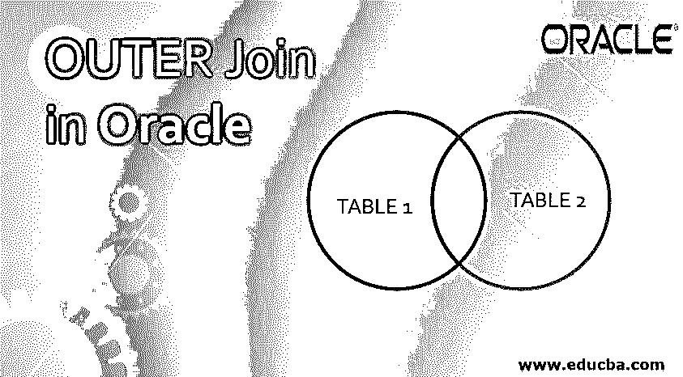
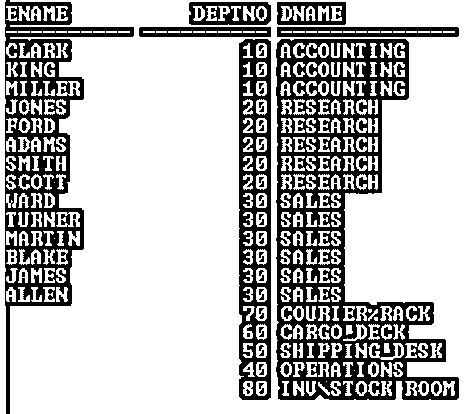
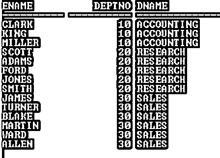
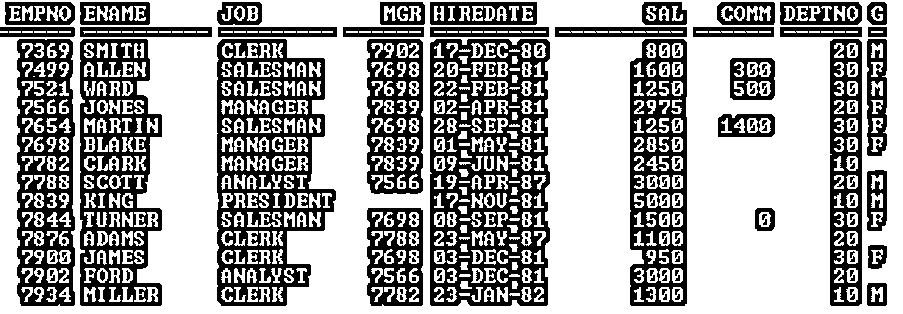
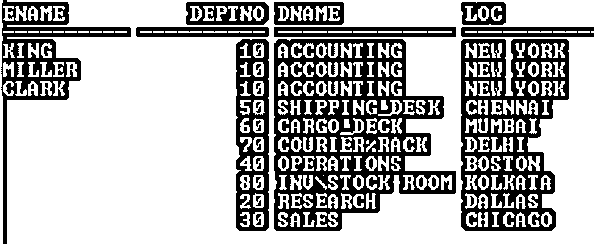

# Oracle 中的外部联接

> 原文：<https://www.educba.com/outer-join-in-oracle/>

## Oracle 中的外部连接是什么？

联接是将两个或多个表、视图或实体化视图中的行组合在一起的查询。有四种 Oracle 专有联接，外部联接是其中之一。外部联接返回满足联接条件的所有行，还返回一个表中不匹配的行，对于这些不匹配的行，另一个表返回 null。这意味着它从一个表中返回匹配和不匹配的行，从另一个表中返回匹配的行，对于不匹配的行返回 null。

### 集中点

*   外部联接将多个表、视图或物化视图结合起来检索数据。
*   外部联接返回满足联接条件的所有行，也返回不匹配的行。
*   Oracle 提供了一个外部联接运算符(+)来对多个表执行外部联接，并返回一个表中的所有行，对于不匹配的行，返回另一个表中的 NULL。
*   如果外部联接运算符“(+)”与表 A 的列一起出现，Oracle 将返回表 B 的所有行，对于没有匹配行的所有行，表 A 将返回 NULL。
*   条件中的列不必是选择列表的一部分。

**语法:**

<small>Hadoop、数据科学、统计学&其他</small>

`SELECT Table1.Column_1, Table2.Column_n FROM Table1, Table2 WHERE    Table1.Column_2 (+) = Table2.Column_2;`

`SELECT Table1.Column_1, Table2.Column_n FROM Table1, Table2 WHERE  Table1.Column_2 = Table2.Column_2 (+);`

**描述:**

*   **Col_1/2/n:** 根据您的要求进行计算的列。
*   **表 1/2:** 根据您的要求
*   **其中:**必须使用外部连接操作符。
*   **+:** 它是一个外连接操作符。

**举例:**

`SELECT E.Ename, D.Deptno, D.Dname FROM Emp E, Dept D
WHERE E.Deptno (+) = D.Deptno ORDER BY E.Deptno;`

**输出:**

`SELECT E.Ename, D.Deptno, D.Dname FROM Emp E, Dept D
WHERE E.Deptno=D.Deptno (+) ORDER BY E.Deptno;`

**输出:**

**解释:**在第一个例子中，外部连接操作符出现在 Emp 表(别名为 E)中，所以它返回 Emp 表中所有匹配的行，但是 Dept 表(别名为 D)返回所有匹配的行和不匹配的行，对于不匹配的行，Emp 表返回空值。根据 ANSI，它是右外连接。

但是在第二个示例中，外部连接运算符(+)出现在 Dept 表(别名为 D)中，它只返回匹配的行，因为 Emp 表的所有行都与 Dept 表的行匹配，并且 Emp 表中没有任何不匹配的行。这就是为什么它只返回匹配的行。根据 ANSI，它是左外连接。

### 规则和限制

在实现 Oracle 外部连接之前，必须了解外部连接的一些重要规则和限制。列出如下:

*   外部联接运算符(+)只能出现在 WHERE 子句中。
*   外部联接运算符(+)可以出现在 FROM 子句的左相关上下文中，并且只能应用于表或视图的列。
*   如果“A”和“B”由多个连接条件连接，则必须在所有这些条件中应用外部连接运算符(+)。
*   外部联接运算符(+)只能应用于列，而不能应用于任意表达式。
*   如果条件包含外部联接运算符(+)，则 OR 逻辑运算符不能用于组合其他条件
*   使用 IN 运算符时，列不能使用带有表达式的外部联接运算符(+)执行条件比较。
*   条件不能将任何标有外部联接运算符(+)的列与子查询进行比较。
*   如果外部联接运算符(+)与列一起出现，则不能对该列应用条件来与子查询进行比较。

### Oracle 外部连接的实现及示例

在本节中，我们将看到 Oracle 外部连接的实现及其行为。为此，我们将使用下面的示例表(Emp，Dept ),分别包含 14 条和 8 条记录，来理解 Oracle 外部连接行为。

`SELECT * from Emp;`

**输出:**

`SELECT * from Dept;`

**输出:**

*   带有其他子句的外部连接运算符(+)

`SELECT E.Ename, D.Deptno, D.Dname FROM Emp E, Dept D
WHERE E.Deptno=D.Deptno (+) ORDER BY E.Deptno (+);`

**输出:**

`SELECT E.Ename, D.Deptno, D.Dname FROM Emp E, Dept D
WHERE E.Deptno=D.Deptno (+) GROUP BY E.Ename (+), D.Deptno (+),D.Dname (+);`

**输出:**

在上面的示例中，SELECT 语句返回“无效字符”错误消息。为什么？

因为外部联接运算符(+)只能出现在 WHERE 子句中，但在上面的示例中，外部联接运算符(+)也会出现在其他子句中。

*   多条件查询的外部连接

`SELECT E.Ename, D.Deptno, D.Dname, D.Loc FROM Emp E, Dept D
WHERE E.Deptno (+) = D.Deptno AND E.Deptno = 10 ORDER BY E.Deptno;`

**输出:**

`SELECT E.Ename, D.Deptno, D.Dname, D.Loc FROM Emp E, Dept D
WHERE E.Deptno (+) = D.Deptno AND E.Deptno (+) = 10 ORDER BY E.Deptno;</code?`

**输出:**

上面的两个示例是多条件的，在上面的第一个示例中，外连接运算符(+)只出现在第一个条件中，但在第二个示例中，外连接运算符(+)同时出现在两个条件中。正因为如此，结果是不同的。

在第一个示例中，第二个条件(没有(+)运算符)表现为一个正常条件，它过滤行并返回属于 Deptno 10 的行。

但是在第二个示例中，外部连接操作符(+)出现在所有条件中，它返回 Dept 表的所有行(匹配和不匹配)以及 Emp 表的匹配行，不匹配的行为空。

小贴士:

*   NVL 函数可用于填充不匹配行的空值。
*   当 WHERE 子句包含任何联接时，不能在 WHERE 子句中指定 LOB 列

### 结论

Oracle 外部连接是一种结合多个表、视图或物化视图来检索数据的查询。如果要查找一个表中的所有记录，而只查找另一个表中的匹配行，则可以使用 Oracle OUTER join，因为它从一个表中返回匹配和不匹配的行，从另一个表中返回匹配的行，不匹配的行为空。

### 推荐文章

这是 Oracle 中外连接的指南。在这里，我们将通过示例讨论 Oracle 外部连接的介绍、关注点和实现。您也可以浏览我们的其他相关文章，了解更多信息——

1.  [甲骨文联合所有](https://www.educba.com/oracle-union-all/)
2.  [Oracle 中的左连接](https://www.educba.com/left-join-in-oracle/)
3.  [甲骨文运算符](https://www.educba.com/oracle-operators/)
4.  [Oracle 中的排序依据](https://www.educba.com/order-by-in-oracle/)

