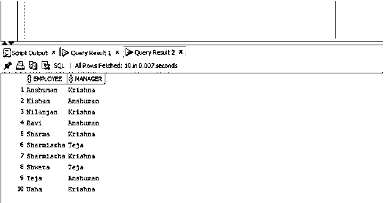
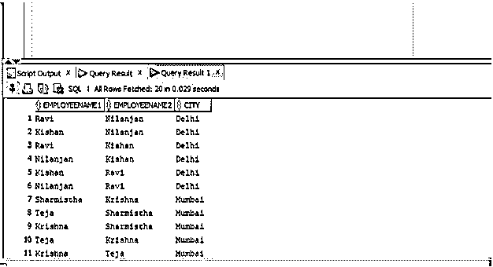

# Oracle 自联接

> 原文：<https://www.educba.com/oracle-self-join/>

## Oracle Self Join 简介

Oracle 自联接是一种联接类型，如联接自身。这意味着表中的每一行都与其自身以及表中的每隔一行组合在一起，oracle 自联接也可以描述为两个副本的联接(数据库中没有表的实际副本),这是基于查询中提供的某种联接条件，以便只从表中提取并返回满足给定条件的那些行。

**语法**

<small>Hadoop、数据科学、统计学&其他</small>

现在让我们来看看 oracle 数据库中 Oracle 自连接的语法。

`SELECT a.column_name, b.column_name...
FROM table a, table b
WHERE a.common_condition = b.common_condition;`

**参数:**

*   **column_name:** 是指我们要提取的列的名称。
*   **a，b:** 这是同一个表的别名，因为它是自连接的
*   **Common_condition:** 需要满足的条件。

### Oracle Self Join 是如何工作的？

Oracle Self Join 是一种特殊类型的连接，与其他连接不同，在其他连接中，两个不同的表基于一些公共条件进行连接，但在 Self Join 中，它是一元关系(表与自身连接)。自联接的工作方式是指定表中的每一行与其自身以及同一表中的每隔一行进行组合。换句话说，我们可以说自连接根据查询数据的条件来比较表中的行。

**Note:** One important point to note that we can use other joins like inner join and left join with Oracle self join.

### 实施 Oracle Self Join 的示例

为了更好地理解，让我们看一些例子:

#### 示例#1

Self Join with WHERE 子句:在第一个示例中，我们将从 employee 表中返回每个雇员的姓名以及该雇员的经理的姓名。我们将使用自连接来实现这一结果。让我们看看下面的查询:

**代码:**

`SELECT e1.name employee, e2.name manager
FROM employee e1, employee e2
WHERE e2.employee_id = e1.manager_id
Order BY employee;`

**输出:**

**解释:**在上面的例子中，employee 表根据它的两个别名 e1 和 e2 被调用了两次。根据连接条件对行进行比较，并返回雇员姓名和经理姓名。正如我们在输出中看到的，查询成功执行，并且显示了带有雇员姓名和他们各自经理姓名的列。

#### 实施例 2

在使用 where 子句执行自联接的第二个示例中，我们将使用自联接来匹配 employee 表中共享同一个城市的雇员。我们将检索雇员姓名和他们所在的城市。让我们看看这个查询。

**代码:**

`SELECT e1.name AS EmployeeName1, e2.name AS EmployeeName2, e1.City
FROM employee e1, employee e2
WHERE e1.EMPLOYEE_ID <> e2.EMPLOYEE_ID
AND e1.City = e2.City
ORDER BY e1.City;`

**输出:**

**解释:**在上面的例子中，如果我们看到表基于别名 e1 和 e2 被调用两次，并且根据条件返回满足两个条件的值。在这种情况下，条件是首先检查表 e1 和表 e2 的雇员 id(两者都是同一个表 employee 的别名)是否相同，但是它们的城市必须相同才能满足整体谓词。

需要记住的一点是，这两个条件都应该满足。上面的屏幕截图显示查询执行成功，结果集包含三列，第一列显示来自表 employee 的 e1 别名的名称，第二列显示来自表 employee 的 e2 别名的名称，第三列显示城市名称。

#### 实施例 3

使用 ON 子句的自联接:在本例中，我们将使用 ON 子句来获取员工经理的姓名。要求与之前相同，我们将提取两列，一列包含雇员姓名，另一列包含相应的经理姓名，但是我们将使用带有 self join 的 ON 子句，而不是前面示例中使用的 WHERE 子句。让我们看看这个查询:

**代码:**

`SELECT e1.name employee, e2.name manager
FROM employee e1 JOIN employee e2
ON e2.employee_id = e1.manager_id
Order BY employee;`

如果我们看一下上面的例子，on 子句被用在条件之前，该条件根据写在 ON 子句之后的条件比较表中出现的每一行。

**输出:**

**解释:**正如我们在上面的截图中看到的，结果显示了带有员工姓名和他们各自经理姓名的列。

#### 实施例 4

使用 left join 的自连接:在这个查询中，我们将使用 LEFT JOIN 从数据库中的 employee 表中检索雇员姓名及其对应的经理姓名。让我们看看下面的查询:

**代码:**

`SELECT e1.name employee , e2.name manager
FROM employee e1 LEFT JOIN employee e2
ON e2.employee_id = e1.manager_id
Order BY employee;`

在本例中，如果我们看到查询引用了表两次(一次针对雇员，另一次针对经理)。连接谓词用于比较表中出现的每一行，并基于此显示结果。

**输出:**

**解释:**正如我们在截图中看到的，查询成功执行，因为我们在查询中使用了 INNER JOIN，所以我们还可以看到没有经理的雇员。

### 结论

在本文中，我们讨论了 Oracle 自连接的定义、语法以及自连接在数据库中的工作方式。为了更好地理解，我们还看了一些案例和例子。

### 推荐文章

这是 Oracle 自联接的指南。在这里，我们讨论 Oracle Self Join 的介绍、语法、工作原理、代码和输出示例。您也可以浏览我们的其他相关文章，了解更多信息——

1.  [甲骨文提交](https://www.educba.com/oracle-commit/)
2.  [Oracle 约束条件](https://www.educba.com/oracle-constraints/)
3.  [Oracle 唯一约束](https://www.educba.com/oracle-unique-constraint/)
4.  [甲骨文别名](https://www.educba.com/oracle-aliases/)

