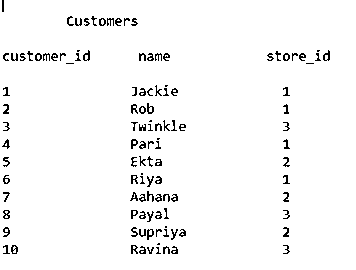
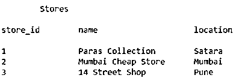
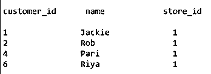
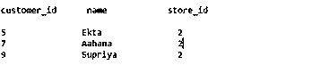
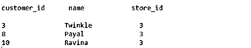

# Oracle 散列连接

> 原文：<https://www.educba.com/oracle-hash-join/>

## Oracle 散列连接简介

在散列连接中，创建一个散列表，这是一种用于连接两个或多个表的技术。每当要设置计算机内存时，oracle 优化器的最佳选择是使用散列连接。每当我们连接两个或更多的表时，oracles optimizer 会从这些表中选择最小的表，并使用这些表的连接键生成一个哈希表。之后，优化器选择另一个剩余的表(通常是该连接中较大的一个表)进行扫描，然后哈希表和该表一起被探测以找到合适的匹配。

### 哈希连接发生的条件

只有当参数 PGA_AGGREGATE_TARGET 的值非常大，足以执行连接时，Oracle 优化器才会以非常高效的方式选择散列连接。如果我们使用 MEMORY_TARGET 参数，那么 MEMORY_TARGET 的值将被添加到 PGA_AGGREGATE_TARGET 中，并一起被考虑用于散列连接。但是，仍然建议将这两个参数值设置为所需的最小值。PGA _ 目标的规范中不包括参数 PGA_AGGREGATE_TARGET 的值。因此，即使设置了 SGA 目标，也必须设置 PGA 聚合目标。

<small>Hadoop、数据科学、统计学&其他</small>

每当嵌套循环连接由于缺少有用的索引而变得低效时，散列连接被证明是非常高效的。可能会出现这样的情况，散列连接甚至比排序合并连接的速度更快。因为在散列连接的情况下，探测哈希表的不同值被证明比 b 树索引遍历快得多。散列连接只有在有等价连接时才有用。如果排序内存不足，散列连接的工作会变得很慢，因为如果发生这种情况，散列连接将使用 I/O 服务和表的临时空间的内存资源。只有在使用基于成本的优化时，我们才能在 oracle 中使用散列连接。如果我们的应用程序运行在 Oracle 11g 上，这是最常见的情况。在其中一个表上构建哈希表是影响哈希连接成本的唯一因素。

### 例子

假设有两个名为 customers 和 stores 的表。这两个表基于名为 store id 的连接键进行连接。客户和商店表的内容如下图所示

**客户表—**

**商店表—**

假设被触发的 SQL 查询如下所示，在连接键 store_id 上的表 customers 和 stores 中。

`SELECT cust.name, store.store_id
FROM Stores AS stores
JOIN Customers AS cust
WHERE cust.store_id = store.store_id;`

当对上面显示的客户表执行散列连接并将该表存储为输入集时，oracle 优化器会在内部对较小的表值生成一个散列表。在本例中，哈希表将基于内存中 customers 表的 store_id 连接键生成。此外，优化器获取客户表的每条记录，并通过与哈希表进行比较来寻找匹配值。针对商店表中的值，检查客户表的所有记录。

对于，扫描 store 表中的每条记录 customer 表中的所有记录，循环继续，直到所有 store 记录都完成匹配，并且所有记录都被隔离。在存储的情况下，执行散列连接排序所需的循环次数将是三次。

第一个循环将查找客户表中商店 id 为 1 的所有记录。当商店的记录匹配为 1 时，第一次循环后检索到的记录如下所示

第二个循环将分离客户表中商店 id 为 2 的所有记录。当商店的记录匹配为 2 时，第一次循环后检索到的记录如下所示

最后，将进行最后一次扫描，以查找商店 id 值为 3 的所有匹配记录。当商店的记录匹配为 3 时，第一次循环后检索到的记录如下所示

第四个循环将不返回值，因为 customer 表中没有商店 id 为 4 的记录。

当散列表不适合 PGA 区域时，oracle 优化器会使用临时空间来容纳散列表的一小部分。这些临时空间部分也称为分区。除了哈希表，大表的某些部分也存储在分区中。该过程包括 oracle 数据库算法遵循的以下步骤。

它在较小的表上执行完整的扫描，与两个连接表相比，该表包含较少的记录，并将散列桶存储在 PGA 和磁盘中。当 PGA 区域填满时，哈希表的最大部分被选择并存储在磁盘的临时空间中。这样，当 PGA 区域不够用时，数据会存储在内存和磁盘分区中。

### 结论

在散列连接技术中，每当在 oracle 中以基于成本的优化方式执行连接时，都会根据较小表上的连接键生成一个散列表。此外，会逐一扫描较大表格的所有记录，以探查匹配值。对所有的连接键哈希值都继续这个过程。我们必须小心，PGA 变量被设置为适当的值，以容纳哈希表的所有数据。

### 推荐文章

这是一个 Oracle 散列连接的指南。这里我们讨论散列连接发生的条件，以及例子和输出。您也可以看看以下文章，了解更多信息–

1.  [Oracle INSTR()](https://www.educba.com/oracle-instr/)
2.  [甲骨文授予](https://www.educba.com/oracle-grant/)
3.  [Oracle Synonyms](https://www.educba.com/oracle-synonyms/)
4.  [甲骨文系统日期()](https://www.educba.com/oracle-sysdate/)

