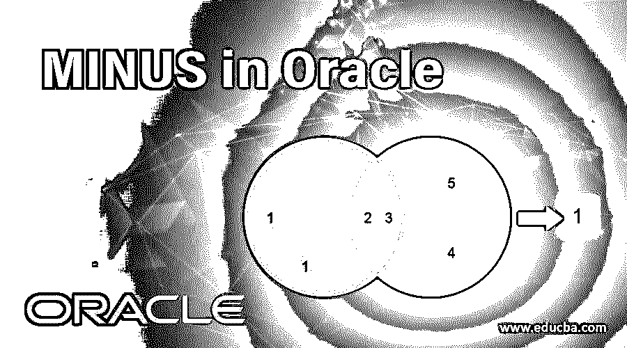
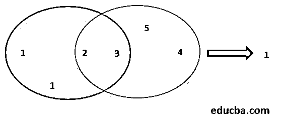
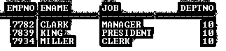
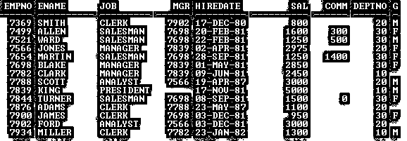
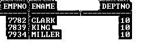
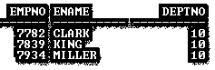
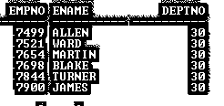
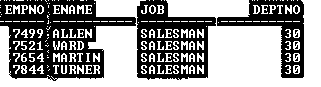

# 甲骨文中的减号

> 原文：<https://www.educba.com/minus-in-oracle/>

## Oracle 中的减运算符是什么？

Oracle 中的减号运算符用于多个 select 语句之间，依次从所有 select 查询中提取唯一的记录。结果输出是在执行的 MINUS 查询中不会重复多个 select 语句的行。这里的 select 查询是单独执行的，而结果是组合的，对这个结果应用减号得到最终输出。它是 Oracle 的 PL/SQL 中可用的垂直连接运算符之一。

简而言之，减运算符只返回那些在第一个 SELECT 语句中是唯一的，而在第二个 SELECT 语句中不存在的行。

<small>Hadoop、数据科学、统计学&其他</small>

*   减号运算符可以应用于两个或两个以上的 SELECT 语句。
*   减运算符通常称为垂直联接，因为其结果是基于列而不是行来组合来自两个或多个 SELECT 语句的数据。
*   每个 SELECT 语句的结果可以被视为一个集合，减号运算符应用于这些集合，并组合这些结果集以获得一个最终结果或一个只存在于第一个 SELECT 语句中并且是唯一的记录集。

**绘画作品:**

| **数据集 1** | **数据集 2** |
| One | Two |
| Two | Three |
| Three | Four |
| One | Five |

**说明:**减号查询返回红色轮廓区域的记录，但不与黑色轮廓区域共享，即 1。这是数据集 1 中存在但数据集 2 中没有的记录。

### 集中点

*   这些查询都是独立执行的，但是它们的输出是合并的
*   只有最后一个查询以分号“；”结尾

**语法:**

`SELECT col_1, col_2, ..., col_n FROM TableName WHERE condition(s)
MINUS
SELECT col_1, col_2, ..., col_n FROM TableName WHERE condition(s);`

**描述:**

*   **Col_1/2/n:** 根据您的要求进行计算的列
*   **表名:**根据您的要求
*   其中:可有可无，取决于你的要求

**查询:**

`SELECT Empno, Ename, Job, Deptno FROM Emp WHERE Deptno=10
MINUS
SELECT Empno, Ename, Job, Deptno FROM Emp WHERE Deptno=30;`

**输出:**

### 在 Oracle 中实施 MINUS 的示例

在这一节中，我们将看到减号操作符的实现及其行为。为此，我们将使用下面有 14 条记录的样本表(Emp)来理解减运算符的行为。

**查询:**

`SELECT * from Emp;`

**输出:**

#### 示例# 1–不带任何条件的减运算符

**查询:**

`SELECT Empno, Ename, Deptno FROM Emp
MINUS
SELECT Empno, Ename, Deptno FROM Emp;`

**输出:**

在此示例中，MINUS 运算符返回零条记录，因为每个 SELECT 语句都生成一个单独的结果集，但是在合并结果集的过程中，第一个结果集的所有记录都存在于第二个结果集中。

#### 示例# 2–带有 WHERE 子句的减运算符

**查询:**

`SELECT Empno, Ename, Deptno FROM Emp WHERE Deptno = 10
MINUS
SELECT Empno, Ename, Deptno FROM Emp WHERE Deptno = 30;`

**输出:**

在此示例中，两个 SELECT 语句都基于 condition 和 MINUS 运算符创建了一个单独的结果集，然后合并这两个结果集，并显示一个包含第一个结果集中的三条记录的最终结果。

第一个 SELECT 语句提取的记录如下所示

*   第二个 SELECT 语句提取的记录如下所示

它清楚地显示第一组记录与第二组记录不匹配，这就是为什么最终结果显示第一个结果集的三行输出。

#### 示例# 3–不同列数的减运算符

**查询:**

`SELECT Empno, Ename, Deptno FROM Emp WHERE Deptno = 10
MINUS
SELECT Ename, Deptno FROM Emp WHERE Deptno = 30;`

**输出:**

**为什么输出中显示错误？**

as-MINUS 运算符规则和限制规定，所有 SELECT 语句的结果集必须具有相同的列数。但是在本例中，第一个 SELECT 语句包含三列，而第二个 SELECT 语句包含两列。

#### 示例# 4–包含无效列名的减号运算符

**查询:**

`SELECT Dname, Ename, Deptno FROM Emp WHERE Deptno = 10
MINUS
SELECT Ename, Deptno FROM Emp WHERE Deptno = 30;`

**输出:**

**为什么输出中显示错误？**

由于列名“Dname”在 Emp 表中不存在，因此输出显示无效的标识符。

**NOTE:** This example proves that each SELECT statement creates a separate result set.

#### 示例 5–数据类型不匹配的减运算符

**查询:**

`SELECT Ename, Hiredate, Deptno FROM Emp WHERE Deptno =10
MINUS
SELECT Ename, Job, Deptno FROM Emp WHERE Deptno = 30;`

**输出:**

**为什么输出中显示错误？**

as-MINUS 运算符规则和限制规定，第二个结果集中每一列的数据类型必须与第一个结果集中对应列的数据类型相匹配。但是在这个例子中，两个结果集中的列号相同，但是数据类型不匹配。第一个 SELECT 语句结果集包含数据类型为日期的列“Hiredate ”,但第二个结果集包含数据类型为 VARCHAR2 的列“Job ”,这是一种不匹配的数据类型，因此输出显示数据类型错误。

#### 示例# 6–带有 ORDER BY 子句的减运算符

**查询:**

`SELECT Empno, Ename, Deptno FROM Emp WHERE Job =’SALESMAN’
ORDER BY Empno
MINUS
SELECT Empno, Ename, Deptno FROM Emp WHERE Deptno = 30;`

**输出:**

在此示例中，即使列号和数据类型条件与两个结果集都匹配，输出也会引发错误。

**为什么输出中仍然显示错误？**

在此示例中，第一个 SELECT 语句使用 ORDER BY 子句对结果集进行排序。但是我们只能在最后一个 SELECT 语句中使用 ORDER BY 子句。以下是使用 ORDER BY 子句的正确方法，如下所示:

**查询:**

`SELECT Empno, Ename, Job, Deptno FROM Emp WHERE Job =’SALESMAN’
MINUS
SELECT Empno, Ename, Job, Deptno FROM Emp WHERE Deptno = 10
ORDER BY   1;`

**输出:**

在本例中，最后一个 SELECT 语句使用 ORDER BY 子句对结果进行排序，没有任何错误。

**注:**

*   在 ORDER BY 子句中，也可以使用列位置号来代替列名。
*   在某些情况下，减操作比其他操作(连接、子查询等)的开销更大。)

### 规则和限制

下面列出了减运算符的重要规则和限制:

*   查询的结果集必须具有相同的列数。
*   第二个结果集中每一列的数据类型必须与第一个结果集中对应列的数据类型相匹配。
*   这两个 SELECT 语句可能不包含 ORDER BY 子句，但减号运算的最终结果可以排序。
*   用于排序的列可以由列号定义。
*   为了对最终结果集进行排序，SELECT 语句可以包含 ORDER BY 子句，但最后一个 SELECT 语句只能包含 ORDER BY 子句。

### 结论

减运算符执行垂直连接，只返回第二个结果集中不存在的记录。要获取唯一且不存在于第二个 SELECT 语句结果集中的记录，可以使用减号运算符，但列号和数据类型必须相同。

### 推荐文章

这是甲骨文中的减号指南。在这里，我们讨论什么是 oracle 中的负运算符，以及集中点，包括规则和限制及其示例。您也可以阅读以下文章，了解更多信息——

1.  [SQL 选择查询示例](https://www.educba.com/sql-select-query/)
2.  如何从数据库中提取数据？
3.  [Oracle 数据库的架构](https://www.educba.com/what-is-oracle-database/)
4.  [安装 Oracle 的步骤](https://www.educba.com/install-oracle/)

