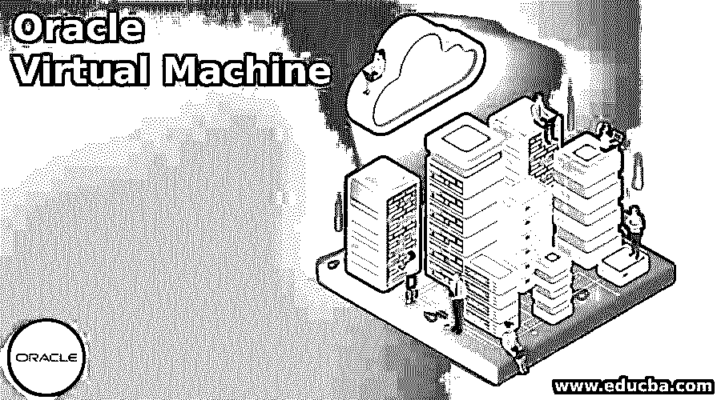
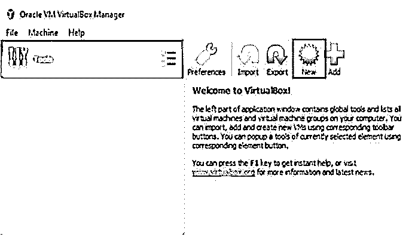
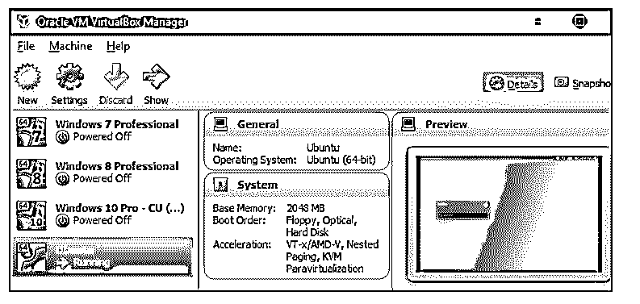

# Oracle 虚拟机

> 原文：<https://www.educba.com/oracle-virtual-machine/>

## Oracle 虚拟机简介

以下文章概述了 Oracle 虚拟机。Oracle VM 允许用户在虚拟化环境中构建操作系统和开发工具。它是一个跨平台的工具，用于创建、维护和操作作为自由软件(VM)的虚拟机实例。虚拟机是主机模拟硬件组件的计算机。用户可以使用它来虚拟化和控制完整的硬件和软件基础设施。虚拟机(VM)可以托管在特定的物理计算机(通常是服务器)上，并通过虚拟机软件进行管理。

### 什么是 Oracle 虚拟机？

VM Oracle VirtualBox 附带了用于主机平台的虚拟机管理程序、用于控制主机虚拟机的 API 和 SDK，以及用于远程管理它们的命令行实用程序。Oracle VM VirtualBox 是一个商业产品，也是一个自由软件。在工作场所和家里都可以使用。借助 Oracle VM VirtualBox 的快照功能，用户可以保存虚拟机的状态，并在需要时进行恢复。可以创建尽可能多的快照，允许用户在虚拟机时间内来回移动。运行虚拟机的实际设备称为主机，而虚拟机本身称为来宾。

<small>Hadoop、数据科学、统计学&其他</small>

### 为什么要使用 Oracle 虚拟机？

Oracle 将虚拟机用于:

*   虚拟机形式的灵活性。
*   专为各种工艺而设计。
*   独立应用程序开发人员(独立软件)负担得起的框架。

要在 oracle 中使用虚拟机，我们需要以下支持:

*   **容量:**无论何时构建专用虚拟机主机，我们都会为其选择一个形状。该形状控制主机上部署的实例的空间量和种类。
*   **计费:**在创建专用虚拟机主机时，立即对其进行计费，而不是对在其上创建的特定虚拟机实例进行计费。如果映像许可证费用与我们用于虚拟机实例的映像有关，您仍将被收取费用。

以下案例受益于 VM VirtualBox:

*   **同时使用众多操作设备** : Oracle VM VirtualBox 允许我们运行多个操作系统。这将使我们能够在一个操作系统上执行开发的软件，而不需要重新启动，例如 Linux 或 Mac 上的 Windows 软件。
*   **备份和恢复，以及测试**:一台机器及其虚拟硬盘可用作包装器，在部署后可被隐藏、唤醒、克隆、备份和跨主机移动。
*   **软件安装简化**:软件供应商可以使用虚拟机交付完整的程序配置。例如，在实际的 PC 上部署整个 SMTP 服务器系统可能非常耗时。相反，可以使用 Oracle VM VirtualBox 将一个复杂的设置(称为设备)打包到一台虚拟计算机中。将设备导入 Oracle VM VirtualBox 可以轻松安装和运行邮件服务器。

虚拟机影响组件，允许客户操作系统在完全虚拟化中独立运行。虚拟机有助于封装。安装在虚拟机上的各种软件可以被监控和更改。虚拟机有多种好处，包括能够放入新的操作系统。单个系统问题不受主机上其他操作系统的影响。它允许在虚拟机之间传输大型文件，并且不需要对多操作系统主机进行双重引导。

我们使用 Oracle VM VirtualBox 软件来设置虚拟环境。下载安装包后启动 app。单击“新建”启动新的虚拟计算机。

下图显示了使用该操作系统的不同平台。

在 VBoxVmService 启动并运行后修改每个虚拟机是一件痛苦的事情。当虚拟机在 VBoxVmService 下运行时，我们可以访问 Oracle VM VirtualBox Manager，因此它们的状态不会正确显示在 GUI 中。

### 虚拟机类型

它具有一系列功能，使管理多个虚拟机变得轻而易举。例如，VirtualBox 使主机系统能够共享文件、驱动器和设备。虚拟机根据其用途和与简单机器的相似性分为两部分。

#### 1.系统虚拟机

硬件虚拟机是系统虚拟机的另一个名称。这是一个系统软件仿真。它模仿整个计算机系统。系统虚拟机是运行整个操作系统的框架。划分内存空间来安装将建立几个不同的孤立的类似的应用程序运行在一个单一的控制台。oracle 的虚拟机箱属于系统虚拟机。缺点是效率受到损害，因为虚拟机间接使用完全相同的硬件。根据系统，在同一台物理计算机上同时运行的多个虚拟机可能会导致不同的吞吐量。

#### 2.进程虚拟机

基于内核的虚拟机的目标是创建一个独立于平台的编程环境，该环境隐藏了实际硬件的复杂性，并使应用程序能够类似地在每个平台上运行。设计师可以通过虚拟化机器在各种系统上测试应用，而无需购买昂贵的设备。

#### 3.Oracle 虚拟机服务

云中的虚拟机(VM)为从小型基础设施项目到大型全球应用程序(如实时通信平台)的应用程序提供受保护的弹性计算能力。通过使用灵活的形状，客户可以使用定制的 CPU 和内存设置来优化虚拟机资源，从而提高性价比。我们还可以同时运行多个虚拟机，但每个虚拟机都会消耗 CPU 时间、RAM 和其他资源。[虚拟化](https://www.educba.com/what-is-virtualization/)释放工作空间以支持潜在员工，同时减少维护和发展 IT 能力所需的办公楼数量。

公司可以利用带有虚拟机的安全预配置主机模板来快速实施新的虚拟化资源。例如，虚拟机管理程序充当交通警察，控制裸机功能并将其分配给每个生成的虚拟机。第 1 类虚拟机管理程序运行在物理硬件(通常是服务器)上，替代操作系统。第 2 类虚拟机管理程序专为特定的台式机或笔记本电脑平台而设计，在主机操作系统中作为应用程序运行。

### 结论

本文重点介绍了如何使用 Oracle VM Virtual Box 创建虚拟机。首先，我们已经了解了虚拟机是如何组装的。接下来，如有必要，我们需要再创建两台配置相同的虚拟机。

### 推荐文章

这是 Oracle 虚拟机指南。这里我们讨论引言；为什么要使用 oracle 虚拟机？和类型。您也可以看看以下文章，了解更多信息–

1.  [甲骨文描述表](https://www.educba.com/oracle-describe-table/)
2.  [Oracle SQL](https://www.educba.com/course/oracle-sql-training-courses/)
3.  [在 Oracle 中创建一个表](https://www.educba.com/create-table-in-oracle/)
4.  [Oracle GROUP_CONCAT](https://www.educba.com/oracle-group_concat/)

