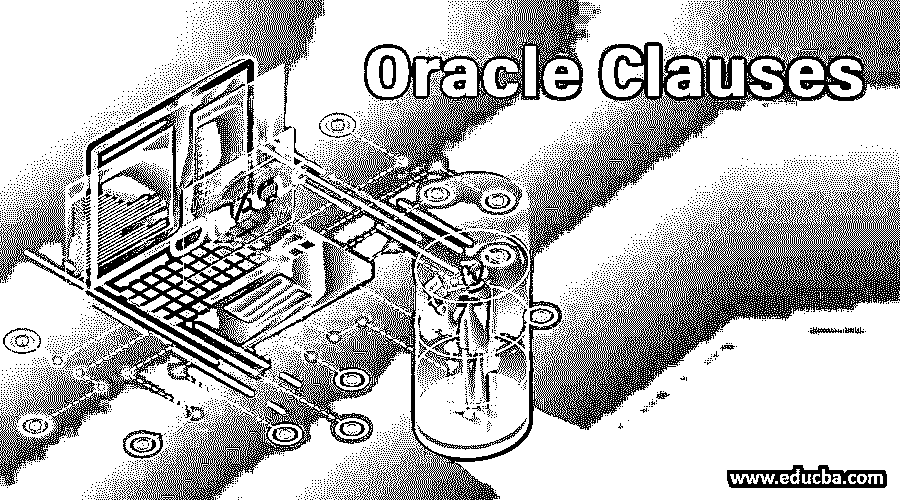

# Oracle 子句

> 原文：<https://www.educba.com/oracle-clauses/>

## Oracle 子句介绍

Oracle 子句是条件关键字或语句，可以根据需要包含在查询数据库或表中。一些常用的 oracle 子句有:用于获取表内容的“Select ”,用于提及表名的“from ”,用于在查询中添加条件的“where ”,用于对结果数据进行排序的“order by ”,用于对查询内容进行分组的“group by ”,用于限制 group by 语句的结果的“having”等。

oracle 中的条款列表如下所示

<small>Hadoop、数据科学、统计学&其他</small>

*   **FROM 子句**
*   **约束子句** **:** 它是 CREATE TABLE 语句的可选子句。约束子句定义了插入数据时要满足的规则。
*   **WHERE 子句****:**Select 语句或 update 语句或 DELETE 语句的可选子句。WHERE 子句指定根据条件选择哪些行。
*   **ORDER BY 子句:**它是 select 语句或 CREATE VIEW 语句或 INSERT 语句的可选子句。ORDER BY 子句指定结果集行的显示顺序。
*   **FOR UPDATE 子句** **:** 它是 SELECT 语句的可选子句。默认情况下，光标是只读的。游标应该是可更新的，则 FOR UPDATE 子句在编译期间强制执行 check SELECT 语句，以满足游标可更新的条件。
*   **GROUP BY 子句** **:** 它是 Select 语句的可选子句，GROUP BY 子句将一个结果子集化成组。
*   **HAVING 子句** **:** 它是 select 语句的可选子句。HAVING 子句限制作为 GROUP BY 子句结果的组选择。
*   **result offset 和 fetch first 子句****:**result offset 子句用于跳过前 N 行，选择剩余的行作为结果集。fetch first 子句与 result offset 子句一起使用，以限制在结果集中选择的行数。
*   **使用子句** **:** 在**的连接操作中是一个强制子句。**USING 子句显示连接两个表时要检查哪些列相等。
*   **WHERE CURRENT OF 子句** **:** 它是 delete 或 UPDATE 语句中的可选子句。WHERE CURRENT OF 子句指定删除可更新游标或更新的位置。

### Oracle 子句列表

接下来，让我们详细了解每个条款——

#### 1.FROM 子句

FROM 子句是 Select 语句中的强制部分。FROM 子句指定表的名称，从该表中可以访问数据或列，以便在 select 表达式中使用。

**FROM 子句的语法**

`FROM Table1 [ , Table2 ] *`

**查询示例**

`Select * from employee ;`

**带有 where 子句条件的查询示例**

`select d.dep_id
from department as d
where dep_id< 10`

**带有 order by 子句的查询示例**

`select st .tablename, sc .isindex
from sys.systables st, sys.sysconglomerates sc
where st.tableid = sc.tableid
order by tablename, isindex`

**带有连接条件的查询示例**

`select *
from flights f, flightavailability fa
where fa.flight_id = f.flight_id
and fa.segment_number = f.segment_number
and f.flight_id < 115`

#### 2.约束条款

CONSTRAINT 子句是 CREATE TABLE 语句的可选子句。约束子句定义了插入数据时要满足的规则。

不同级别的约束是不同的，如下所示

##### 1.列级约束

列级约束将规则强制应用于表中的单个列。下面给出了列级约束条件

*   **NOT NULL:** 指定该列不能存储空值。
*   **主键:**它指定列值应该是唯一的，可以用来标识表中的一行。主键隐式指定 NOT NULL。
*   **UNIQUE:** 指定列值必须是唯一的。
*   **外键:**指定列值必须作为主键引用。
*   **CHECK:** 指定列值的规则。

##### 2.表级约束

表级约束将规则强制应用于表中的一列或多列。表级约束与列级约束相同，但不同之处在于指定约束的位置。

**查询示例**

名为 did _ PK–的列级主键约束示例

`create table department
(
Deptid number constraint did_pk primary key,
Dname char(10),
Location char(80) not null,
) ;`

名为 did_pk 的表级主键约束示例

`create table department
(
Deptid number constraint did_pk primary key,
Dname char(10),
Location char(80) not null,
primary key (Deptid)
);`

#### 3.WHERE 子句

这是 Select 语句、update 语句或 DELETE 语句的可选子句。WHERE 子句指定根据条件选择哪些行。只有那些条件或表达式计算结果为 TRUE 的行才会返回、删除或更新。

**Where 子句的语法**

`WHERE Booleanexpression`

**例子**

Where 子句示例

`select *
from flight
where business_taken_seats is null
or business_taken_seats = 0`

连接多个表的 Where 子句示例

`select a.*, last name
from emp_act as a, employee as e
where a.empno = e.empno ;`

#### 4.ORDER BY 子句

ORDER BY 子句是 SELECT 语句、CREATE VIEW 语句、INSERT 语句、标量子查询或表子查询的可选子句。子句指定结果集行的显示顺序。

**ORDER BY 子句的语法**

`ORDER BY { columnName | Expression | ColumnPosition }
[ ASC (default) | DESC ] ;`

columnName 是指结果集排序所依据的列名。ColumnPosition 是一个整数，它指定 Select 语句查询中选择项的列位置。该表达式是数值、日期时间和字符串表达式。ASC 指定升序。DES 指定降序。

**用相关名**按示例排序

在下面的 select 语句中，location 列具有相关名称 country，它是 order by 子句中使用的

`Select name, location as country
From employee
Order by country`

**用数值表达式按示例排序**

在下面的 select 语句中，order by 子句使用表达式 salary+hike-

`Select name, salary, hike from emp
Order by salary + hike`

**用函数**按示例排序

在下面的 select 语句中，order by 子句使用函数来指定位置

`Select a, len from calculation
Order by sin(a)`

**用空排序指定示例排序**

您可以使用空值排序规范来指定空值的位置:

`Select * from  table1 order by column1 asc nulls last`

#### 5.FOR UPDATE 子句

FOR UPDATE 子句在编译期间强制执行 check SELECT 语句，以满足游标可更新的条件。

**FOR UPDATE 子句的语法**

`FOR
{
FETCH ONLY | READ ONLY | UPDATE [ OF columnName [ , columnName]* ] }`

columnName 在查询的 FROM 子句中指定。

**FOR UPDATE 子句示例**

`select eid, name, salary, deptid from emphist for update`

#### 6.GROUP BY 子句

此子句返回组结果的子集。

**GROUP BY 子句的语法**

`GROUP BY
{
columnName [ , columnName ]*
|ROLLUP ( column-Name [ , column-Name ]* )
}`

**例题**

查找按部门分组的雇员的平均工资

`select avg (salary), deptid
from employee
group by deptid ;`

`select max (salary), deptid
from employee
group by deptid ;`

#### 7.HAVING 子句

HAVING 子句限制由 GROUP BY 子句定义的组选择。

HAVING 子句的语法

`HAVING Condition`

HAVING 子句示例限制 avg (salary)的组选择-

`select avg (salary), deptid
from employee
group by deptid having avg(salary) > 50000;`

下面给出的查询是非法的，因为 deptid 列不是分组列–

`select avg (salary), deptid
from employee
group by deptid having deptid > 5;`

**结果偏移和获取优先子句**

result offset 和 fetch first 子句用于跳过前 N 行，fetch first 子句用于限制在结果集中选择的行数。

**结果偏移和提取优先子句的语法—**

`OFFSET { integer } {ROW | ROWS}
FETCH { FIRST | NEXT } [ integer ] {ROW | ROWS} ONLY`

**例题**

获取 T 的第一行

`Select * from employee fetch the first row only`

#### 8.Using 子句

using 子句根据条件使用来联接两个表。

**使用子句的语法**

`Using ( columnname [,columnname ]* )`

**例题**

在该示例中，countries 表和 cities 表在 cities.country 等于 countries 的条件下联接。国家–

`Select * from employee join department
using (eid)`

#### 9.WHERE CURRENT OF 子句

WHERE CURRENT OF 子句指定删除可更新游标或更新的位置。

**子句**的 WHERE CURRENT 的语法

`WHERE CURRENT OF cursorName`

**例子**

`Statement stmt  = conn.createStatement();
stmt.setCursorName("employeeres");
ResultSet res = conn.executeQuery(
"SELECT ename, salary FROM employee FOR UPDATE OF salary");
Statement stmt1 = conn.createStatement();
stmt1.executeUpdate("UPDATE employee SET salary = salary +10000 WHERE CURRENT
OF employeeres");`

### 推荐文章

这是一本甲骨文子句指南。这里我们用例子讨论了 Oracles 子句列表，用相应的结果讨论了语法。oracle 中的子句是用于特定目的或指定特殊含义的关键字。您也可以浏览我们推荐的其他文章，了解更多信息——

1.  [Oracle Warehouse Builder](https://www.educba.com/oracle-warehouse-builder/)
2.  [什么是 Oracle 数据库](https://www.educba.com/what-is-oracle-database/)
3.  [Oracle 数据库管理员职业生涯](https://www.educba.com/career-in-oracle-database-administrator/)
4.  [Oracle 顶级版本指南](https://www.educba.com/oracle-versions/)
5.  [甲骨文运营商|前 7 名](https://www.educba.com/oracle-operators/)
6.  [MySQL 汇总完整指南](https://www.educba.com/rollup-in-mysql/)

