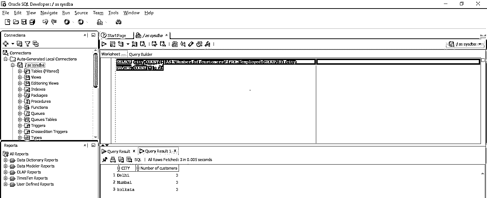
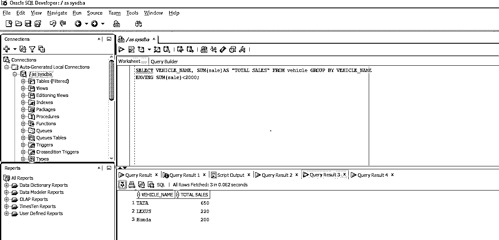
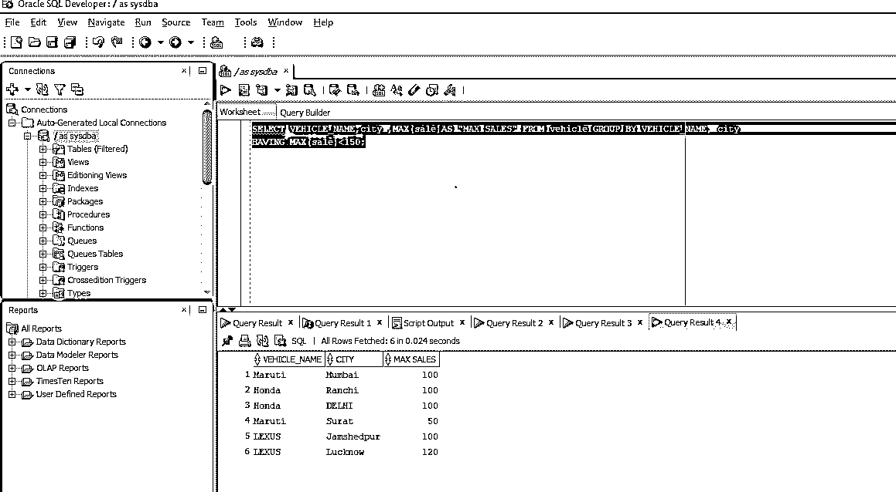
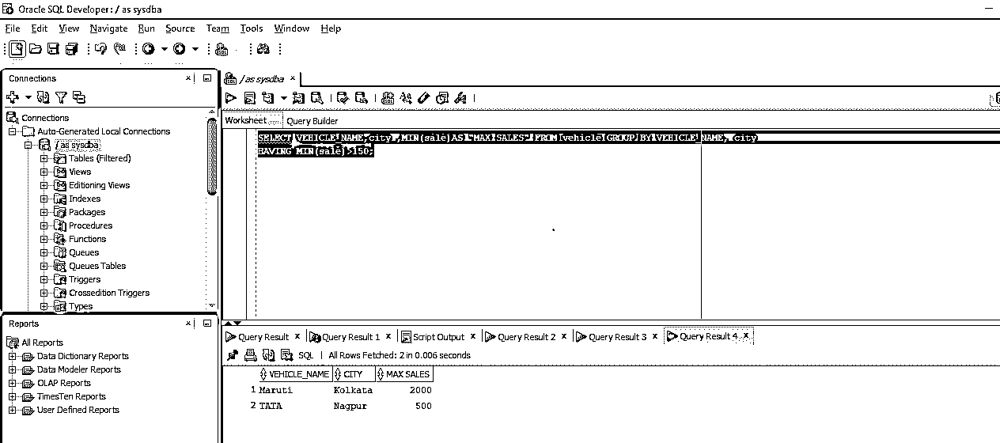

# 甲骨文 Having 子句

> 原文：<https://www.educba.com/oracle-having-clause/>

## Oracle Having 子句介绍

Oracle HAVING 子句是一个非强制的条件子句，可以与 GROUP BY 函数一起用作聚合选项，但不能单独使用该子句。Oracle 上的 HAVING 子句是一个特定于 GROUP BY 语句下的条件的过滤器，所有条件都在同一个查询中。作为 HAVING 子句的一部分，在 GROUP BY 下应用的一些聚合操作是 SUM、MAX、MIN 和 COUNT。

**语法**

<small>Hadoop、数据科学、统计学&其他</small>

语法如下所示:

`SELECT aggregatefunction(expression) FROM TABLES [where condition] GROUP BY column/expression
HAVING condition;`

### 因素

聚合函数:该参数表示查询中使用的聚合函数。

示例:计数、总和、平均值

*   **表达式:**括号中给出了我们应用聚合函数的表达式。
*   **Tables:** 要从中提取数据的表的名称。
*   **Where 条件:**这是可选的。如果我们想为选择记录设置任何条件，就使用它。
*   **GROUP BY:** 用于根据表达式/列对行进行分组，表达式/列后接 GROUP BY。
*   **HAVING Conditions:** 这指定了应用于聚合行以进行过滤的条件。

### Oracle 中的 HAVING 子句是如何工作的？

所以，现在我们应该想到的问题是 HAVING 子句是如何工作的。我们将在这一部分讨论同样的问题。

HAVING 子句是一个可选子句，通常用在 GROUP BY 之后。HAVING 不像 WHERE 子句那样处理数据行，而是实际处理聚合数据或数据组。假设我们有一个如下所示的查询:

`SELECT COUNT(*) FROM employee WHERE age>25 GROUP BY city HAVING  COUNT(*)> 2;`

如果我们看到这个查询中有 HAVING 子句。因此，当执行查询时，将首先执行 FROM 以从数据库中获取表，然后执行条件，这将为我们提供年龄大于 25 的行。一旦我们得到，我们将根据城市对行进行分组，然后 HAVING 子句将被应用，这样只有城市多于两个条目的组才会被选中。一旦我们得到它，我们将使用一个聚合函数来计算所选组中的行数。

因此，通过上面的例子，我们了解了 HAVING 子句查询的工作原理。

为了帮助我们更好地理解，我们将通过几个例子。

我们将使用 ORACLE 中的各种聚合函数作为示例。

#### 1.具有计数功能

COUNT 是一个聚合函数，用于返回一个组中的项目数。它包括空值和重复值。在下面的例子中，我们将看到如何将 COUNT 与 having 一起使用

**查询:**

`SELECT city, COUNT(*)AS "Number of customers" FROM employee GROUP BY city
HAVING COUNT(*)> 2;`

在本例中，城市组是由 GROUP BY 函数选择的，然后我们使用 HAVING 子句和 COUNT 函数来选择城市超过两条记录的组。

下面的屏幕截图显示了在 SQL developer 中执行时的输出。

正如您在输出中看到的，它只显示那些在表中有超过 2 条记录的城市。

#### 2.具有求和函数

SUM 函数返回括号内提供的列或表达式的合计值。在下面的例子中，我们将看到如何在 SUM 函数中使用 HAVING 子句

**查询:**

`SELECT VEHICLE_NAME, SUM(sale)AS "TOTAL SALES" FROM vehicle GROUP BY VEHICLE_NAME
HAVING SUM(sale)<2000;`

在上面的查询中，我们显示了车辆名称及其总销售额。group by 函数根据车辆名称创建一个组，然后我们必须只选择销售额总和小于 2000 的记录。

下面的屏幕截图显示了在 SQL developer 中执行查询时的输出。

如您所见，输出只显示了总销售额小于 2000 的车辆名称。

#### 3.具有最大函数

MAX 函数返回集合的最大值。它忽略集合中的空值。

**查询:**

`SELECT VEHICLE_NAME,city ,MAX(sale)AS "MAX SALES" FROM vehicle GROUP BY VEHICLE_NAME, city
HAVING MAX(sale)<150;`

在上面的查询中，我们试图找到车辆名称和城市以及小于 150 的最大销售额。因此，首先使用 group by 函数根据车辆名称和城市对记录进行分组，然后通过使用 HAVING 子句，我们只允许选择最大值小于 150 的那些组。

在 SQL 中执行查询时，我们得到了下面的结果。

如您所见，只显示了销售额小于 150 的记录。

#### 4.具有最小函数

它与 MAX 相反。MIN 函数返回一个集合的最小值。

**查询:**

`SELECT VEHICLE_NAME,city ,MIN(sale)AS "MAX SALES" FROM vehicle GROUP BY VEHICLE_NAME, city
HAVING MIN(sale)>150;`

在上面的查询中，我们试图查找车辆名称和城市以及超过 150 的最小销售额。因此，首先使用 group by 函数根据车辆名称和城市对记录进行分组，然后通过使用 HAVING 子句，我们只允许选择最小值大于 150 的那些组。

在 SQL 中执行查询时，我们得到了下面的结果。

如您所见，只显示了最小销售额超过 150 的记录。

### 结论

在本文中，我们已经了解了什么是 HAVING 子句，它在执行方面是如何工作的，还讨论了各种示例，以详细了解可以与 HAVING 子句一起使用的各种聚合函数。

### 推荐文章

这是甲骨文 Having 子句的指南。这里我们讨论 HAVING 子句如何在 oracle 和参数中工作，以及语法和查询示例。您也可以浏览我们推荐的其他文章，了解更多信息——

1.  [Python 中的作用域](https://www.educba.com/scope-in-python/)
2.  [Oracle LIKE 运算符](https://www.educba.com/oracle-like-operator/)
3.  [数据模型的类型](https://www.educba.com/types-of-data-model/)
4.  [插入甲骨文](https://www.educba.com/insert-in-oracle/)
5.  [了解不同的 Oracle 版本](https://www.educba.com/oracle-versions/)

