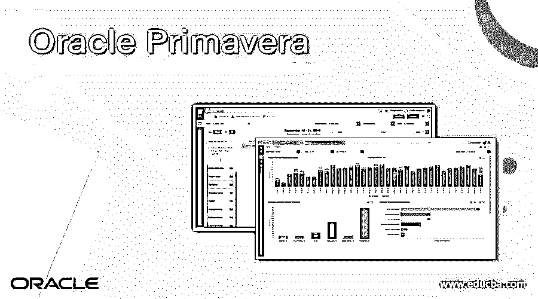
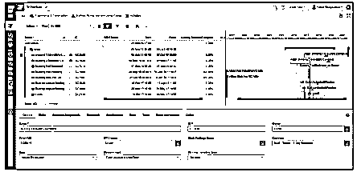
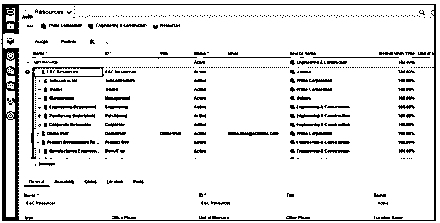
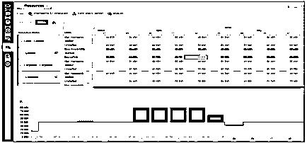
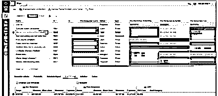
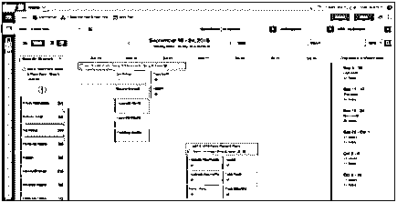
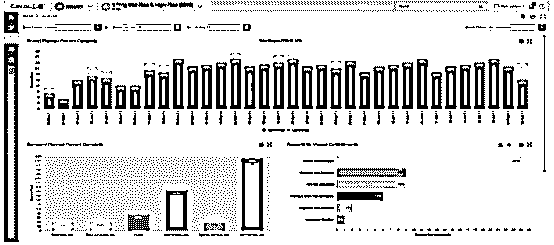
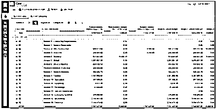

# Oracle Primavera

> 原文：<https://www.educba.com/oracle-primavera/>

## Oracle Primavera 简介

Oracle 提供的项目组合管理软件就是 oracle Primavera。在其中我们可以管理项目、安排项目、风险分析、管理机会、资源管理、定义协作和控制功能，并且它帮助我们将它们与 Oracle ERP 系统等其他软件集成。它是开源的，我们可以根据需要同时安排多个项目。它提供了安全性，我们可以保护多用户对时间表的访问。提高组织的计划效率是有用的。

### 为什么我们需要先知，春华？

下面我们来看看 oracle Primavera 的需求是什么。

<small>Hadoop、数据科学、统计学&其他</small>

它是管理投资组合的软件。在 Primavera 软件的帮助下，我们看到了项目的信息，包括项目的拟议规划和项目的预计成本，这意味着我们可以管理所有与项目有关的事情。

它是一个基于云的软件应用程序，因此处理时间比其他软件更快。

oracle Primavera 的主要用途是用于优化资源以保持项目正常进行。

### Oracle Primavera 是如何工作的？

现在我们来看看 oracle Primavera 是如何工作的，如下所示。

它包含了不同的模块，所以让我们来看看下面的内容。

#### 1.投资组合管理

在此模块中，我们可以查看特定项目的详细结构，如项目管道、项目预算、项目支出以及资金分配要求。Oracle portfolio 是一个基于云的长期管理工具，用于跨项目组合进行资本规划和定义预算。

#### 2.进度管理

进度管理是有效项目管理的关键要素。在其中我们可以规划项目，我们还可以定义项目的时间表。本模块的另一个要点是项目经理有效地管理项目里程碑、可交付成果和时间表。

#### 3.资源管理

Oracle Primavera cloud service 允许项目经理管理其项目的资源和角色层次结构。通过使用这个模块，可以选择组织，或者我们可以说他们可以管理企业级的角色和资源，并允许项目经理根据项目的需求来利用它们。

#### 4.风险管理

它提供了风险管理模块，组织风险登记簿在其中查看和分配风险优先级。它还有一个应对项目风险的风险应对计划。

#### 5.精益任务管理

它提供了一个精益云任务管理工具；在这个工具或模块的帮助下，我们可以改进计划者和主管之间的协调、计划和工作执行。该工具还帮助外业工作人员选择以最低效率执行工作的最佳方式。

#### 6.成本管理

在本模块中，项目经理和股东管理预算、分析项目成本、预测预算以及如何降低持续项目成本。

#### 7.范围管理

使用管理模块的范围，我们有效地管理每个项目的整个工作范围。它允许项目经理在项目生命周期中安排和管理范围内的所有方面，包括设备部署。

#### 8.文件管理

Oracle Primavera 具有强大的文件管理功能。例如，我们可以管理设计文档、详细规范和文件权限控制，以管理整个企业的访问。

### 优点和缺点

以下是下面提到的优点和缺点

#### 优势

1.  与其他产品相比，它非常容易使用
2.  它提供了在一个位置分析所有数据的工具。
3.  当成千上万的工人在同一个地方工作时，它提供了更好的沟通。
4.  它为计划内的所有用户提供访问权限和责任。
5.  如果项目很复杂，那么它会提供分解功能。
6.  在 oracle primavera 的帮助下，我们可以轻松地准备和控制项目。

#### 不足之处

1.  软件的功能性高，功能丰富，所以成本也丰富。
2.  这对初学者来说很难掌握。
3.  它可以定制报告。
4.  导入和导出功能需要更多选项。
5.  需要风险模块，而不是二级应用程序。

### 例子

现在，让我们看看 oracle Primavera 如何在不同模块的帮助下工作。这里我们导入了一张甲骨文官网的截图。

使用 Oracle Primavera，我们可以管理整个时间表，这是项目管理的一个关键要素，如下图所示。

假设项目经理需要管理资源管理模块下所有资源的层级角色，如下截图所示。

下面的屏幕截图显示了项目级别的资源和角色分析。

在风险管理工具中，我们可以定义风险阈值；下面的屏幕截图显示了如何登记风险以及我们将计划的相关响应。

精益任务管理有助于提高不同计划员之间的协调，最大限度地减少浪费，因此在下面的截图中，我们展示了 oracle Primavera 精益周计划，如下所示。

之后，假设我们需要监控周计划，这意味着计划员的绩效，我们使用任务分析选项卡看到的计划员的绩效，如下图所示。

oracle Primavera 的主要模块是成本管理；下面的截图显示了一个成本表，给出了正在进行的项目的详细成本，如项目的预算和成本等。

### Oracle Primavera 的使用

### 结论

我们希望通过这篇文章，您已经了解了 Oracle Primavera。从这篇文章中，我们学习了不同的例子。我们还将了解 Oracle Primavera 的优势和劣势。最后，本文介绍了如何以及何时使用 Oracle Primavera。

### 推荐文章

这是 Oracle Primavera 的指南。在这里，我们讨论 Oracle Primavera 的不同示例及其优缺点。您也可以看看以下文章，了解更多信息–

1.  [甲骨文唯一索引](https://www.educba.com/oracle-unique-index/)
2.  [甲骨文列](https://www.educba.com/oracle-column/)
3.  [甲骨文系统日期()](https://www.educba.com/oracle-sysdate/)
4.  [甲骨文 NVL()](https://www.educba.com/oracle-nvl/)

